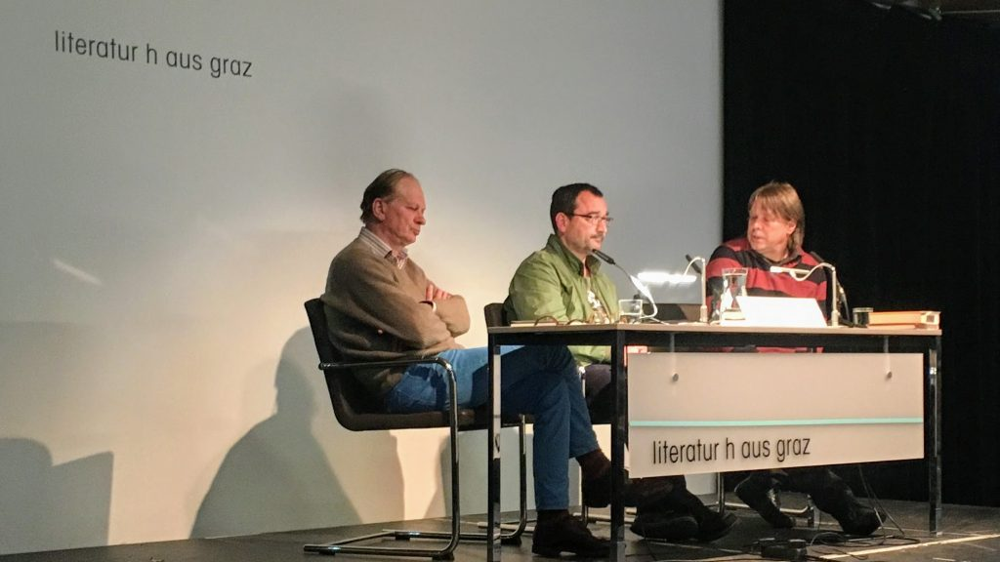

Josef Winkler, Erwin Köstler und Andreas Leben stellen Ivan Cankar vor. Literaturhaus Graz, 29.4.2019

Von dem [Abend im Literaturhaus zu Ivan Cankar](http://www.literaturhaus-graz.at/veranstaltung/klassiker-revisited-mit-josef-winkler-zu-ivan-cankar/ "Klassiker revisited mit Josef Winkler zu Ivan Cankar | Literaturhaus Graz") möchte ich Cankar selbst in Erinnerung behalten, und auch einige Sätze [Josef Winklers](https://www.suhrkamp.de/autoren/josef_winkler_5368.html "Josef Winkler - Suhrkamp Insel Autoren Autorendetail"), der gestern seine Nacherzählung von Cankars [Jernej der Knecht und sein Recht](http://www.pavelhaus.at/cm/publikationen/literarische_publikationen/ "Jernej der Knecht und sein Recht - Comic einschließlich der Neuübersetzung Erwein Köstlers, herausgegeben vom Pavelhaus") vorlas. Er interessiere sich eigentlich _nur für die Sprache von Texten, kaum für die Inhalte_, sagte Winkler. Die Sprache sei _wie eine Katze oder ein Tiger, die sich elegant vorwärts bewegen_, manchmal sei _eine klappernde Blechdose an den Schwanz gebunden: der Inhalt_. Ich dachte: Wie peinlich wäre es mir, wenn ich Winkler sagen müsste, dass ich an einem Studiengang für Content-Strategie arbeite, und ob es vielleicht erträglich wäre, von Inhaltsstrategie zu sprechen. _Wir seien bei vielen Texten auf Übersetzungen angewiesen_, sagte Winkler, als ihn eine Zuhörerin aufforderte, Slowenisch zu lernen. Jetzt seien gerade einige große Texte in neuen Übersetzungen erschienen—Romane von Dostojewskij, Tolstoi, Knut Hamsun, Melville. Die Übersetzungen und die Kritiken der Übersetzungen seien ein Anlass, _wieder in diesen Büchern zu lesen_, und nur diese großen Texte _seien es Wert, gelesen zu werden_, alles andere seien _nur Seifenblasen_. Er selbst _sei auch nur eine Seifenblase_, sagte Winkler, anders als viele Passagen Handkes, an dessen Beschreibung einer Igelfamilie er sich öfter erinnere als an die Igelfamilie, die er selbst vor einigen Jahren in Holland beobachtet habe. Er frage sich, _wie ein Mensch überhaupt so schreiben könne_.

Fast zwei Stunden lang haben Winkler, [Erwin Köstler](https://de.wikipedia.org/wiki/Erwin_K%C3%B6stler_%28%C3%9Cbersetzer%29 "Erwin Köstler – Wikipedia") und [Andreas Leben](https://online.uni-graz.at/kfu_online/wbForschungsportal.cbShowPortal?pPersonNr=76937 "Leben Andreas - Profil - Forschungsportal - Karl-Franzens-Universität Graz") Ivan Cankars (und Josef Winklers) Sprache vorgestellt. Ich habe Cankar vorher nicht einmal dem Namen nach gekannt. Die Abschnitte, die ich gestern gehört habe, erinnern mich im Naturalismus und der Kritik an nationalistischer Provinzialität an Joyce und in der Insistenz und der Frage nach der Gerechtigkeit entfernt an Kafka. Einen Abend, bei dem die Sprache so unaufgeregt und konzentriert in den Mittelpunkt gestellt werden, habe ich auch im Grazer Literaturhaus nicht oft erlebt.

Viele Werke Cankars sind übersetzt [im Drava-Verlag erschienen](https://www.drava.at/autor/ivan-cankar/ "Drava"). Köstler und Leben notiere ich mir als Gewährsleute für slowenische Literatur.
