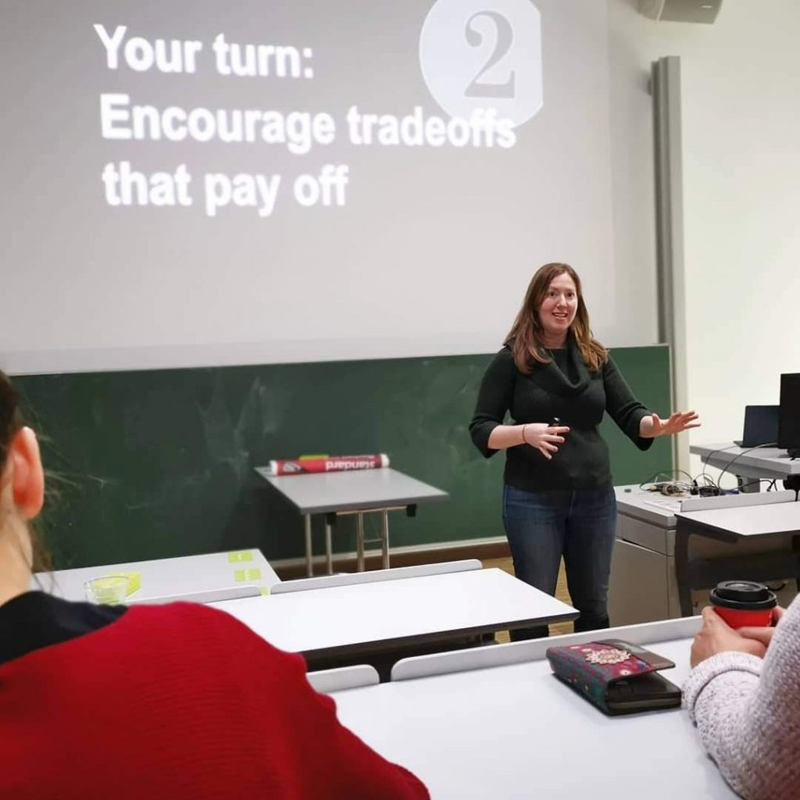
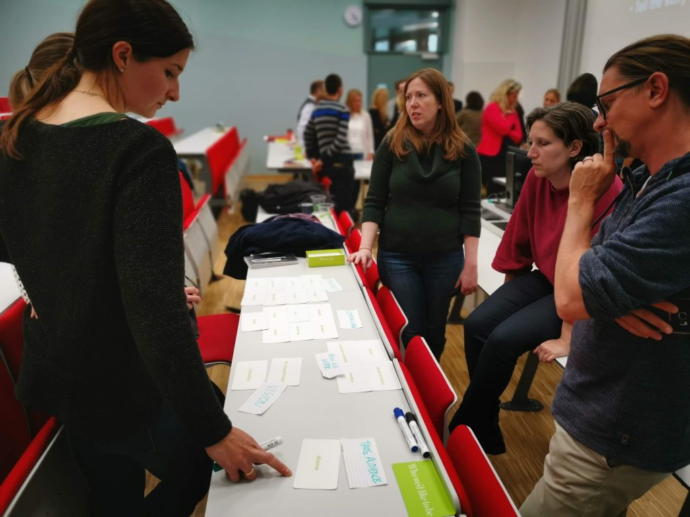

Gestern nachmittag war ich in einem [Workshop](http://www.bildungsnetzwerk-stmk.at/markenbotschaften-und-content-strategie/ "Markenbotschaften und Content-Strategie | Bildungsnetzwerk Steiermark") mit [Margot Bloomstein](http://appropriateinc.com/ "Brand and Content Strategy | Margot Bloomstein | Appropriate, Inc."). Unser [Studiengang](https://www.fh-joanneum.at/cos/ "Studiengang Content-Strategie / Content Strategy") hat ihn zusammen mit dem [Bildungsnetzwerk Steiermark](http://www.bildungsnetzwerk-stmk.at/ "Bildungsnetzwerk Steiermark | Das Bildungsnetzwerk Steiermark - die Koordinationsstelle der steirischen Weiterbildung") veranstaltet.

- 
    
    Margot Bloomstein in der FH Joanneum, 13.5.2019
    
- 
    
    Margot Bloomstein bei einer Card Sorting-Übung
    

Margot hat in die Content-Strategie allgemein eingeführt und sich dann vor allem mit Botschaftsarchitektur beschäftigt und ihre Methode des Card Sorting mit uns geübt. Am Samstag hat sie in Berlin unseren Jahrgang [#cos17](https://twitter.com/hashtag/cos17 "Hashtag #cos17 auf Twitter") unterrichtet, und heute spricht sie beim Designmonat zu [Designing Trust in an Era of Self Validating Facts](https://www.designmonat.at/event/designing-trust-in-an-era-of-self-validating-facts/ "Designing Trust in an Era of Self Validating Facts - Designmonat Graz").

Ich habe selbst schon Workshops zur Einführung in die Content-Strategie für dieselbe Zielgruppe gehalten und kann aus dem Vergleich viel lernen. Margot reduziert die Inhalte viel mehr und konzentriert sich auf die Präsentation—weniger auf die Folien als darauf, die Teilnehmerinnen und Teilnehmer anzusprechen. Sie hat den Workshop perfekt um wenige zentrale Inhalte herum entwickelt, wobei sie sich immer auf ihre eigenen Erfahrungen und Beispiele aus ihrer Praxis bezieht. Von vielen anderen in der Content-Strategie unterscheidet sie sich als Vortragende wie als Autorin dadurch, dass reale Case-Stories ihre Ausgangspunkte bilden.

Zum ersten Mal habe ich gestern einen entscheidenden Punkt von Margots Konzept begriffen: Bei der Konzentration auf Kernbotschaften geht es nicht nur darum, seine eigene Identität zu definieren und deutlich mitzuteilen, sondern auch darum, so ökonomisch und effizient wie möglich zu kommunizieren, also begrenzte Ressourcen nur dafür zu verwenden das mitzuteilen, was man tatsächlich unbedingt sagen muss. Unter dieser Perspektive kann man sagen: Je weniger Ressourcen für die Kommunikation zur Verfügung stehen, desto klarer müssen die Kernbotschaften herausgearbeitet werden. Bisher habe ich die Notwendigkeit einer Botschaftsarchitektur vor allem damit erklärt, Einheitlichkeit über eine Vielfalt von Touchpoints herzustellen. Das unterscheidet sich nicht unbedingt im Ergebnis, aber die Motivation ist anders.

Ich habe Margot gefragt, was die Botschaftsarchitektur in ihrem Ansatz von Markenwerten unterscheidet. Sie hat geantwortet, dass Kernbotschaften

- für die internen Beteiligten,
- umsetzungsorientiert (_actionable_) und
- priorisiert

festgelegt werden. Auch hier geht es also um das _actionable_—darum, praktisch und ökonomisch zu kommunizieren. Um einen neueren Begriff zu verwenden, der bei Margot Bloomstein so nicht vorkommt: Botschaftsarchitektur und Kernbotschaften ermöglichen _content operations_, während sich aus Markenwerten allein nicht ableiten lässt, welche Inhalte produziert und welche nicht produziert werden sollen. Am Ende des Workshops hat uns Margot einen Redaktionskalender gezeigt, in dem einzelne Inhalte einfach per Farbcode den Kernbotschaften zugeordnet waren.

Auf Margot Bloomsteins Konzept der Botschaftsarchitektur greifen in unserem Studiengang fast alle Masterarbeiten zurücl. Sie hat mit der Botschaftsarchitektur eine Komponente jeder Content-Strategie sehr fokussiert herausgearbeitet und fast im Alleingang in der Content-Strategie-Community etabliert. Das (aber nicht das allein) begründet ihre Bedeutung für diese Disziplin. Ich bin froh, dass ich gestern mitbekommen habe, wie sie selbst ihren Ansatz begründet und vermittelt.

(Fotos: [Anastasija Georgi](http://anastasijageorgi.com/ "- Anastasija Georgi"))
