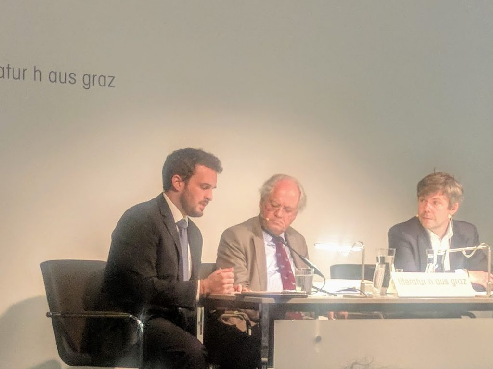

Ich kenne [David Abulafia](https://www.hist.cam.ac.uk/directory/dsa1000@cam.ac.uk "Professor David Abulafia, FBA — Faculty of History")s Namen, weil mir [Regina](https://www.facebook.com/regina.fendlwittenbrink "Regina Fendl-Wittenbrink") vor Jahren seine [Biografie des Mittelmeers](https://www.perlentaucher.de/buch/david-abulafia/das-mittelmeer.html "David Abulafia: Das Mittelmeer. Eine Biografie - Perlentaucher") geschenkt hat. Ich habe in den letzten Wochen öfter an an das Buch gedacht und mir vorgenommen, es zuende zu lesen, wenn wir im Sommer auf Žirje sind. Das Abulafia [in Graz liest](http://www.literaturhaus-graz.at/veranstaltung/david-abulafia-das-mittelmeer-eine-biographie/ "David Abulafia liest aus „Das Mittelmeer. Eine Biographie“ | Literaturhaus Graz"), habe ich erst ein paar Stunden vor der Veranstaltung gesehen.

David Abulafia mit Dominik Berger (links) und Steffen Schneider (rechts) im Literaturhaus Graz, 16.5.2019

Der Abend begann sehr verhalten, und Abulafia las zuerst wie ein distanzierter Professor. Aber je mehr er zwischen den Leseabschnitten mit [Steffen Schneider](https://homepage.uni-graz.at/de/steffen.schneider/ "Schneider, Steffen, Univ.-Prof. Dr.phil.") ins Gespräch kam, und noch mehr, als er auf Fragen der Zuschauer antwortete, hörte man ihm als einem Erzähler zu. Er macht die akademische Geschichtschreibung zum Medium des Erzählens und zeigt die erzählerischen Potenzen des wissenschaftlichen Vorgehens, er illustriert nicht im Nachhinein auf anderem Wege erschlossene, unanschauliche Fakten. Oder vielleicht, umgekehrt: Er macht die Erzählung zum Ausgangspunkt der wissenschaftlichen Erschließung, bis dahin, dass er die Geschichte eines ganzen Meeres erzählt. In diese Geschichte verwoben ist die Geschichte seiner Familie. Er selbst sagte, dass ihm diese persönlichem Motive seiner Arbeit erst im Nachhinein bewusst geworden sind. Abulafia stammt aus einer sephardischen Familie, deren Mitglieder im Laufe der Jahrhunderte an vielen Orten des Mittelmeerraums gelebt haben.

Dass Erzählen und Darstellen für Abulafia nicht nachrangig ist, lässt mich jetzt auch seine Bemerkungen zu [Fernand Braudel](https://de.wikipedia.org/wiki/Fernand_Braudel "Fernand Braudel – Wikipedia") verstehen, dessen [Werk zum Mittelmeer](https://de.wikipedia.org/wiki/Das_Mittelmeer_und_die_mediterrane_Welt_in_der_Epoche_Philipps_II. "Das Mittelmeer und die mediterrane Welt in der Epoche Philipps II. – Wikipedia") einen _Intertext_ von Abulafias Buch bildet. Abulafia hat sich nicht methodisch oder theoretisch von Braudel abgesetzt, sondern gesagt, dass Braudels Mittel für ihn nicht ausreichten, um die Geschichte des Mittelmeers zu erzählen. Braudel, so habe ich es in Erinnerung, hätte das Mittelmeer zu sehr von den Landregionen her verstanden, die es umgeben. Vielleicht zielt auch die andere kritische Bemerkung Abulafias zu Braudel nicht nur auf ein falsches theoretisches Konzept, sondern auf einen Ansatz, der erzählerisch nicht funktioniert: Er habe sich zu wenig mit den Menschen beschäftigt. Für Abulafia selbst stehen die menschlichen Entscheidungen im Mittelpunkt. Menschliche Handlungen wie die Gründung Alexandrias nach einem Traum Alexanders des Großen könnten Folgen über Jahrtausende haben. Durch menschliche Entscheidungen könnten sich Situationen auch sehr schnell verändern, in viel kürzen Zeitspannen, als sie Braudel erfasst habe: _Not all change is slow._

In der Diskussion sprach Abulafia vom Mittelmeer als einem _open space_. In diesem Raum ist nichts fix. Diese Nichtfixiertheit ist ein Leitthema Abulafias. Sie betrifft alle Entitäten, auch die sogenannten _Völker_. Abulafia schreibt über _Schiffe, Menschen und Völker, die sich bewegen_. Die Portugiesen, die in der frühen Neuzeit in Italien auftauchen, seien äußerlich konvertierte Juden aus Spanien gewesen, die sich dann in späteren Generationen in Holland angesiedelt und niederländisch gesprochen hätten. Für die mediterranen Städte, die Abulafia—mit Nostalgie—porträtierte, ist charakteristisch, dass in ihnen unterschiedliche Gruppen, wie Griechen, Juden, Armenier zusammenleben, dass sie sich nicht ethnisch verstanden. In Triest habe sich diese Vielfalt etwas besser erhalten als in vielen anderen der berühmten mediterranen Städte. In Smyrna und später in Alexandria habe sie der Nationalismus ausgelöscht.

> Something very precious hast been lost and is very difficult to replace.

Ich habe Abulafia in der Diskussion nach den Besonderheiten Dubrovniks gefragt, und er ist sofort auf die multiple Identität dieser Stadt zu sprechen gekommen, auf die drei Sprachen (kroatisch, italienisch, dalmatinisch), die dort früher gesprochen wurden, und auch auf ihre Mittler-Position zwischen dem Meer und den Balkanländern. Zum Thema _Abulafia als Erzähler_ gehört auch, dass das historische Wissen bei ihm persönliches Wissen ist, das er bei den Fragen, die ihm gestellt wurden, sofort abrufen kann, und dass er mit diesem Wissen ein bestimmtes Publikum oder auch einen einzelnen Fragesteller ansprechen und erreichen kann.

In der Diskussion erwähnte Abulafia mehrfach Katalonien und Barcelona, wo man die katalanische Identität nie ethnisch verstanden habe. Er zitierte [Artur Mas](https://de.wikipedia.org/wiki/Artur_Mas "Artur Mas – Wikipedia"), der davon geträumt habe, dass die Migranten aus Afrika den Keim einer neuen multikulturellen Gesellschaft in Barcelona bilden würden. Dass Abulafia die Beweglichkeit und Offenheit des Meers der Statik der Territorien gegenüberstellt, motiviert vielleicht auch sein Engagement für den Brexit, für den er als Sprecher der [Historians For Britain](https://www.historiansforbritain.org/ "Historians For Britain - Understanding the Past, to Decide Today, for the Future") eintritt.

Nach Kroatien möchte ich mir im Sommer Abulafias Mittelmeer-Buch mitnehmen, und dieses oder ein anderes mal auch einige andere Bücher, die ich an dem Abend im Literaturhaus kennengelernt habe: Abulafias spätere Geschichte der Ozeane [The Boundless Sea](https://www.penguin.co.uk/books/182/182654/the-boundless-sea/9781846145087.html "The Boundless Sea"), [The Corrupting Sea](https://www.wiley.com/en-us/The+Corrupting+Sea%3A+A+Study+of+Mediterranean+History-p-9780631218906 "The Corrupting Sea: A Study of Mediterranean History | Ancient & Classical Studies | General & Introductory Classical Studies | Subjects | Wiley") von [Peregrine Horden](https://en.wikipedia.org/wiki/Peregrine_Horden "Peregrine Horden - Wikipedia") und [Nicholas Purcell](https://en.wikipedia.org/wiki/Nicholas_Purcell_%28classicist%29 "Nicholas Purcell - Wikipedia"), ein anderes neueres klassisches Werk zu Geschichte des Mittelmeers, [In Search of the Phoenicians](https://press.princeton.edu/titles/11132.html "Quinn, J.: In Search of the Phoenicians (Hardcover, Paperback and Ebook) | Princeton University Press"), in dem [Josephine Quinn](https://oxford.academia.edu/JosephineCrawleyQuinn "Josephine Crawley Quinn | University of Oxford - Academia.edu") die Phönizier als eine Fiktion der nationalistischen Geschichtsschreibung bezeichnet, und Texte von [Amin Maalouf](https://de.wikipedia.org/wiki/Amin_Maalouf "Amin Maalouf – Wikipedia") wie [Les Identités meurtrières](https://fr.wikipedia.org/wiki/Les_Identit%C3%A9s_meurtri%C3%A8res "Les Identités meurtrières — Wikipédia").
