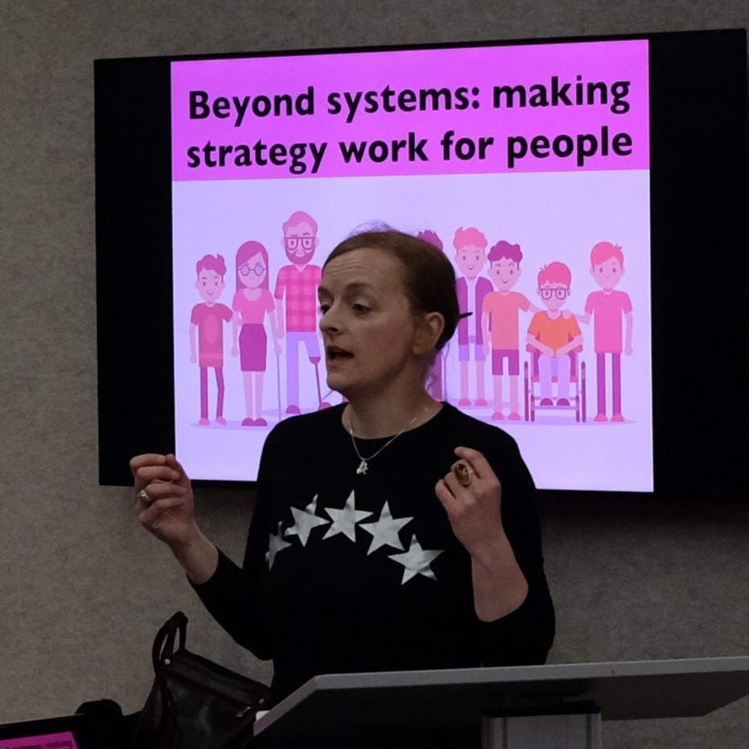

> "Meaning isn't universal. Getting meaning from content depends on factors including context, the language we use, culture and upbringing. You can also apply this to how you develop a strategy with an organisation."

Thank you @findgoodthings! #cos18 /@ContentGraz

