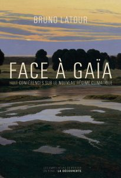

Cover von Latour, Face à Gaïa

Gestern habe ich endlich angefangen, [Face à Gaïa](https://editionsladecouverte.fr/catalogue/index-Face____Ga__a-9782359251081.html) von Bruno Latour zu lesen (deutsch: [Kampf um Gaia: Acht Vorträge über das neue Klimaregime](https://www.suhrkamp.de/buecher/kampf_um_gaia-bruno_latour_58701.html)). Ich finde sehr viele Bezüge zu den Themen, mit denen ich mich, auch angeregt von Latour, jetzt schon länger beschäftige. Ein Detail: [Jan Zalasiewicz](https://www2.le.ac.uk/departments/geology/people/zalasiewicz-ja), über den ich [neulich geschrieben habe](https://wittenbrink.net/lostandfound/jan-zalasiewicz-und-das-anthropozaen/), gehört zu den Wissenschaftlern, bei denen sich Latour explizit bedankt.

Einer der wichtigsten Punkte in der ersten der acht Vorlesungen, die das Buch enthält: das Verhältnis von wissenschaftlicher Neutralität und Politik. Latour greift auf, wie Klimawissenschaftler mit den sogenannten Klimaskeptikern debattieren und dabei in eine Falle gehen: Die Klimaskeptiker greifen im Interesse der Ölindustrie Ergebnisse der Erdsystemwissenschaft an. Die Forschung reagiert durch Diskussion dieser Angriffe, denen eine wissenschaftliche Basis fehlt. Die Diskussion alleine sorgt in der Öffentlichkeit für den Eindruck, dass es zu dieser Frage unterschiedliche legitime Positionen gibt und also die Zeit zum Handeln noch nicht gekommen ist. Die Alternative stellt Latour exemplarisch ausgehend von einer Figur des Dramas [Gaia Global Circus](http://www.bruno-latour.fr/node/359.html) dar, die einen bezahlten Klimaskeptiker anschreit: „Sagen Sie Ihren Herren, dass die Wissenschaftler auf dem Kriegspfad sind!“ Die Alternative besteht darin, die politische Funktion der Klimaskepsis zu analysieren und anzugreifen und damit die eigene Forschung explizit auch als politisch zu verstehen. _Politisch_ bedeutet dabei nicht, dass es die Wissenschaft nicht mit objektiven Ergebnissen zu tun hat, sondern dass gerade diese objektiven Ergebnisse politische Konsequenzen haben.

Erste Bemerkung dazu: Latour hat sein Buch vor der Wahl Trumps zum Präsidenten und vor dem Brexit geschrieben. Es bezieht sich auf das, was man, wiederum mit einem [bewusst irreführenden Ausdruck](https://www.theguardian.com/environment/2003/mar/04/usnews.climatechange), _Klimawandel_ nennt. Es ist frappierend, jetzt im Nachhinein zu sehen, dass die _klimaskeptische_ Form der Argumentation mit, wie es dann später genannt wurde, _alternativen Fakten_ für die gesamte Manipulations-Maschinerie des Ethnonationalismus oder Rechtspopulismus übernommen wurde. Die Gleichheit in der Form zwischen der sogenannten Klimaskepsis und der übrigen Propaganda Trumps, der Brexiter und ihrer Gesinnungsgenossen ist ein wichtiges Indiz dafür, dass der Klimanotstand das Phänomen ist, von dem ausgehend man diese neuen rechten Bewegungen verstehen muss—so wie man den Faschismus der 30er Jahre als Reaktion auf eine drohende sozialistische Revolution verstanden hat.

Zweite Bemerkung: Die Argumentation für ein politisches Selbstverständnis der Wissenschaft lässt sich auf den Journalismus übertragen, z.B. in Bezug auf die Debatten über die Objektivität des ORF und sein Verhältnis zur FPÖ. Journalismus bemüht sich, genau wie die Wissenschaft, um Objektivität, und diese Objektivität ist als solche politisch. Vom Journalismus zu verlangen, er solle unterschiedliche Positionen zu Wort kommen lassen, obwohl von diesen Positionen die einen klar faktenbasiert sind und die anderen mit alternativen Tatsachen oder Fiktionen arbeiten, bedeutet, eine ähnliche Falle aufzustellen, wie die, in die die Klimaforschung oft gegangen ist. Das Ethos der Neutralität des Journalismus wird benutzt, um objektiven Journalismus als parteiisch darzustellen—das ist die Grundfigur der antijournalistischen Hetze der FPÖ und der AfD. In Bezug auf den Journalismus ist dieser Zusammenhang immer wieder aufgedeckt worden—interessant finde ich die strukturelle Ähnlichkeit zu Latours Argumentation in Bezug auf die Wissenschaft.

Es geht hier um die Beziehungen zwischen der [Epistemic Crisis](https://wittenbrink.net/lostandfound/tag/epistemic-crisis/), die zum Rechtspopulismus gehört, und der Klimakrise (auch dieser Ausdruck ist problematisch, weil Krisen enden). Es ist schwer kausale Beziehungen zwischen beiden nachzuweisen, aber sie verstärken sich offensichtlich wechselseitig.
