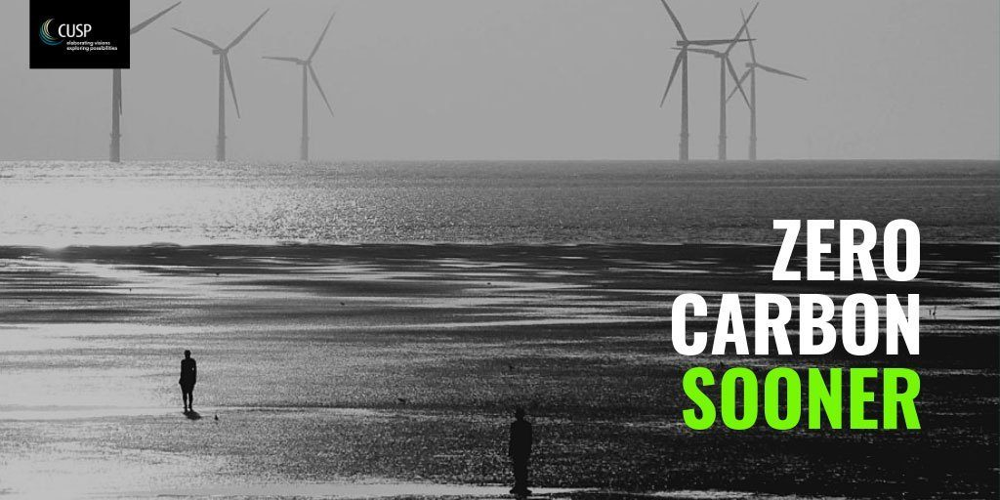

Im Juli hat [Tim Jackson](https://timjackson.org.uk/) in dem Aufsatz [Zero Carbon Sooner—The case for an early zero carbon target for the UK](https://www.cusp.ac.uk/themes/aetw/zero-carbon-sooner/) begründet, warum Großbritannien wesentlich früher als—wie derzeit geplant—bis 2050 CO2-neutral werden muss, wenn es einen fairen Beitrag dazu leisten will, die globale Erhitzung bei weniger als 1,5° Celsius zu stoppen.

Cover: Anthony Gormley's 'Another Place' in Liverpool; photographed by Bernie Catterall / Flickr (CC-BY 2.0)

Jackson stellt auf knappen Raum konkret und unaufgeregt dar, warum diese Reduktion notwendig ist und was sie bedeutet. Knapp zusammengefasst, erfordert das vorhandene CO2-Budget, dass Großbritannien ab sofort den Ausstoß an Treibhausgasen jährlich um etwa ein Viertel reduzieren und die CO2-Neutralität zwischen 2025 und 2030 erreichen muss. Man kommt vermutlich zu ähnlichen Ergebnissen, wenn man seinen Ansatz auf andere europäische Länder überträgt, wobei Großbritannien [seit 1980 seine Emissionen deutlicher reduziert hat als Deutschland und Österreich auf niedrigem Niveau praktisch nichts getan hat](https://en.m.wikipedia.org/wiki/List_of_countries_by_carbon_dioxide_emissions_per_capita).

Jackson gegründet genau, wie hoch das Pro-Kopf-CO2-Budget in Großbritannien noch ist, und bezieht dabei ein, dass

- das Land in der Vergangenheit besonders stark zu den Treibhausgasen beigetragen hat, die sich heute in der Erdatmosphäre befinden, und
- dass ein großer Teil der von den Einwohnern eines hoch industrialisierten Landes verursachten CO2-Produktion in anderen Ländern zustande kommt—insgesamt etwa 60%.

Jackson argumentiert ausgehend von den Aussagen des Weltklimarats über das globale CO2-Budget:

> Die jüngste Schätzung des IPCC über das verfügbare globale CO2-Budget (ab Ende 2017), die uns eine Chance von 66% gibt, innerhalb des 1,5o C Erwärmungsziels zu bleiben, beträgt 420 GtCO2 (Milliarden Tonnen CO2). Dieses Budget wird durch die derzeitigen Emissionen um 42 Gt CO2 pro Jahr verringert. (The most recent IPCC estimate of available global carbon budget (from the end of 2017) that would give us a 66% chance of remaining within the 1.5o C warming target is 420 GtCO2 (billion tonnes of CO2). This budget is being depleted by current emissions of 42 Gt CO2 per annum. Übers. von H.W. mit Hilve von deepl.com.)

Wenn man annimmt, dass 2050 10 Milliarden Menschen auf der Erde leben werden, ergibt sich, dass für die rund 70 Millionen Einwohner Großbritanniens ein Budget von 2,9 Gigatonnen CO2 bleibt. Dieses Budget reduziert Jackson maßvoll, da Großbritannien überproportional zu den bereits in der Atmosphäre vorhandenen Treibhausgasen beigetragen hat, und die Länder des globalen Südens in den kommenden Jahrzehnten mehr CO2 verbrauchen müssen als die reichen Länder, um die Armut zu bekämpfen. Er kommt zu einem Budget von 2,5 Gigatonnen für Großbritannien.

Der aktuelle CO2-Verbrauch der Briten (einschließlich des außerhalb von Großbritannien durch Produktion und Transport von dort verbrauchten Gütern produzierten CO2) liegt bei jährlich 660 Millionen Tonnen. Wollte man diesen Verbrauch bis 2050 linear reduzieren, dann würde bei weitem mehr CO2 produziert, als es das Gesamtbudget von 2,5 Gigatonnen zulässt. Den Überhang müsste man aus der Atmosphäre entfernen (_negative Emissionen_). Die Annahme, dass Techniken dafür bis 2050 in ausreichendem Maß zur Verfügung stehen, ist hochspekulativ.

Wenn die CO2-Emissionen linear so reduziert werden sollen, dass Großbritannien sein Gesamt-Budget einhält, dürfte das Land bereits 2025 keine CO2-Emissionen mehr verursachen. Eine nichtlineare Reduktion würde mehr Zeit lassen, aber in manchen Jahren innerhalb dieses Zeitraums noch radikalere Maßnahmen erfordern. Jackson schreibt über mehrere Alternativen innerhalb eines fairen CO2-Budgets, die aber alle eine vergleichbar radikale Veränderung der Wirtschaft erfordern.

![Historische Emissionen und zukünftige Emissionspfade (Verbrauchsperspektive) | a) Reduktionsrate entsprechend dem aktuellen Trend; b) Zero Carbon 2050 entlang eines linearen Pfades c) Zero Carbon 2025 entlang eines linearen Pfades; d) 24% jährliche Reduktionsrate. Die gestrichelte vertikale Linie zeigt den Punkt an, an dem das Kohlenstoffbudget für die Wege (a) und (b) ausgeschöpft ist. Quelle: <https://www.cusp.ac.uk/themes/aetw/zero-carbon-sooner/#1475182667098-0328ae0f-4bcb3691-b07686d5-d83f5228-4386ff54-925d>](https://i0.wp.com/www.cusp.ac.uk/wp-content/uploads/Fig-2-Historical-emissions-and-future-emission-pathways-consumption-perspective.jpg?w=1000&ssl=1)

Es ergibt sich:

> Es stellt sich heraus, dass das späteste Datum, zu dem wir auf einem linearen Weg ohne Überschreitung des Kohlenstoffbudgets auf Null Kohlenstoff hinarbeiten könnten, Ende 2025 sein würde. (It turns out that the latest date at which we could aim for zero carbon along a linear pathway without exceeding the carbon budget would be the end of 2025. Übers. H.W. mit Hilfe von deepl.com ).

Pro Jahr ein Viertel weniger Treibhausgas-Emissionen zu fordern, wirkt utopisch und naiv. Wenn man die Forderung durchdenkt, kommt man zu dem Ergebnis, dass sie durchaus umsetzbar ist, und dass ihre Umsetzung einem Szenario, bei dem das Klima weltweit komplett aus dem Ruder läuft, sicher vorzuziehen ist. Außerdem ist diese Zielsetzung konkret, und sie verspricht, dass nach 2025 tatsächlich ein Zustand erreicht ist, in dem Wirtschaft und Gesellschaft auf einer anderen Grundlage funktionieren.

Die Umsetzung der Überlegungen Jacksons würde bedeuten, dass man der Gesellschaft klar sagt, dass alle Aktivitäten, die CO2 produzieren, im Jahr durchschnittlich um 25% reduziert werden müssen. Das ist eine Größenordnung, die vorstellbar ist, wenn man sie für die verschiedenen Sektoren übersetzt. Sie könnte bedeuten, dass man 25% weniger mit dem Auto fährt, dass man 25% weniger Flugzeuge benutzt, dass 25% weniger Fleisch gegessen wird, dass 25% weniger neu gebaut wird, und dass 25% weniger Handel getrieben wird, bei dem CO2 durch den Transport produziert wird oder aber bei der Produktion der gehandelten Güter ausgestoßen wird. Außerdem würde die Industrieproduktion, für die CO2 verwendet wird, auch um 25% sinken. Parallel müsste sich die Gesellschaft und die Wirtschaft deutlich verändern. Es müsste massiv in regenerative Energien investiert werden und an die Stelle der Globalisierung der letzten Jahrzehnte würde eine Umstellung auf lokale Produktion und lokale Dienstleistungen treten, in Verbindung mit einer Form der Digitalisierung, die die Produktion materieller Güter verringert statt sie zu vergrößern.

Ich möchte dieses Degrowth-Szenario hier nicht ausmalen. Wer bis hierher gelesen hat, hält mich wahrscheinlich schon jetzt für eine Spinner. Jacksons Aufsatz ist ein guter Startpunkt um sich zu überlegen, wie eine radikale Reduzierung von Treibhausgasen in einem westeuropäischen Land aussehen könnte. Alle Alternativen dazu, das ist sicher, führen in viel dramatischere Situationen.

_Bemerkungen zu diesem Post_: Ich bin auf Tim Jackson erst in der vergangenen Woche aufmerksam geworden, und zwar durch den Artikel [In the age of extinction, who is extreme? A response to Policy Exchange.](https://www.opendemocracy.net/en/oureconomy/age-extinction-who-extreme-response-policy-exchange/). Darin wird auf einen TED-Vortrag Jacksons hingewiesen:

https://youtu.be/NZsp\_EdO2Xk

Jacksons Buch [Wohlstand ohne Wachstum](https://www.oekom.de/nc/buecher/vorschau/buch/wohlstand-ohne-wachstum-das-update.html) erscheint gerade aktualisiert. In der ZDF-Mediathek kann man sich noch bis zum 6.8.2020 die Dokumentation [Die großen Irrtümer der Globalisierung](https://www.zdf.de/dokumentation/zdfinfo-doku/die-grossen-irrtuemer-der-globalisierung-104.html) ansehen, in der Jackson mehrfach zu Wort kommt. Jacksons Aufsatz gibt mir die Hoffnung, dass meine Überlegungen, wie man [Graz bis 2025 klimaneutral machen kann](https://wittenbrink.net/lostandfound/wie-koennen-wir-graz-bis-2025-klimaneutral-machen-vorueberlegungen/), nicht willkürlich sind.
