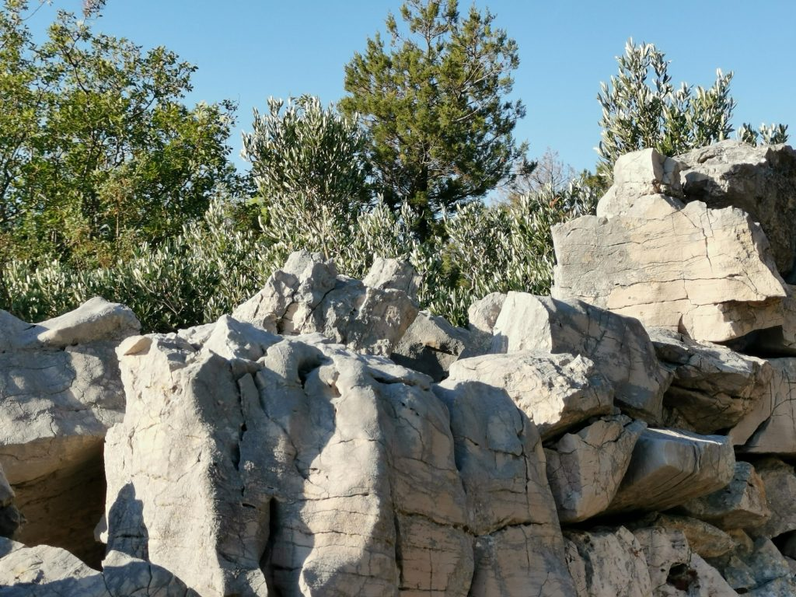

\[caption id="attachment\_9558" align="aligncenter" width="700"\] Mauer auf Žirje (Bild: Anastasija Georgi)\[/caption\]

Am Donnerstagabend sind wir aus Kroatien zurückgekommen. Ich muss mich nicht nur an Graz gewöhnen, sondern auch daran, wieder zu bloggen. Nicht einmal der Editor ist mir noch ganz vertraut.

Wir waren drei Wochen auf der Insel Žirje—eine der ruhigsten, die wir finden konnten. Ich habe drei Wochen auf die Hafenbucht vor unserer Terrasse geschaut. Wasser und Wind änderten sich fast täglich—von einem Sturm, den auch die Einheimischen im August so noch nicht erlebt hatten, bis zu fast absoluter Windstille vor unserer Abfahrt. Wir sind fast jeden Tag mit dem Rad gefahren oder spazieren gegangen, zwischen Kalkstein-Mauern, zum Teil gepflegt oder wiederhergestellt und oft zu Steinhaufen zerfallen. Irgendwann haben sie wohl die ganze Insel mit einem Raster überzogen. Heute wachsen vor allem Kiefern auf Žirje. Wir haben uns mit [unsere Vermietern](http://www.apartmani-skoric.hr/de/) angefreundet, die uns in das Leben auf der Insel eingeführt und und mit Öl, Wein und manchmal auch mit selbstgefangenem Fisch versorgt haben. Wir haben mit ihnen zusammen geholfen, für ein EU-Projekt (die gibt es auch auf Žirje), Steinbänke und Tische auf den Anhöhen der Insel aufzustellen. Wir sind bei der Velika-Gospa-Prozession am 15. August mitgegegangen. Wir haben uns immer öfter und immer lieber vorgestellt, wie es wäre, auf dieser Insel zu leben. Wir sind wehmütig weggefahren und haben unseren Gastgebern versprochen, bald wiederzukommen.

Harter Schnitt: Für die letzte Woche sind wir in das überfüllte Dubrovnik gefahren, mehr zum Besuch bei Anas Familie als um Urlaub zu machen. Wir haben Konzerte und eine Ausstellung besucht und besprochen, wie unsere [off\_gallery](https://offgallery.at/) mit der Dubrovniker [Galerie Otok](http://www.arl.hr/hr#naslovnica) zusammenarbeiten kann. Wie fast alle in Dubrovnik hängt auch Anas Familie vom dem krebsartig gewucherten Tourismus ab, der hier jede andere wirtschaftliche Entwicklung erstickt. Der Tourismus stresst alle, die an ihm beteiligt sind—auch die Besucher, die in Gruppen durch die Stadt geschleust werden. Zwischendurch haben wir uns trotzdem erholt, am meisten vielleicht, wenn wir von der [Gradska Kavana](http://www.nautikarestaurants.com/gradska-kavana-arsenal/) oder von den seltenen freien Plätze vor der [Buzz Bar](https://thebuzzbar.wixsite.com/buzz) aus auf die Leute geschaut haben, die sich —oft perfekt gestylt—wie auf Laufbändern an uns vorbei bewegten. Man kann es im Sommer in Dubrovnik aushalten, aber man muss dazu sehr fasziniert von dieser Stadt sein.

Ich habe nicht ganz auf soziale Medien und Nachrichten verzichtet, aber ich habe darauf verzichtet, zu reagieren, und ich habe auch nur sehr selektiv gelesen (die Feeds, die mir [Tiny Tiny RSS](https://tt-rss.org/) liefert, das ich endlich eingerichtet habe). Ich habe viel über meinen Konsum von Online-Inhalten nachgedacht—nicht nur über die Frage, wie ich ihn organisiere und begrenze. Wie immer in den letzten Monaten denke ich dabei an die Klimakatastrophe und daran, was _Inhalte_ und _Inhaltskonsum_ mit ihr zu tun haben. Der, wenn man es so zusammenfassen kann, marktgemäße Umgang mit Inhalten und Informationen erscheint mehr immer mehr als Problem und nicht als Lösung, als Ursache der _epistemischen Krise_ und nicht als Gegenmittel. Zu den Transformationen, die wir jetzt brauchen, gehört sicher auch eine Transformation des Umgangs mit Inhalten und Information. Jetzt, in Kroatien, hat mich aber mehr die persönliche als die gesellschaftliche Transformation beschäftigt: Wie komme ich von Dauerbeunruhigung und Scheinreaktionen los, wie komme ich weg von einem medialen [Default Modus](https://www.ncbi.nlm.nih.gov/pmc/articles/PMC4529365/), der Illusionen erzeugt—ohne dass ich auf Informationen und Öffentlichkeit verzichte, ohne mich also in einen Dauerurlaub oder in eine Nische zurückzuziehen? Ich habe keine Antwort auf diese Frage, aber ich möchte mehr mit Praktiken und Werkzeugen experimentieren, die auch bei Inhalten in das [Postwachstum](http://www.postwachstumsoekonomie.de/material/grundzuege/) führen. Ich hoffe, dass mir die Erholung dabei hilft.
