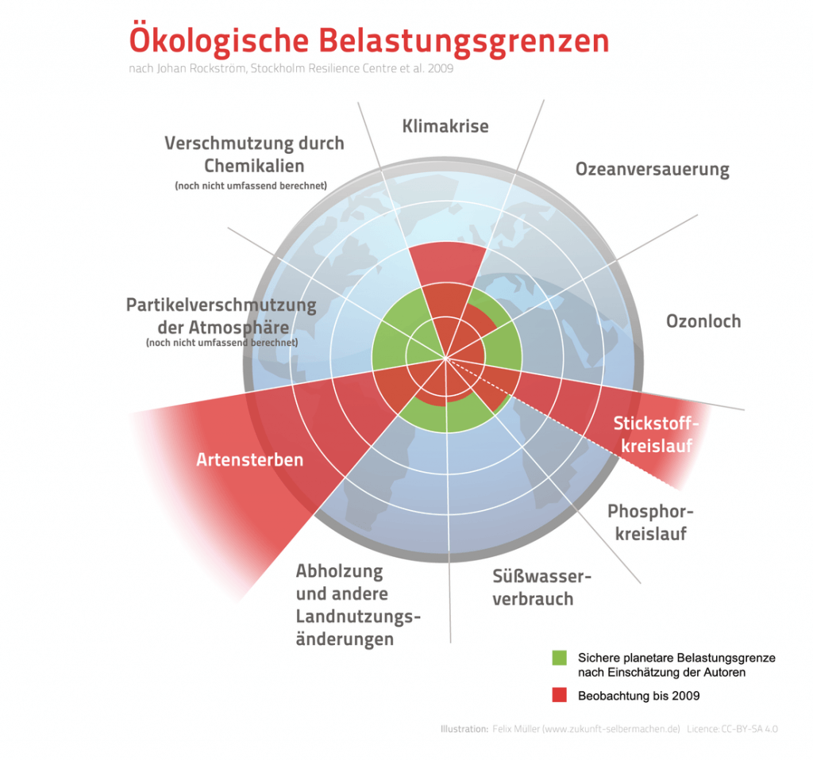

[Die Klimakrise macht verrückt](https://www.fr.de/kultur/literatur/verruecktwerden-11019073.html), schreibt Latour—davon kann ich mich nicht ausnehmen. Es ist wahrscheinlich unangemessen und vielleicht sogar lächerlich, ein epochales Phänomen wie die globale Erhitzung in einem Blog mit Thesen zu begleiten. Ich habe die folgenden Thesen formuliert, um meine Gedanken zu ordnen und um mich in Diskussionen auf sie beziehen zu können. Wichtiger als diese Thesen selbst sind mir ihre Konsequenzen etwa in Content-Strategie und Webkommunikation oder bei lokalen politischen Aktionen. Ich freue mich über Widerspruch und Diskussion.

Copyright: Visuelle Darstellung der „planetary boundaries“ nach Johan Rockström et al. 2009; Felix Mueller CC-BY-SA 4.0, via Wikimedia Commons

## 1\. Disruption

Die Klimakrise und das Durchbrechen der [Planetary Boundaries](https://www.stockholmresilience.org/research/planetary-boundaries/planetary-boundaries/about-the-research/the-nine-planetary-boundaries.html) führen zu disruptiven Veränderungen, die alle gesellschaftlichen Veränderungen, zu denen es seit 1950 gekommen ist (Übergang zur Wissensgesellschaft, Digitalisierung, Globalisierung) um Dimensionen übertreffen. Im 21. Jahrhundert wird es keine wirtschaftlichen, gesellschaftlichen und technischen Entwicklung geben, die unabhängig von der Klimakrise eingeschätzt und gesteuert werden kann.

## 2\. Notstand

Eine adäquate Reaktion auf die Klimakrise ist nur durch Notstandsmassnahmen möglich, die in ihren Folgen wenigstens denen nach den Weltkriegen des 20. Jahrhunderts entsprechen. Sie werden um so wirksamer sein, je schneller sie eingeleitet werden. Keiner der bestehenden Besitzstände kann dabei als selbstverständlich vorausgesetzt werden.

## 3\. Décroissance

Die globale Erhitzung und das Überschreiten der übrigen Planetary Boundaries lassen sich nur wirksam bekämpfen, wenn die Wirtschaft sofort auf die Minimierung des Verbrauchs materieller Güter statt auf Wachstum ausgerichtet wird. In den reichen Ländern bedeutet das eine Rückwachstums-Strategie.

## 4\. Persönliches Verhalten

Angesichts der Notstandssituation setzen Gegenstrategien eine radikale Veränderung des Verhaltens der Bevölkerung voraus. Sie lässt sich glaubhaft nur nur von Menschen vertreten, die selbst nicht mehr Ressourcen verbrauchen und vor allem nicht mehr CO2 erzeugen, als es für jeden Menschen auf der Erde ohne hohe Risiken für die Zukunft möglich ist.

## 5\. Eliten

Die Kompetenzen der politischen, wirtschaftlichen und medialen Eliten befähigen sie nicht zum Umgang mit der Klimakrise, sondern hindern sie daran—vor allem durch die Orientierung an finanziellem Erfolg und am Wettbewerb. Die Eliten sind Problemlösungs-, Herrschafts- und Kommunikations-Praktiken gewohnt, in denen Gesellschaft und Natur voneinander getrennte Handlungsräume sind und in denen sie für ihr Agieren als Teil eines Erdsystems nicht verantwortlich sind.

## 6\. Gerechtigkeit

Globale Erhitzung und Überschreiten der Planetary Boundaries werden vor allem von den Reichen im nationalen und internationalen Maßstab verursacht. Dabei ist Hoffnung auf die Ergebnisse des Wachstums das zentrale Motiv für die global und im nationalen Vergleich Armen, die (wachsende) wirtschaftliche Ungleichheit zu ertragen. Eine Bekämpfung der Klimakrise und ein Abschied von Wachstum erfordern deshalb, die wirtschaftliche Ungleichheit durch Umverteilung und Ausgleich statt durch Wachstum abzubauen.

## 7\. Desinformation

Die existenzielle Gefährdung der Menschheit durch die globale Erhitzung und durch das Ignorieren der übrigen Planetary Boundaries sind so leicht zu erkennen, dass alle, die an der Fortsetzung des aktuellen Zustands Interesse haben—und das sind vor allem große Teile der Wirtschaft—Änderungen mit massiven Desinformations-Kampagnen bekämpfen und bekämpfen werden. Die Desinformation und die Auseinandersetzung damit werden die ideologischen Debatten in der absehbaren Zukunft bestimmten.

## 8\. Wissenschaft

Erfolgreich gegen die globale Erhitzung zu kämpfen bedeutet, das öffentliche Handeln an wissenschaftlichen Erkenntnissen zu orientieren. Das erfordert eine Veränderung der institutionellen Rolle und des gesellschaftlichen Verständnisses von Wissenschaft. Die Wissenschaft darf sich nicht zum apolitischen Elfenbeinturm neutralisieren lassen, der die Interpretationshoheit den bestehenden nichtwissenschaftlichen Eliten überlässt.

## 9\. Lokale Aktionen

Globales und Lokales sind durch den Klimanotstand paradox miteinander verbunden: Die Globalisierung zwingt zur Relokalisierung. Lokales Verhalten wirkt sich unmittelbar global aus: Jedes Kilo CO2, das ich hier erzeuge, verkleinert das CO2 Budget weltweit. Auf diese Situation kann man wirksam nur mit lokalen Gegenmaßnahmen reagieren, also z.B. indem man die eigene Stadt konsequent und kurzfristig CO2-neutral macht. Alle anderen Strategien sind wirkunsgloser und verschieben die Verantwortung entweder auf die, die weniger CO2 erzeugen, oder auf die, die noch mehr CO2 produzieren.

## 10\. Ideologie

Die Bedingungen des [Anthropozäns](http://quaternary.stratigraphy.org/working-groups/anthropocene/) sind radikal verschieden von denen, in denen Gesellschaften in einer _Umwelt_ agierten, die höchstens in Teilaspekten von menschlichen Handlungen beeinflusst wurden. Die herkömmlichen Ideologien des Marktliberalismus und des Sozialismus (und schon gar nicht die des Nationalismus) können auf diese neuen Bedingungen nicht adäquat antworten. Alle Lösungsversuche müssen sich an der aktuellen wissenschaftlichen Erforschung des Erdsystems in seiner Komplexität orientieren.
