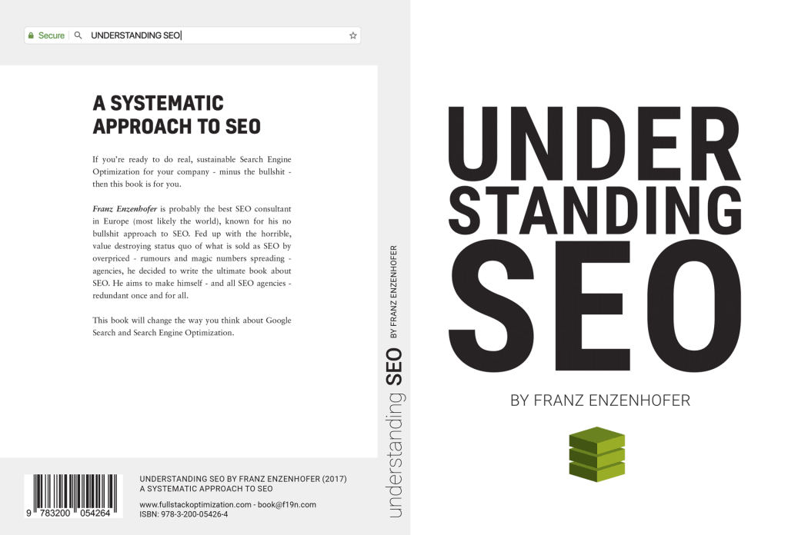

Am Freitag gebe ich wieder einmal bei der Summer Business School der FH ein Seminar zum [Texten für das Web mit Google und Co.](https://www.sbs.fh-joanneum.at/a11/?sem=A11), diesmal zusammen mit [Carmen Ausserhuber](https://mariah.at/). Zur Vorbereitung habe ich im Juli endlich das [SEO-Buch von Franz Enzenhofer](https://www.fullstackoptimization.com/b/understanding-seo) gelesen. Ich versuche gerade, in meine alte [SEO-Präsentation](https://heinzwittenbrink.github.io/slides-intro2seo/#/title-slide) einzuarbeiten, was ich dabei gelernt habe—und das ist ziemlich viel.

Cover von: Franz Enzenhofer, Understanding SEO

Hier ein Versuch, thesenartig einige der wichtigsten Aussagen des Buchs aufzulisten (ohne Anspruch auf Vollständigkeit und Ordnung):

1. Erfolg in der Suche ist nicht das Ergebnis einer isolierten Tätigkeit namens SEO, sondern beruht auf der Arbeit einer ganzen Organisation oder Firma. (Beispiel: Wenn ein Studiengang der FH Joanneum gefunden werden soll, dann muss dieser Studiengang selbst einen Namen—und damit auch einen Inhalt—haben, der in der Suchmaschine Erfolg hat. Sich durch scheinbare Originalität abzugrenzen, ist kontraproduktiv.)
2. Da Erfolg in der Suche das Ergebnis der Arbeit einer ganzen Organisation ist, müssen auch alle in der Organisation dafür koordiniert zusammenarbeiten. Wie immer, wenn es um Online-Kommunikation geht (Content-Strategie, Interne Kommunikation), sind Silos der Feind des Erfolgs.
3. Eine entscheidende Rolle spielt es, dass die eigene Marke gefunden und im richtigen Kontext gefunden wird. Wer etwas sucht, muss darauf vertrauen können, in dem mit meiner Marke verbunden Angebot die bestmöglichen Informationen (oder Transaktionmöglichkeiten) zu finden.
4. Optimierung ohne eine Business-Ziel ist sinnlos. So lange ich nicht weiss, warum sich jemand mit meinem Angebot beschäftigen soll (also kein konkretes Business-Ziel habe), kann und brauche ich auch nicht zu optimieren. Auch hier zeigt sich, dass Content-Strategie und SEO untrennbar miteinander verbunden sind.
5. SEO ist vor allem eine Sache der kontinuierlichen Praxis. Man muss kontinuierlich mit konkreten Zielen und datengestützt daran arbeiten, besser gefunden zu werden. Enzenhofer empfiehlt, dass wenigstens einmal im Jahr alle Angebote überarbeitet werden (also mindestens 2% wöchentlich). Auch hier ist die Verbindung zur Content-Strategie bzw. zu den Content Operations deutlich, die inzwischen in den Fokus der Content-Strategie gerutscht sind.
6. Auch in Verbindung mit SEO ist der Long Tail meist am wichtigsten. Es kommt in der Regel vor allem darauf an, mit _Nischeninhalten_ da Erfolg zu haben, wo noch niemand anderes ist. In diesem Zusammenhang (dieser Punkt ist natürlich nicht nur von Enzenhofer): Jede einzelne Seite muss spezifisch _getargeted_, also auf eine eigene Suchabfrage hin erstellt werden (Enzenhofer vermeidet es von der Optimierung für _Keywords_) zu sprechen.
7. Die wichtigsten Quellen für SEO-Wissen sind die Spezifikationen von Google und anderen Suchmaschinen-Anbietern und die begleitenden Informationen. Wenn man sich an ihnen orientiert, kann man sich die pilzartig im Netz wuchernden SEO-Tipps und ähnliches sparen.
8. Eine entscheidende Rolle für den Erfolg in der Suche spielt die _Distribution_. Gemeint ist damit die Mitteilung an Suchmaschinen, was auf einer Site indiziert werden kann. Deshalb muss man sich um [XML-Sitemaps](https://www.sitemaps.org/index.html) und die interne Verlinkung sorgfältig kümmern.
9. Der wichtigste Gesichtspunkt bei der Aktualisierung von Seiten ist die Diversität. Bei einer Seite, die aus Text-Abschnitten besteht, sind weitere oder neue Textabschnitte weit weniger wichtig als z.B. Listen oder Medien. Suchmaschinen sind vor allem an unterschiedlichem Material zu einem Thema interessiert, nicht an mehr von dem, was es schon gibt.
10. Google (und andere Suchmaschinen) lassen sich nicht _reverse-engineeren_. Man muss kontinuierlich experimentieren, aber man hat —über sehr allgemeine Prinzipien hinaus—keine Chance nachzuvollziehen, wie sie arbeiten.

Das ist eine provisorische Auflistung einiger Punkte aus dem sehr empfehlenswerten Buch (empfehlenwert vor allem auch wegen der vielen Details). Was mir immer klarer wird: SEO und Content-Strategie (nicht im verkürzten Marketing-Sinn, sondern im Sinne des strategischen, Domain-bezogenen Designs) sind Aspekte derselben Sache.
