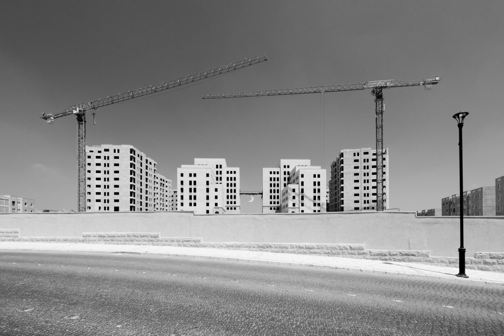

Aus: “The Promise of the City”. © Martin Grabner

Gestern haben wir in der [Off\_gallery](https://offgallery.at/) die erste Ausstellung des Herbstprogramms eröffnet: Bilder [Martin Grabners](http://www.martingrabner.com/) unter dem Titel [The Promise of the City](https://offgallery.at/ausstellungen/the-promise-of-the-city/). Der Text zur Ausstellung auf unserer noch sehr provisorischen Website ist von Martin selbst und bildet eine Ausgangspunkt für die Interpretation.

Ausgedruckt und gehängt (von Martin und [Erika Petric](https://erikapetric.com/)) habe ich die Bilder gestern selbst zum ersten Mal gesehen. Ich versuche sie zu verstehen, vielleicht sollte ich eher sagen: sie zu lesen. Ich bin damit noch am Anfang, und ich habe mit Martin auch noch nicht über die fertige Ausstellung gesprochen.

Ich nehme einen Widerspruch zwischen dem wahr, was die Bilder darstellen, und dem, wie sie es darstellen. Sie zeigen Blicke auf die, wie Martin es nennt, _neoliberale_ Stadtentwicklung. Sie tun das in einer sehr artifiziellen Weise, mit einer vielschichtigen Bildsprache, zu der für mich der Bildaufbau aus Massen gleichartiger kubischer Elemente, Zentralkompositionen, ein fast verfremdender Schwarz-Weiss-Kontrast und der Gegensatz zwischen den repetitiven architektonischen Elementen und Spuren oder Zeichen von menschlichen Aktivitäten und Pflanzen gehören. Zu dem, was sie darstellen, fallen mir Ausdrücke wie _developer_, _development_ ein, die ich zum ersten Mal in Verbindung mit den Geschäften Trumps gelesen habe: _development_ im Sinne der Maximierung des Profits, der sich aus Immobilien schlagen lässt. Die Bilder zeigen kleinere und große Gebiete in Städten (London, Ramallah, Haifa, Athen), die _entwickelt_ wurden und werden—Zonen, in denen in kürzester Zeit mit massivem Einsatz von Kapital und Technik Bauten hochgezogen werden, die sich im großen Stil als Wohnungen oder Büros vertreiben lassen. Die Gebäude sind Hüllen, an denen Spuren menschlichen Gebrauchs unpassend wirken. Fotografiert sind sie statt aus der Perspektive des _developers_ oder des Verkäufers mit dem Anspruch eines Architekturfotografen, dessen Inszenierungen die Frage stellt, was sie sein könnten oder was an iher Stelle sein könnte. Man fragt sich, was an ihnen schön, richtig sein könnte, weil sie gut fotografiert werden. Die Bilder geben aber auf diese Frage keine Antwort. Sie lassen nur vermuten, dass diese Antwort von den Menschen und der Natur kommen könnte, die für die Immobilienentwicklung nur als Marktteilnehmer relevant sind und sonst beseitigt werden.

Um die Bilder weiter zu analysieren, könnte man versuchen, Akteure und narrative Strukturen in ihnen zu identifizieren: Die _developer_, deren Macht (das _pouvoir_ der [Greimas'schen Modalitäten](https://www.persee.fr/doc/lgge_0458-726x_1976_num_10_43_2322)) sich in den Gebäuden ausdrückt, die (meist abwesenden) menschlichen Nutzer, Pflanzen und Landschaftselemente, die mehr oder weniger übriggeblieben sind (eine Erinnerung daran das inzwischen die [Technosphäre jedem Quadratmeter der Erdoberfläche mit mehr als 50 kg belastet](https://www.sciencedaily.com/releases/2016/11/161130085021.htm)), die Kamera und der Fotograf/Bildbearbeiter, deren Aktionen und deren Wissen von den Bildern genauso dokumentiert werden wie Willkür und Zufälligkeit der dargestellten Objekte.

Mich werden diese Aufnahmen sicher noch lange beschäftigen, auch die Konstellation, zu der die Bilder, ihre Objekte, der Ausstellungsraum in der Griesgasse und der Blick von dort zum Schlossberg und zum Griesplatz gehören.
