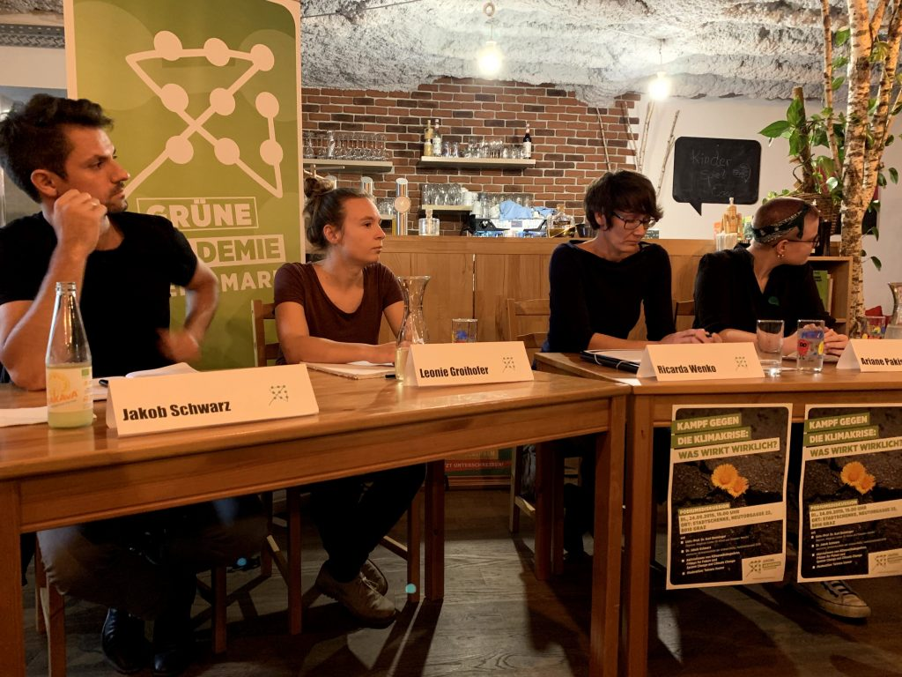

Kampf gegen die Klimakrise–Was wirkt wirklich? Teil des Podium bei der Diskussion am 24.9.2019 in Graz

Gestern war ich auf einer Veranstaltung der Grünen Akademie Graz: [Kampf gegen die Klimakrise: Was wirkt wirklich?](https://www.facebook.com/events/708833832920578/)

Eingeladen waren Vertreterinnen und Vertreter unterschiedlicher Organisationen, die sich hier in Graz gegen den Klimanotstand engagieren: von den Grünen, die eingeladen hatten ([Jakob Schwarz](https://stmk.gruene.at/jakob-schwarz)) über [System Change, not Climate Change!](https://systemchange-not-climatechange.at/de/blog/) (Leonie Groihofer), das [Klimavolksbegehren](https://klimavolksbegehren.at/) (Ricarda Wenko) und [Fridays For Future](https://www.fridaysforfuture.at/regionalgruppen/graz) (Ariane Pakisch) bis zur Klima- und Systemwissenschaft, die [Alfred Posch](https://online.uni-graz.at/kfu_online/wbforschungsportal.cbshowportal?pPersonNr=50605) vertrat, und zu [Extinction Rebellion Austria](http://xrebellion.at/), für die sich Elisabeth Zury noch auf das Podium gesetzt hat. Die Veranstaltung war sehr dicht, und die Diskussionen waren, trotz unterschiedlicher Akzente bei einzelnen Fragen wie der Benennung der Klimakrise in der Öffentlichkeit, kaum kontrovers.

Die Sitzordnung auf dem Podium hat das Spektrum der verschiedenen Gruppen gut repräsentiert: von den pragmatischen Grünen auf der einen Seite bis hin zu den Positionen der österreichischen Klimaforschung und dem Aktivismus von Extinction Rebellion (die ich unterstütze) auf der anderen Seite. Es hat auch gut gepasst, dass Fridays For Future und das Klimavolksbegehren in der Mitte saßen. Mein Eindruck war, dass alle diese Formen sich zu engagieren, notwendig sind und dass sie zusammengehören. Notwendig sind die realpolitische Erfahrung, die die Grünen inzwischen haben, und eine breite Mobilisierung, die die Bevölkerung heute und so, wie sie ist, erreicht. Notwendig sind aber auch das Insistieren auf den wissenschaftlichen Ergebnissen und ziviler Ungehorsam, um auf die Dramatik der Situation aufmerksam zu machen und den Verantwortlichen vor Augen zu führen, dass sie mit dem Klimanotstand nicht durch das _business as usual_ fertig werden, das in die Krise geführt hat.

Die Veranstaltung gestern, in der [internationalen Klimastreikwoche](https://de.globalclimatestrike.net/) und ein paar Tage vor der großen [Klima-Demo in Graz](https://www.fridaysforfuture.at/events/2019-09-27-earth-strike-grosser-klimastreik-fuer-die-zukunft), hat die Vertreterinnen der unterschiedlichen Organisationen und Bewegungen miteinander in Verbindung gebracht hat. Dazu haben auch die vielen Beiträge aus dem Publikum beigetragen. Diese Vernetzung ist sicher einer der wichtigsten Bedingungen dafür, noch wirksamer in die Bevölkerung hinein zu wirken. Die Grüne Akademie hat das toll gemacht!

Es waren sich gestern alle über die Dramatik der Situation einig, und es waren sich, wenn ich es richtig sehe, auch alle einig, dass nur eine radikal veränderte Wirtschaft und Gesellschaft überlebensfähig sein wird. Die eigentliche Herausforderung ist die Frage, mit welchen Schritten man diese Transformation konkret einleiten kann, ohne dass es zu Rückschlägen wie der Gelbwesten-Bewegung in Frankreich kommt. Weitere Treffen sollten vor allem diesen Punkt thematisieren. Hier in Graz und in den meisten anderen Städten in Österreich oder Deutschland hängt ein großer Teil der Bevölkerung wirtschaftlich von Industrien ab, die die Klimakrise weiter verschärfen. Was Graz angeht, braucht man nur Firmen wie Magna, Andritz oder die AVL zu nennen, die alle mehr oder weniger eng mit dem fossil-fuel-Komplex verbunden sind. Die Frage ist, wie man diese Industrien in konkreten Schritten und schnell umsteuert bzw. radikal verändert. Dazu ist mit Sicherheit ein sehr großes öffentliches Engagement notwendig—sprich: Interventionen der Stadt und des Staats, die mit extrem hoher Verschuldung verbunden sein werden. Wie das konkret aussehen kann, im großen Maßstab, aber auch und vor allem im kleinen Maßstab z.b. einer Stadt, ist eine entscheidende Frage. In diesem Zusammenhang fand ich die Statements von [Hannes Bauer](https://www.linkedin.com/in/hannes-bauer-7b27b125/?originalSubdomain=at) wichtig, der sich um eine Bürgerversammlung zum Klima hier in Graz bemüht.
