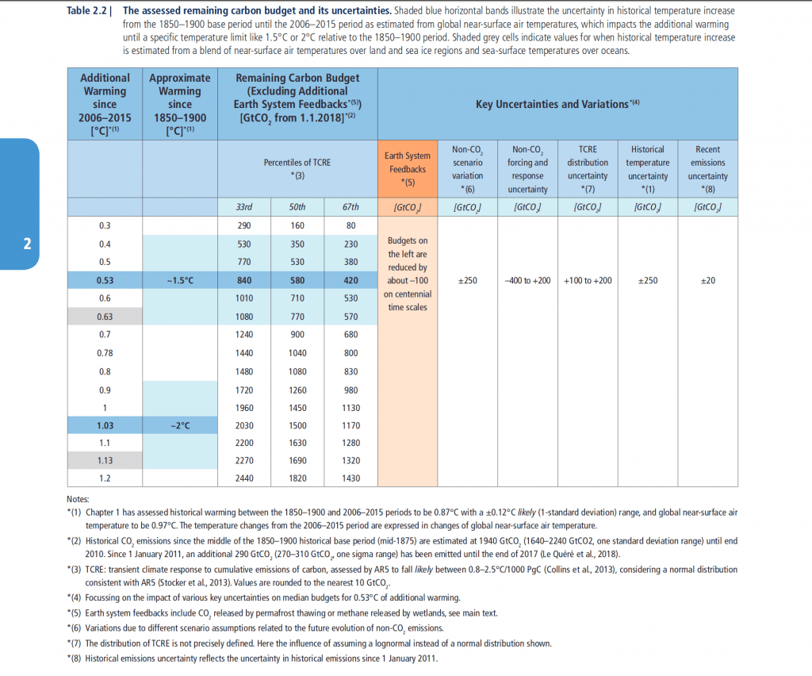

Twitter hat mich eben auf diesen Tweet von Greta Thunberg hingewiesen, den auch [Michael Mann](https://twitter.com/michaelemann) geliket hat:

https://twitter.com/GretaThunberg/status/1179507708493471744

Ich habe mir die Seite des Reports des Weltklimarats (deutsch [hier](https://www.de-ipcc.de/256.php)) herausgesucht und angesehen. Sie enthält vor allem diese Tabelle:

Das bedeutet im Kern, dass weltweit noch ca. 420 Gigatonnen CO2 freigesetzt werden können, um die Erderwärmung mit 66% Wahrscheinlichkeit auf 1.5° zu beschränken.

Um sicherzugehen, dass ich die Tabelle richtig verstehe, habe ich via Google u.a. dieses Zitat [auf der Site des -Mercator Research Institute on Global Commons and Climate Change](https://www.mcc-berlin.net/de/forschung/co2-budget.html)gefunden:

> Der Sonderbericht vom Oktober 2018 präsentiert neue Zahlen. Demnach können noch knapp 420 Gigatonnen (Gt) CO2 in die Atmosphäre abgegeben werden, um das 1,5-Grad-Ziel nicht zu verfehlen. Da die Welt jedoch jedes Jahr circa 42 Gt an CO2 ausstößt – rechnerisch entspricht dies 1332 Tonnen pro Sekunde – dürfte dieses Budget in gut neun Jahren aufgebraucht sein. Das Budget von circa 1170 Gt für das Zwei-Grad-Ziel wird in etwa 26 Jahren erschöpft sein.

Diese Zahlen sind nicht neu und sprechen für sich selbst. Ich notiere sie hier vor allem als Material für Präsentationen. Wer der Klimawissenschaft, Fridays For Future, Greta Thunberg persönlich und Bewegungen wie Extinction Rebellion vorwirft, dass sie zu radikal sind, hat diese Fakten nicht verstanden oder will nicht, dass man sie versteht.
