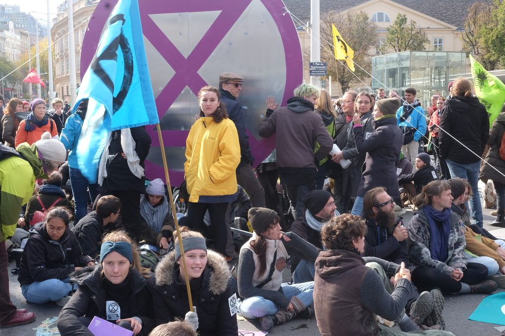

Ich war am Montag und Dienstag in Wien. Ich habe an der ersten Aktion der [Rebellion Week](http://xrebellion.at/wir-rebellieren-ab-7-oktober-in-wien-und-weltweit/) teilgenommen und viele XR-Mitglieder kennengelernt. Ich bin noch dabei, meine Eindrücke und Gedanken zu sortieren.

Zum ersten Mal erzielt [Extinction Rebellion](https://rebellion.earth/international-rebellion/) (XR) jetzt auch im deutschen Sprachraum größere Aufmerksamkeit —jedenfalls gibt es viele Kommentare in Zeitungen und viel Diskussion auf Twitter über XR. Einige machen es sich extrem einfach, wie auf der einen Seite [Jutta Ditfurth](https://twitter.com/jutta_ditfurth/status/1180904831566921729) und auf der anderen, noch primitiver, [Ulf Poschardt](https://weltnewscheck.podigee.io/623-neue-episode). Sie ordnen XR in ihre _unzerreissbare Weltanschauung_ ([Robert Musil](https://gutenberg.spiegel.de/buch/der-mann-ohne-eigenschaften-erstes-buch-7588/16)) ein.

Blockade am Plat der Menschenrechte in Wien, 7.10.2019

Ich kenne XR noch nicht gut. Aber schon aufgrund dessen, was ich bisher gelernt und auch erfahren habe, kann ich sagen, dass es sich um eine neuartige Bewegung (wenn dieser Ausdruck passt) handelt, deren Besonderheiten man nicht erfasst, wenn man mit Totschlags-Begriffen wie _Sekte_ operiert. Wenn man schon Analogien braucht: XR ist eher ein weltweites politisches Startup, dass auf eine neuartige Situation mit neuartigen Mitteln reagiert. Viele dieser Mittel sind von älteren Organisationen und Traditionen übernommen. Aber sie werden umfassend adaptiert und neu kombiniert. Wenn man über oder mit XR diskutieren will, sollte man versuchen, das Neuartige in den Blick zu bekommen. Es ergibt sich aus den Handlungs-Notwendigkeiten und Handlungsmöglichkeiten der aktuellen politischen und ökologischen Situation. Ein paar unabgeschlossene Gedanken dazu:

1. Die Mitglieder von XR nehmen die aktuelle ökologische Situation als eine **Krise mit apokalyptischem Potenzial** wahr und ernst. Sie reagieren sowohl auf die globale Erhitzung wie auf das sechste Massenaussterben, das bereits begonnen hat. Das Ausmaß und die Folgen dieser Krisen sind wissenschaftlich vielfach bestätigt und keine Erfindungen von XR. XR bezieht sich auf Tatsachen, über die wissenschaftlicher Konsens besteht, und schätzt die Risiken nicht anders ein als etwa der Weltklimarat oder der Papst in Laudato si.
2. XR ist eine politische Bewegung oder besser: eine **politische Aktion**. Ziel ist ein radikal veränderter politischer Umgang mit der ökologischen Krise. Deshalb sind die Adressaten der Aktionen die politisch Verantwortlichen, und deshalb agiert XR auch vor allem in den Hauptstädten. Ziel ist es nicht, Öffentlichkeitsarbeit zu machen, Interessenpolitik zu betreiben oder ein neues politisches System einzuführen, sondern die politisch Verantwortlichen zu zwingen, alles überhaupt Mögliche gegen eine weitere Verschärfung der ökologischen Krise zu unternehmen.
3. XR ist ein Versuch, angesichts der ökologischen Krise die **politschen Handlungsmöglichkeiten jeder und jedes Einzelnen** zu erweitern. Es geht darum, so wirkungsvoll und so schnell wie möglich zu agieren und sich dabei nicht von bestehenden Institutionen bremsen zu lassen. Die Konzentration auf politische Aktionsmöglichkeiten der Einzelnen in einer Notstandssituation—als Alternative zum passiven Hinnehmen einer Katastrophe—ist die wichtigste Eigenschaft von XR. Wenn man über XR diskutiert, sollte man vor allem über dieses Thema diskutieren. (Es geht um die _agency_ angesichts der ökologischen Katastrophe und um die Optionen im Vergleich zum Arbeiten in bestehenden Institutionen, in Parteien oder in anderen Bewegungen wie Fridays For Future.)
4. XR ist eine sehr professionell konzipierte, lernende Organisation, die vor allem darauf ausgerichtet ist, dass alle Teilnehmerinnen und Teilnehmer **zugleich dezentral und koordiniert** handeln. Trainings, Phasen der Regeneration, die Rollenverteilung in den Bezugsgruppen sind Mittel, um die Handlungsmöglichkeiten der Teilnehmerinnen zu erweitern, schnell zu wachsen und gemeinsam Ziele durchsetzen zu können.
5. Der Ansatz von XR ist **fokussiert und minimalistisch**. Es geht um wenige, aber relevante Ziele (#tellthetruth, CO2-Neutralität bis 2025, Bürgerversammlungen), die mit größtmöglichen Druck tatsächlich erreicht werden sollen. Dieser Minimalismus unterscheidet XR von klassischen, weltanschaulich orientierten politischen und sozialen Bewegungen. Man kann ihn kritisieren, aber man sollte ihn wahrnehmen und ernst nehmen.
6. Das **Prinzip der Gewaltlosigkeit und das Handlungskonzept von XR** sind nicht voneinander zu trennen. Jede Form von Gewalt würde die Organisation von innen zerstören und ihren Angehörigen die Handlungsmöglichkeiten nehmem, wegen denen sie bei XR teilnehmen. Der inklusive Ansatz von XR ist mit Gewalt nicht zu vereinbaren.
7. XR ist keine Sekte, sondern eine gemeinsame Aktion von Menschen, die die **ökologische Notstandssituation als existenzielle Krise** erfahren, auf die sie auch mit persönlicher Opferbereitschaft antworten. Die persönliche Opfer- oder Risikobereitschaft ist das wichtigste Element der Kommunikation von XR. Ohne sie würde XR nur Tatsachen wiederholen, die lange bekannt sind, aber bisher gemessen an ihrem Gewicht kaum politische Folgen hatten.

Soweit mein Versuch, Extinction Rebellion zu verstehen und auch zu verteidigen. Er ist eine persönliche Interpretation—ich spreche dabei nur für mich und diskutiere gerne darüber.
