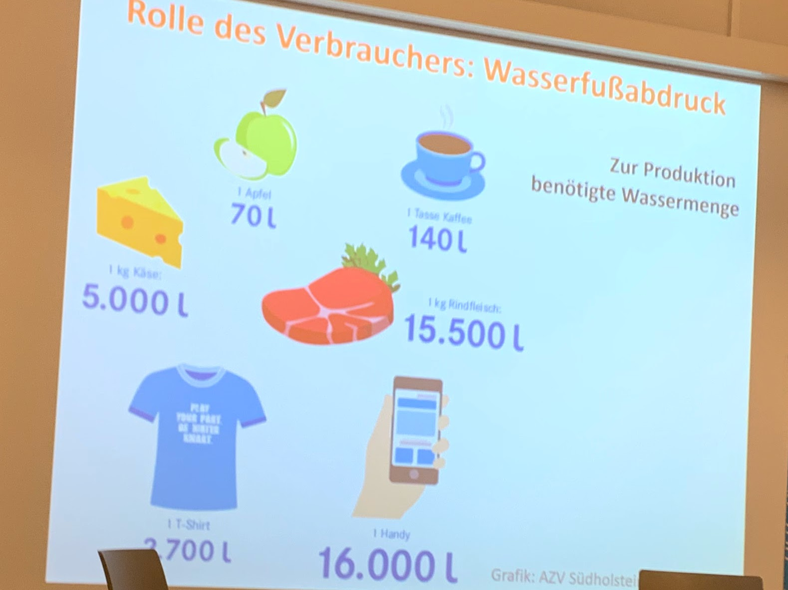
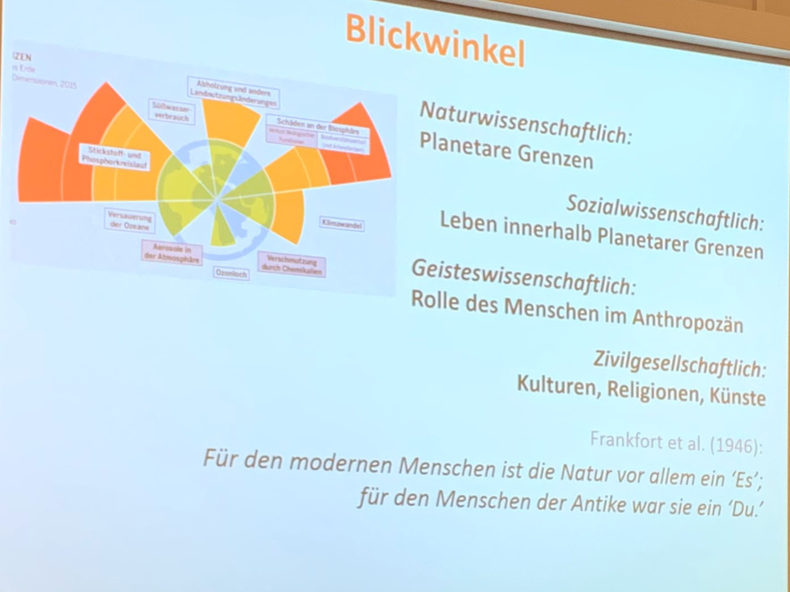

In der letzten Woche hat [Dieter Gerten](https://www.pik-potsdam.de/members/gerten) vom Potsdam Institut für Klimafolgenforschung in der katholischen Hochschulgemeinde einen [Vortrag über das Leben innerhalb der planetaren Grenzen](https://khg.graz-seckau.at/?d=wie-koennen-wir-innerhalb-planetarer-grenzen-leben-1) gehalten.

Ich habe mich für den Vortrage und den Vortragenden auch interessiert, weil das [Potsdam-Institut](https://www.pik-potsdam.de/pik-startseite) für mich inzwischen zu einem wichtigen intellektuellen Orientierungspunkt geworden ist. Auf das Institut gestoßen bin ich durch eine [Diskussion zwischen Bruno Latour und Hans Joachim Schellnhuber](https://soundcloud.com/hkw/discussion-with-bruno-latour-hans-joachim-schellnhuber) im letzten Jahr.

Ich bin noch dabei, den Vortrag für mich aufzuarbeiten. Viele der sehr informativen Folien, die Gerten gezeigt hat, habe ich inzwischen in verschiedenen Versionen online gefunden ([hier](https://www.bafu.admin.ch/dam/bafu/de/dokumente/daten-karten/praesentation/Vortrag%20Planetare%20Belastbarkeitsgrenzen.pdf.download.pdf/Vortrag%20Planetare%20Belastbarkeitsgrenzen.pdf), [hier](https://www.lehre-interdisziplinaer.tu-darmstadt.de/media/cisp_1/studienschwerpunkte/forum_nachhaltigkeit/gc_2016/1_Sitzung_PD_Dr_Gerten.pdf) und [hier](https://www.unternehmensgruen.org/wp-content/uploads/2016/11/PlanetareGrenzen_Gerten_PIK.pdf)). Ich gehe ihren Quellen nach. Ich möchte dieses Material gerne in der Lehre an der FH und für Talks bei Extinction Rebellion verwenden.

## Das Ende des Holozäns

Gerten hat mit einer sehr preußischen Bodenständigkeit und Bescheidenheit sehr viel Basiswissen der Erdsystem-Wissenschaft vermittelt und dabei, wenn ich es richtig sehe, auf zentrale Fakten und Quellen verwiesen. Er hat das Konzept der planetaren Grenzen dargestellt und außer über die globale Erhitzung über die übrigen Grenzen des Erdsystems und ihre Überschreitung gesprochen. Gerten hat sich selbst vor allem mit dem globalen Wasserverbrauch beschäftigt, der in seinem Vortrag auch eine große Rolle gespielt hat. Über Wasser und Wasserknappheit gibt es auch [ein Buch von ihm](https://www.pik-potsdam.de/aktuelles/nachrichten/neues-buch-wasser-knappheit-klimawandel-und-welternaehrung-von-dieter-gerten).

Folie zum persönlichen Wasserfußabdruck aus dem Vortrag von Dieter Gerten "Wie können wir innerhalb planetarer Grenzen leben?" (23.10.2019)

Die Informationen zum Wasser waren für mich ganz neu. In einer Folie stellt Gerten zum Beispiel dar, dass für ein einziges Kilo Rindfleisch 15.500 l Wasser verbraucht werden. In einer anderen Folie wird deutlich, wie viel Wasserverbrauch weltweit durch die Produkte zu Stande kommt, die in die Stadt Berlin importiert werden.

## Warum hat Angela Merkel das Potsdam Institut besucht?

In der Diskussion nach dem Vortrag habe ich Gerten gefragt, wie ernsthaft aus seiner Sicht das Interesse der deutschen Bundesregierung an den Ergebnissen der Klimaforschung ist. Angela Merkel ist ja vor einiger Zeit [in dem Institut gewesen](https://www.pik-potsdam.de/aktuelles/nachrichten/bundeskanzlerin-1). Gerten war bei diesen Gesprächen nicht persönlich involviert. Er sagte, das Interesse der Bundesregierung und übrigens auch einer CDU-Unterorganisation an den Ergebnissen der Erdsystem-Wissenschaft sei echt gewesen. Niemand im Institut habe nachvollziehen können, warum die Bundesregierung dann kurz danach ein dermaßen mittelmäßiges Klimapaket auf den Weg gebracht hat. Offensichtlich hätten sich ganz andere Kräfte durchgesetzt.

## Die philosophische Dimension der Erdsystem-Wissenschaft

Schlussfolie des Vortrags von Dieter Gerten "Wie können wir innerhalb planetarer Grenzen leben?" (23.10.2019)

Online nicht gefunden habe ich die letzte der Folie Gertens. Vielleicht hat er sie extra für den Vortrag in einer katholischen Einrichtung angelegt. In dieser Folie geht es um die Dimensionen der Erdsystem-Wissenschaft. Themen wie das Überschreiten der planetaren Grenzen und der Beginn einer neuen erdgeschichtlichen Epoche jenseits des Holozäns mit seinen günstigen Bedingungen für die Zivilisation betreffen auch die Sozialwissenschaften und die Philosophie. Die Fragen nach der Rolle des Menschen und nach dem Verhältnis des Menschen nach dem, was man _Natur_ oder _Schöpfung_ nennt, stellen sich neu.

## Zur Rolle der Wissenschaft

Gleich zu Beginn des Vortrags hat Gerten ein Luftbild des Potsdamer Instituts gezeigt und darauf hingewiesen, dass hier Ende des 19. Jahrhunderts Institute eingerichtet wurden, um die Natur im Interesse ihrer technischen Verwertbarkeit zu erforschen. An den Forschungen des Potsdam Instituts erkenne man, wie sehr sich Situation und Aufgaben der Wissenschaft verändert hätten. Gerten hat in seinem Vortrag sehr gut gezeigt, dass wissenschaftliche Forschung und gesellschaftliche Konsequenzen untrennbar zusammengehören, und zwar gerade dann, wenn die Forschung nicht im Interesse vorgegebener praktischer Ziele oder Programme unternommen wird. Die Erdsystem-Wissenschaft, die Gerten vertritt, ist eine neue Wissenschaft, so wie die wissenschaftliche Medizin im 19. Jahrhundert neu war. Man kann diese Wissenschaft nur künstlich von den praktischen Konsequenzen lösen, die sich aus ihren Ergebnissen ergeben. So wie die Einsichten in die Verursachung von Krankheiten durch Mikroben dazu geführt haben, dass das gesamte Gesundheitssystem und in Verbindung damit auch viele andere Bereiche wie die Erziehung sich verändert haben, so implizieren die Ergebnisse der Erdsystem-Wissenschaft praktische Veränderungen: zu vermeiden, dass das System Erde in einen Zustand gerät, der von Menschen nicht mehr beherrscht werden kann und die Existenz der menschliche Zivilisation ganz oder in großen Teilen in Frage stellt (siehe dazu u.a. [Bruno Latour: Kampf um Gaia](https://www.suhrkamp.de/buecher/kampf_um_gaia-bruno_latour_58701.html)).
