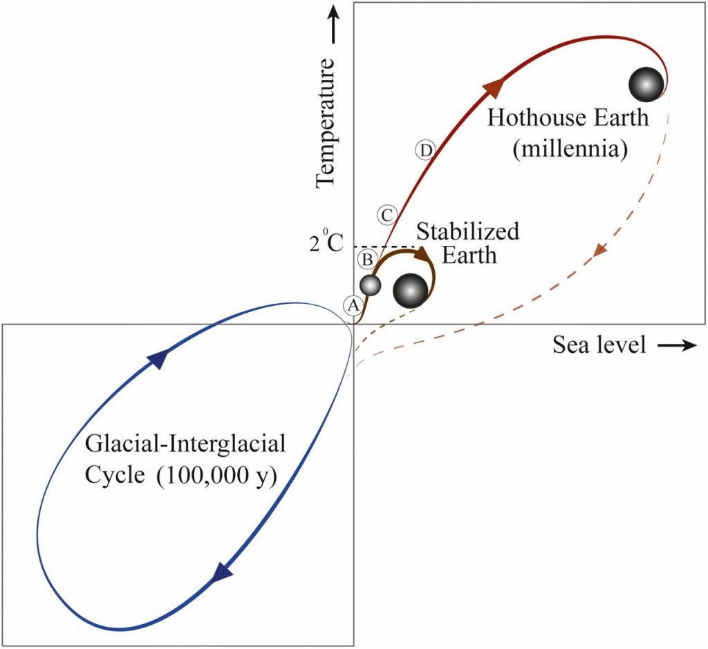
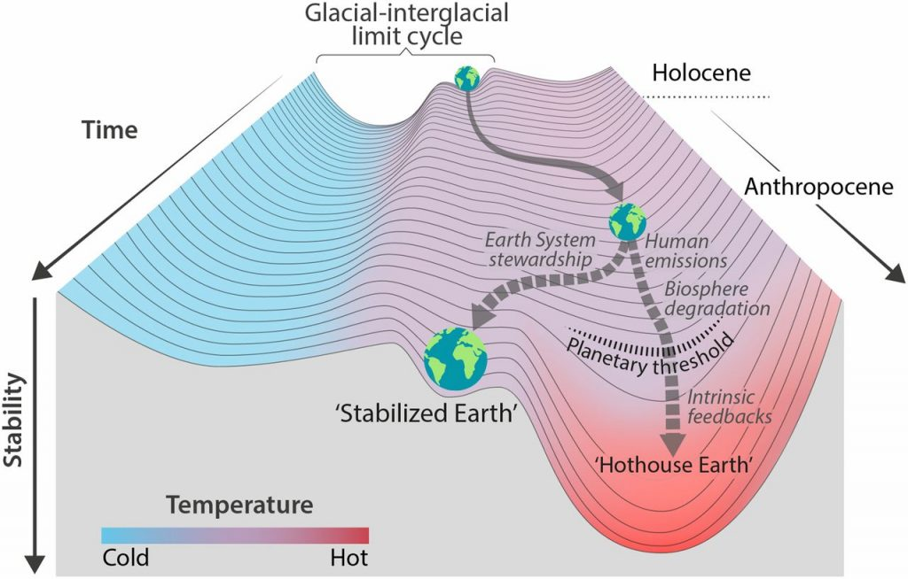

Am Wochenende habe ich zwei wichtige Texte gelesen, die zentrale und meiner Ansicht nach nicht widerlegte Argumente dafür enthalten, für einen sofortigen und radikalen Wechsel unseres Wirtschaftssystems zu kämpfen. Die Argumentation der beiden Texte findet auf verschiedenen Ebenen statt. Es gibt aber viele Berührungspunkte zwischen ihnen. Beide stammen vom August 2018. In beiden geht es um die Risiken, die damit verbunden sind, dass bei einer weiteren Aufheizung der Erdatmosphäre _Tipping Points_ erreicht werden. Jenseits dieser _Kipp-Punkte_ ist eine noch schnellere und viel weiter gehende Erhitzung der Atmosphäre nicht mehr aufzuhalten. Diese Erhitzung ist mit dem Risiko verbunden, dass menschliches Leben nur noch auf Teilen der Erde oder überhaupt nicht mehr möglich ist.

Hothouse Earth Paper, Abbildung 1 (Quelle: siehe Text): Eine schematische Darstellung möglicher zukünftiger Klimapfade vor dem Hintergrund der typischen glazial-interglazialen Zyklen (unten links). Der interglaziale Zustand des Erdsystems befindet sich an der Spitze des glazial-interglazialen Zyklus, während der glaziale Zustand am unteren Ende liegt. Der Meeresspiegel folgt der Temperaturänderung relativ langsam durch thermische Ausdehnung und das Abschmelzen von Gletschern und Eiskappen. Die horizontale Linie in der Mitte der Abbildung stellt das vorindustrielle Temperaturniveau dar, und die aktuelle Position des Erdsystems wird durch die kleine Kugel auf der roten Linie in der Nähe der Abweichung zwischen den Pfaden der stabilisierten Erde und der Treibhauserde dargestellt. Der vorgeschlagene planetarische Schwellenwert bei ∼2 °C über dem vorindustriellen Niveau ist ebenfalls dargestellt. Die Buchstaben entlang der Wege zur stabilisierten Erde/Treibhaus-Erde stellen vier Zeitabschnitte in der jüngsten Vergangenheit der Erde dar, die Einblicke in Positionen entlang dieser Wege geben können ( A, Mittel-Holozän; B, Eemisch; C, Mittel-Pliozän; und D, Mittel-Miozän. Ihre Positionen auf dem Weg sind nur annähernd.)  
Übersetzt von H.W. mit Hilfe von www.DeepL.com/Translator

## Einleitung: Bedeutung der beiden Papiere

In dem sogenannten [Hothouse Earth Paper](https://doi.org/10.1073/pnas.1810141115 "Trajectories of the Earth System in the Anthropocene") (Steffen et al. [2018](#ref-steffenTrajectoriesEarthSystem2018)) zeigen führende Erdsystem- und Klimawissenschaftler, dass nur eine vereinte Aktion der gesamten Menschheit das Risiko vermeiden kann, dass das komplette Erdsystem auf Dauer seinen jetzigen Zustand verlässt und Stabilität erst wieder unter Bedingungen erreicht, unter denen das Leben nur in anderen Formen als denen, die wir kennen, möglich ist.

Hothouse Earth Paper, Abbildung 2 (Quelle: siehe Text): Stabilitätslandschaft, die den Weg des Erdsystems aus dem Holozän und damit aus dem glazial-interglazialen Grenzzyklus zu seiner jetzigen Position im heißeren Anthropozän zeigt. Die Gabelung im Pfad in Abb. 1 ist hier als zukünftige divergierende Bahnen des Erdsystems dargestellt (gebrochene Pfeile). Derzeit befindet sich das Erdsystem auf einem Treibhaus-Pfad, der durch menschliche Treibhausgasemissionen und Biosphärenabbau in Richtung einer planetarischen Schwelle bei ∼2 °C getrieben wird (horizontale gestrichelte Linie bei 2 °C in Abb. 1), woraufhin das System einem im Wesentlichen irreversiblen Pfad folgt, der durch intrinsische biogeophysikalische Rückkopplungen angetrieben wird. Der andere Pfad führt zur Stabilisierten Erde, einem Pfad der Pflege des Erdsystems, der von vom Menschen geschaffenen Rückkopplungen zu einem quasistabilen, vom Menschen bewahrten Zustand geführt wird. "Stabilität" (vertikale Achse) ist hier definiert als invers zur potentiellen Energie des Systems. Systeme in einem hochstabilen Zustand (tiefes Tal) haben ein geringes Potenzial an Energie, und es wird viel Energie benötigt, um sie aus diesem stabilen Zustand herauszuführen. Systeme in einem instabilen Zustand (auf einem Hügel) haben ein hohes Energiepotenzial, und sie benötigen nur wenig zusätzliche Energie, um sie vom Hügel in ein Tal mit niedrigerem Energiepotenzial zu schieben.  
Übersetzt von H.W. mit Hilfe von www.DeepL.com/Translator

[What Lies Beneath](https://www.breakthroughonline.org.au/whatliesbeneath "What Lies Beneath | Breakthrough") (Spratt, Dunlop, and Schellnhuber [2018](#ref-sprattWhatLiesScientific2018)) ist ein vom australischen [Breakthrough Centre for Climate Restoration](https://www.breakthroughonline.org.au/ "HOME | Breakthrough National Centre for Climate Restoration") publizierter Bericht aus der Perspektive des Risikomanagements: Er stellt die Frage, wie die Risiken zu bewerten und zu verhindern sind, die sich aus einer weiteren Erwärmung der Atmosphäre ergeben.

## Gemeinsamkeit: Es gibt keinen linearen Weg zu einer ökologischen Zukunft.

Gemeinsam ist beiden Papieren, dass in ihnen die bisherige Politik des Weltklimarats und die Empfehlungen, die sich aus ihnen ergeben, für unzureichend gehalten werden. Beide Papiere gehen auf die Beschränkungen ein, die sich daraus ergeben, dass der Weltklimarat im Wesentlichen quantitative Analysen als Ausgangspunkt nimmt, die mit empirisch gesicherten Fakten argumentieren, und denen vollständige Strömungsmodelle der Atmosphäre und der Ozeane zugrunde liegen. In diesen Modellen können _Tipping Points_ nicht berücksichtigt werden, und sie können auch nicht auf Risiken eingehen, die mit Zuständen verbunden sind, zu denen bisher nur wenige empirische Daten vorliegen. Beide Papiere machen keine sicheren Prognosen über die Zukunft, sondern fordern, Risiken ernst zu nehmen, die man nicht vernünftig ausschließen kann. Die Veränderungen der Biosphäre, die gerade in den letzten Jahren bereits sichtbar geworden sind—das Abschmelzen der Polkappen, das beginnende Auftauen von Permafrostböden, das Absterben der Korallenriffe, die Verkleinerung der Regenwälder—zeigen, dass die Kipp-Punkte des Klimas möglicherweise bereits erreicht sind.

## Unterschiede: Der Zugang der Erdsystem-Wissenschaft und der Zugang des Risikomanagements

Das _Hothouse Earth Paper_ stammt von Klimaforschern und Erdsystem-Wissenschaftlern, die dieses Papier mit ihrer Autorität beglaubigen. Ihm liegt die Betrachtung des gesamten Erdsystems zugrunde, wobei die Autoren zwischen einem Zustand unterscheiden, den wir gut kennen—das Pendeln zwischen Warm- und Kaltzeiten, das die letzten 100.000 Jahre der Erdgeschichte bestimmt hat—und andererseits einem potentiellen zukünftigen Zustand, bei dem die Atmosphäre wärmer wäre, als sie es zumindest in den letzten 800.000 Jahren gewesen ist. Dieser zweite Zustand lässt sich wissenschaftlich bisher nur in Teilen vorwegnehmen. Die Risiken dieses zweiten Zustands sind allerdings absehbar. Das Papier fordert, alle Anstrengungen zu unternehmen, um das Erdsystem in einem Zustand zu stabilisieren, der nur wenig vom Holozän, also von dem Zustand, in dem sich die menschliche Zivilisation entwickelt hat, entfernt ist. Eine solche Stabilisierung sei nur möglich, wenn sich die Menschheit als _Steward_ (Verwalterin, Hüterin) des Erdsystems begreife und verhalte. Dieser Zustand setzt also eine bewusste und abgestimmte Intervention der gesamten Menschheit voraus.

Im Mittelpunkt von _What Lies Beneath_ steht der Umgang mit _existenziellen Risiken_, also mit Risiken, die die Existenz der Akteure, in diesem Fall der ganzen Menschheit, in Frage stellen. Dieses Papier fordert, dass die politischen und sozialen Antworten auf die Klimakrise und auf die Zerstörungen der Biosphäre den Risiken gerecht werden, die bereits absehbar sind. Es kritisiert, dass vom Weltklimarat und dem auf seinen Empfehlungen aufbauenden Pariser Abkommen Risiken in Kauf genommen werden, mit denen das Ende der Menschheit und vieler anderer biologischer Arten verbunden wäre. Die Autoren dieses Papiers gehen an vielen Stellen auf den Zwang für die Mitglieder des Weltklimarats ein, einerseits im Konsens zu argumentieren und andererseits auf politische Stakeholder Rücksicht nehmen zu müssen. Diese politische Situation mache es unmöglich, Risiken mit der gebotenen Dringlichkeit zu formulieren, weil dabei zu viele politische Rücksichten verletzt würden. Außerdem sei ja gerade für diese Risikoszenarien charakteristisch, dass sich zwar wissenschaftlich begründen lässt, warum sie drohen, dass sie sich aber im einzelnen nur imaginativ vorwegnehmen lassen.

## Ausgangspunkt: Tipping Points und Kaskaden von Tipping Points

Man kann sich vielleicht am leichtesten klar machen, worum es in diesen Papieren geht, wenn sie wenn man sie dem linearen Modell gegenüberstellt, das den Stellungnahmen des Weltklimarats und der aus ihr abgeleiteten Politik zugrundeliegt. Diese Modelle gehen von dem direkten Zusammenhang zwischen den Treibhausgasen in der Atmosphäre und den Temperaturen der Atmosphäre aus. Dieser Zusammenhang ist gut bekannt und lange erforscht.

Aus diesem Zusammenhang ergibt sich, wie viel Treibhausgase in die Atmosphäre gepumpt werden dürfen, um eine bestimmte Temperatur, z.B. 2° Celsius über den bisher gemessenen Werten, nicht zu überschreiten. Umgekehrt ergibt sich aus diesem Zusammenhang, dass man durch Reduktion des Eintrags von Treibhausgasen die Erderwärmung bremsen bzw stoppen kann. Je nachdem, ob diese Reduktion schneller oder langsamer erfolgt, wird ein bestimmtes Ziel schneller oder langsamer erreicht. Dieses lineare Modell liegt dem Pariser Abkommen zugrunde, wobei die vorliegenden Verpflichtungen der Teilnehmerländer, wenn sie überhaupt eingehalten werden, zu einer Erwärmung der Atmosphäre von über 3 Grad führen würden. Nicht berücksichtigt wird dabei, dass es zu _Rückkopplungen_ kommen kann, durch die Treibhausgase in die Erdatmosphäre gelangen, die bisher im Boden, in Wäldern oder im Meer gebunden waren. Diese Prozesse, die durch das Überschreiten von Kipp-Punkten ausgelöst werden, würden zu einer nichtlinearen Entwicklung führen, auf die das menschliche Verhalten keinen oder nur einen geringen Einfluss hat. Es ist möglich, dass einige dieser Kipp-Punkte bereits erreicht sind oder in unmittelbarer Zukunft erreicht werden. Mit den Methoden des Weltklimarats lassen sich die Folgen solcher Rückkopplungs-Prozesse nicht vorhersagen, aber an ihrer katastrophalen Wirkung besteht kein Zweifel.

## Ausgangspunkt: Unsicherheit und qualitative Einschätzungen

Es handelt sich in beiden Papieren um Argumentationen im Grenzbereich des wissenschaftlich Aussagbaren. Einerseits setzen sie wissenschaftliche Erkenntnisse voraus, andererseits beziehen sie sich aber auch auf bekannte Grenzen des empirsch Untersuchbaren und des Vorhersehbaren. Hier sind Begriffe wie der des _sicheren Handlungsraums_ relevant. Die noch unbekannte Zone ist eine Zone extremer oder existenzieller Risiken. Es wäre unverantwortlich, nicht alles zu tun, um diese Zone nicht zu erreichen. Zu den Risiken gehört,

- dass ein großer Teil der jetzt von Menschen besiedelten Gebiete, nämlich die verschiedenen Küstenzonen, nicht mehr bewohnbar sein würden;
- dass große Teile der Erde zu heiß wären, um überhaupt noch in ihn leben zu können;
- dass weite Gebiete der Erde nicht mehr landwirtschaftlich genutzt werden können.

Ob überhaupt noch menschliches Leben möglich ist, wenn die Erde sich zu einem Treibhaus entwickelt, ist unsicher. Sicher ist aber, dass diese Entwicklungen das Leben von Hunderten von Millionen von Menschen bedrohen.

## Konsens: Es ist ein sofortiger und radikaler Systemwandel nötig

Daraus ergibt sich, dass wir unser Wirtschaftssystem nicht langsam und linear umsteuern können, wenn wir diese Risiken ausschließen wollen. Die Prozesse, die zu einer weiteren Erwärmung und einer weiteren Zerstörung der Biosphäre führen können, müssen unterbrochen werden. Implizit bedeutet das: Die Anstrengungen, die dazu unternommen werden müssen, entsprechen denen der Weltkriege des 20. Jahrhunderts, während denen ein erheblicher Teil des Bruttosozialprodukts der Welt für den Krieg ausgegeben wurde. In den beiden Papieren selbst ist von solchen Schritten nicht die Rede, aber sehr wohl davon, dass ein sofortiger Systemwandel notwendig ist.

## Meine Interpretation: Die Forderungen von Extinction Rebellion sind realistisch

Für mich bestätigen die beiden Papiere, dass die [Forderungen von Extinction Rebellion](http://xrebellion.at/wasistxr/unsere-forderungen/ "Unsere Forderungen – Extinction Rebellion Austria") angemessen und realistisch sind:

- sofortige Aufklärung der Bevölkerung über die Ernsthaftigkeit der Bedrohung,
- sofortiger Verzicht auf fossile Brennstoffe und die weitere Zerstörung von Teilen der Biosphäre;
- Bürgerversammlungen, also neue Formen der Konsensfindung, um schnellstmöglich umzusteuern.

Diese Forderung erscheinen heute vielen wirklichkeitsfremd oder radikal. Ich bin ziemlich sicher, dass sie schon bald als sehr vorsichtig gelten werden. Ich verstehe es als eine Bestätigung, dass mit Will Steffen einer der wichtigsten Autoren des Hothouse Earth Paper [€xtinction Rebellion ausdrücklich unterstützt](https://docs.google.com/document/d/1FuZYG-gT5EPTLDyvgNnlYIS5dAy43TM1MnvOls48qIc/edit "Scientists’ Declaration of Support for Non-Violent Direct Action Against Government Inaction Over the Climate and Ecological Emergency").

Man muss die Bedrohungsszenarien, mit denen sich diese beiden Texte beschäftigen, aus ethischen Gründen ernst nehmen. Es gibt aber nicht nur moralische Motive dafür, sich mit ihnen zu beschäftigen. Es besteht kein Grund dafür daran zu zweifeln, dass diese Szenarien realistisch sind. Wenn sie realistisch sind, dann betreffen sie jede Form von Politik und Öffentlichkeit in absehbarer Zeit, ganz unabhängig von den Haltungen der Akteure. Diese Situation stellt die Rolle von Kommunikatoren, Journalisten und intellektuellen in einer Weise in Frage, für die wir keine Vorbilder haben.

(**Nachbemerkung:** Dies ist die erste Version eines Posts über sehr komplexe Zusammenhänge. Ich bitte um Korrekturen, insbesondere bei Missverständnissen oder unklaren Argumentationen. Ich hoffe, den Text bald ergänzen zu können.)

* * *

Spratt, David, Ian Dunlop, and Foreword Hans Joachim Schellnhuber. 2018. “What Lies Beneath: The Scientific Understatement of Climate Risks.” _Breakthrough, National Centre for Climate Restoration, Melbourne, Australia_. [https://www.breakthroughonline.org.au/whatliesbeneath](https://www.breakthroughonline.org.au/whatliesbeneath).

Steffen, Will, Johan Rockström, Katherine Richardson, Timothy M. Lenton, Carl Folke, Diana Liverman, Colin P. Summerhayes, et al. 2018. “Trajectories of the Earth System in the Anthropocene.” _Proceedings of the National Academy of Sciences_ 115 (33): 8252–9. [https://doi.org/10.1073/pnas.1810141115](https://doi.org/10.1073/pnas.1810141115).
