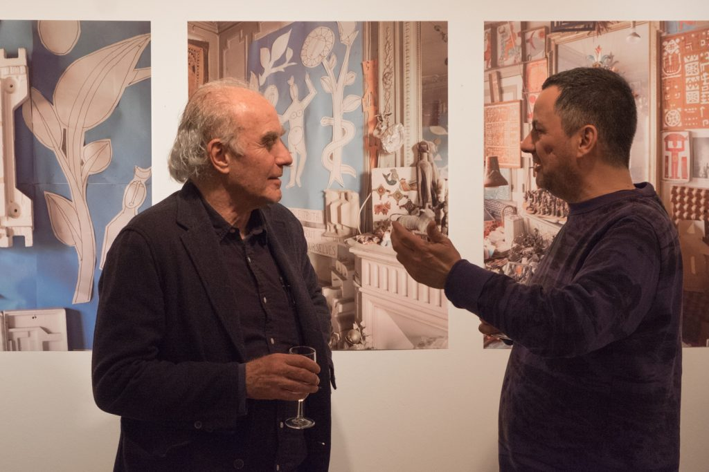

Am Dienstag haben wir in der [off\_gallery](https://offgallery.at/) eine Ausstellung mit Bildern [Stefano Grazianis](https://www.stefanograziani.com/) eröffnet—die letzte in diesem Jahr. Unsere Partnerin und Kuratorin [Erika Petric](https://erikapetric.com/) kennt Graziani schon lange und [hat das Buch rezensiert](https://www.academia.edu/33156888/Book_Review_in_GAM13_of_Yona_Friedman._The_Dilution_of_Architecture_by_Yona_Friedman_Manuel_Orazi_ed._by_Nader_Seraj_Park_books_2015_), in dem seine Fotografien der Wohnung [Yona Friedmans](http://www.yonafriedman.nl/) zum ersten Mal publiziert wurden. Diese Bilder sind auch ein Ausdruck ihres persönlichen Programms in unserer Galerie.

Stefano Graziani (rechts) und Paolo Rosselli in der off\_gallery graz, 3. Dezember 2019. Bild: Anastasija Georgi

Graziani hat in einem kurzen Künstlergespräch darauf hingewiesen, dass zur Fotografie der Anspruch gehört, zu dokumentieren, zu zeigen, wie etwas ist—auch wenn dieser Anspruch trügerisch ist, und auch wenn jede Aufnahme einer Szene sich von allen anderen Aufnahmen derselben Szene unterscheidet. In den Bildern, die bei uns gerade zu sehen sind, zeigt Graziani Details der Wohnung Friedmans, die sich permanent verändert. Friedman bewegt die kaum überschaubar vielen Objekte, die er in seinen Räumen aufbewahrt, offenbar laufend herum. Mit seinen Arbeiten hat Graziani nicht einfach abgebildet, wie es gerade in Friedmans Wohnung aussah, sondern er stellt Fragen wie die, wie sich eine solche räumliche, momentane Konstellation in einem zweidimensionalen dauerhaftem Medium abbilden lässt, und in welcher Beziehung diese Abbildungen zu Friedman stehen, den Grazianis Serie porträtiert, ohne dass er selbst zu sehen ist.

Ich habe vor allem ein Motiv dafür, bei unserer Galerie mitzumachen: mehr über Photographie und Architektur zu lernen, die mich schon lange interessieren, die ich aber bisher nur oberflächlich kennengelernt habe. Jetzt lerne ich gerade etwas über und von Stefano Graziani, mit dem wir uns gestern noch einmal getroffen haben. Ich versuche, mich von meinem Vorverständnis zu lösen und Arbeiten und Perspektiven kennenzulernen, die mir neu sind. Am Dienstag waren [Paolo Rosselli](http://www.paolorosselli.com/), der uns seit Beginn unterstützt, und [Martin Grabner](http://www.martingrabner.com/main.php?typ=text&y=1) dabei, den wir zuvor ausgestellt haben. Der Zugang über Dialoge und Interaktion von Praktikern zum einen und über eine einmalige Präsentation von Arbeiten, die immer wieder anders präsentiert werden, ist offener, intensiver und vielfältiger als der eher theoretische, den ich gewohnt bin. Kein Wunder, dass Kuratieren für viele Menschen zu einer Leidenschaft wird.

Ich versuche gerade, mehr über Graziani zu erfahren und einigen Hinweisen nachzugehen, die er am Abend und im Gespräch danach gegeben hat. Ein Ausgangspunkt für Grazianis Arbeit ist das Thema der [Taxonomien](https://issuu.com/stefanograziani/docs/taxonomies_is). Ich nehme an, dass die Abbildung der Objektsammlungen Friedmans für ihn in diesen Themenkomplex (Klassifikation, Serialität, Sichtbarkeit und Bezeichenbarkeit) gehört. Graziani lehrt Fotografie an Hochschulen. Er hat einen bewussten, reflektierten und klaren Zugang zu seiner Arbeit und beschäftig sich, wenn ich es nach diesen wenigen Eindrücken richtig verstehe, mit der Abbildung und Herstellung von Ordnung und Struktur in der fotografischen Arbeit und mit ihren Bedingungen. Im Gepräch hat er, außer auf [Allan Sekula](https://de.wikipedia.org/wiki/Allan_Sekula), auf [zwei Essays des Fotografen Paul Graham](https://www.paulgrahamarchive.com/writings_by.html) hingewiesen, in denen Graham das Besondere der Fotografie im Verhältnis zu anderen Künsten beschreibt. Auch bei Graham geht es um das Dokumentarische, das sich nicht aus der Fotografie streichen lässt, auch wenn man Fotografien nicht als Abbildungen einer von ihr unabhängigen Wirklichkeit versteht. (Semiotisch gesehen hängt das, was hier gemeint ist, wohl vor allem mit dem [indexikalischen](https://de.wikipedia.org/wiki/Index_(Semiotik%29) Charakter von Fotografien zusammen, mit den Beziehungen der Aufnahme zu etwas räumlich und zeitlich Benachbartem, und mit den [Kontiguitäts-Beziehungen](http://www.columbia.edu/itc/visualarts/r4100/jacobson.html) des Gezeigten oder Sichtbaren zu dem ihm Benachbarten, aber nicht Sichbaren, in den Aufnahmen in unserer Galerie also etwa zu dem unsichtbaren Yona Friedman.)

Ich möchte über die Weihnachtszeit versuchen die Ausstellungen dieses Jahres auf unserer noch unfertigen Website zu dokumentieren. Bisher denke ich vor allem über die technischen Fragen nach, die damit verbunden sind. Aber diese Fragen lassen sich wahrscheinlich nicht von der Frage lösen, was die Besonderheiten einer Ausstellung von Fotografien im Web sind und was sie von Ausstellungen an einem geografischen Ort und der Präsentation in Büchern unterscheidet.
