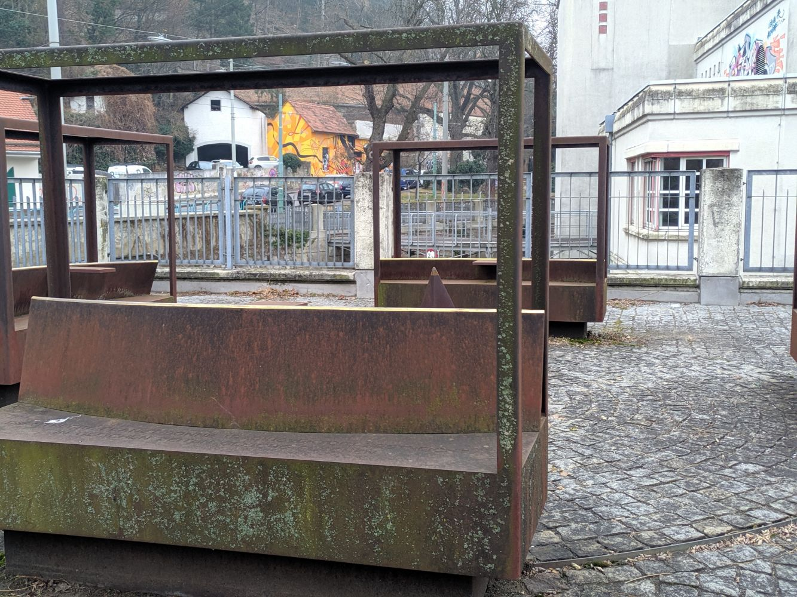

Habe das Grazer Kepler-Denkmal noch nie richtig wahrgenommen. Vermutlich waren die Keplerschen Gesetze damals eine ähnliche Provokation wie heute die Erkenntnisse der Klimaforschung.\[caption id="attachment\_10235" align="alignleft" width="1333"\] Kepler-Denkmal, Graz\[/caption\]
