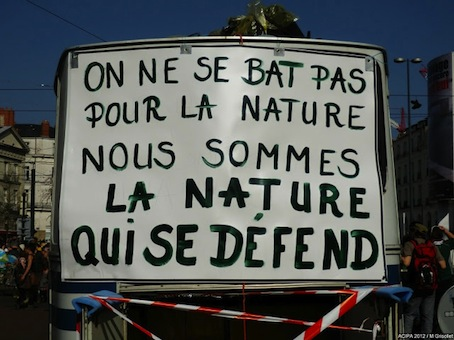

\[caption id="attachment\_10501" align="alignleft" width="454"\] "Wir kämpfen nicht für die Natur—wir sind die Natur, die sich verteidigt." Plakat in Notre-Dame-des-Landes, Quelle: https://reporterre.net/Nous-ne-defendons-pas-la-nature-nous-sommes-la-nature-qui-se-defend\[/caption\]

Seit dem Beginn des Corona-Lockdowns schreibe ich nicht viel. Ich weiss nicht, ob der Lockdown die Ursache für die Schreib-Probleme ist. Wahrscheinlich hat er dazu geführt, dass ich mehr lese als sonst. Was ich gerade lese, führt bei mir zu einer Umorientierung, die nicht abgeschlossen ist (und auch nicht mit dem Lockdown begonnen hat). Deshalb bringe ich auch kurze Texte nicht zuende.

Ich habe Charbonniers [Abondance et liberté](https://editionsladecouverte.fr/catalogue/index-Abondance_et_libert__-9782348046780.html "Abondance et liberté - Pierre CHARBONNIER - Éditions La Découverte") endlich ganz gelesen. Ich habe mich, angeregt durch Charbonnier, etwas mit Karl Polanyi und [The Great Transformation](https://www.suhrkamp.de/buecher/the_great_transformation-karl_polanyi_27860.html "The Great Transformation: Politische und ökonomische Ursprünge von Gesellschaften und Wirtschaftssystemen von Karl Polanyi - Suhrkamp Insel Bücher Buchdetail") beschäftigt. Dank [Erika](https://www.instagram.com/erika_petric/?hl=de "Erika Petric (@erika_petric) • Instagram-Fotos und -Videos") habe ich dabei auch den [Polanyi](https://shop.falter.at/karl-polanyi.html "Karl Polanyi - faltershop.at")\-Band gefunden, den Armin Thurnher und ein paar andere bei der Gründung der österreichischen Polanyi-Gesellschaft herausgegeben haben. Beim Suchen nach der Polanyi-Rezeption heute—und mit der Frage, was die _Digitalisierung_ mit der _großen Transformation_ und der heutigen Marktwirtschaft zu tun hat—habe ich festgestellt, dass sich Shoshana Zuboff bei [ihrer Analyse des Überwachungskapitalismus](https://www.theguardian.com/books/2019/oct/04/shoshana-zuboff-surveillance-capitalism-assault-human-automomy-digital-privacy "Shoshana Zuboff: ‘Surveillance capitalism is an assault on human autonomy’ | Books | The Guardian") auf Polanyi bezieht. Schließlich habe ich zum ersten Mal Dipesh Chakrabartys Thesen über [Das Klima der Geschichte](https://www.archplus.net/home/archiv/artikel/46,4847,1,0.html "ARCH+: Inhalt » Alle Ausgaben » Ausgabe » 230: Projekt Bauhaus 2: Architekturen der Globalisierung - Das Klima der Geschichte: Vier Thesen.[1]") gelesen, auf die ich ebenfalls durch Charbonnier aufmerksam geworden bin. Das alles steht für mich in einem Bezug zum Aktivismus bei Extinction Rebellion (wo ich aktiver mitarbeite, seit sich die Kommunikation Corona-bedingt ins Netz verlagert hat) und zu der Frage, ob und wie man Content-Strategie betreiben kann, ohne vor allem zu versuchen, die Unternehmen in einer destruktiven Wirtschaft noch effizienter zu machen.

Suche ich nach einer Weltanschauung? Nein, ich suche nach einer politischen Position und nach Handlungsmöglichkeiten (aktivistisch und und als Lehrender an einer _wirtschaftsnahen_ Bildungseinrichtung) die in einer Verbindung zur Wissenschaft stehen, unter anderem in einer Verbindung zu dem, was im weitesten Sinne _Erdsystemwissenschaft_ heisst. Wenn ich es ganz abstrakt ausdrücke, interessiert mich das Verhältnis zwischen Wissenschaftlichkeit und Erkenntnismöglichkeiten auf der einen Seite und Praxis auf der anderen Seite, wobei Praxis für mich die mediale oder Online-Kommunikation ist. Um das zu konkretisieren: Mich interessiert z.B., ob man Content-Strategie (das strategische Planen von Online-Inhalten) in einer nicht nur zufälligen (oder rein ethisch motivierten) Weise auf wissenschaftliche Erkenntnisse beziehen kann. Dabei denke ich nicht an Content-Strategie als _Anwendung_ wissenschaftlicher Erkenntnisse sondern an wissenschaftliche Publikationen als Teil einer Content-Strategie, in der Wissenschaftlerinnen und Wissenschaftler und die Dinge, mit denen sie sich beschäftigen, _Stakeholder_ (im Marketing-Jargon) oder Akteure sind. Die Ausblendung dieser Akteure ist charakteristisch für alles, was man unter [Epistemic Crisis](https://wittenbrink.net/lostandfound/tag/epistemic-crisis/ "Epistemic Crisis – Lost and Found") zusammenfassen kann.

Polanyi, Charbonnier und Chakrabarty stehen für mich für ein—sehr grob formuliert—ökologisches Verständnis von sozialen Beziehungen: ein Verständnis, bei dem diese Beziehungen (und damit auch Kommunikation und Inhalte) nicht nur Beziehungen zwischen Kommunikationspartnern in einer nicht kommunizierenden _Umwelt_ sind, sondern die Kommunikation ein Aspekt der Beziehungen heterogener Akteure zueinander ist. Man könnte auch sagen, dass es in jeder Kommunikaktion eine Vielzahl von Delegationsbeziehungen gibt, und dass sich dabei nicht scharf zwischen menschlichen und nichtmenschlichen Delegierten und Delegierenden unterscheiden lässt. Wer kommuniziert, kommuniziert für etwas, und dieses Etwas als _menschlich_ oder _sozial_ im Gegensatz zu _natürlich_ oder _kontextuell_ zu verstehen, ist nicht eine Voraussetzung sondern ein Ergebnis der sozialer Beziehungen.

Chakrabarty spricht davon, dass man Geschichte nach dem Ende des Holozän nie wieder als Geschichte der Menschen im Gegensatz zur nichthistorischen Natur wird verstehen können. Chakrabartys erste These lautet:

> Anthropogene Erklärungen des Klimawandels bedeuten die Auflösung der humanistischen Unterscheidung zwischen Naturgeschichte und Menschheitsgeschichte. (Anthropogenic Explanations of Climate Change Spell the Collapse of the Age-old Humanist Distinction between Natural History and Human History.)

Genauso werden wir Kommunikation nicht mehr als Kommunikation von Menschen in einer nicht kommunizierenden Umwelt verstehen können. Nicht, weil jetzt in einem simpel animistischen Sinn die Dinge anfangen würden zu sprechen, sondern weil die Akteure der Kommunikation sich in der Kommunikation konstituieren und Akteure des Typs _nichtkörperliches menschliches und soziales Subjekt_ nur eine Möglichkeit sind, solche Akteure zu konstituieren. Es geht also nicht darum, Nichtmenschliches zu vermenschlichen, sondern darum, nicht mehr von einem radikalen Unterschied zwischen Menschlichem und Nichtmenschlichem auszugehen.

In diesem Verständnis bringt wissenschaftliche Arbeit und wissenschaftliche Kommunikation bestimmte Akteure in die Kommunikation, in die Inhalte ein, und agiert als von ihnen delegiert. Bei der Entwicklung von Inhalten bestehen unterschiedliche Möglichkeiten, Stakeholder, Beteiligte, durch Delegation teilnehmen zu lassen.

Der Ausdruck _Stakeholder_ wird in der Content-Strategie oft unscharf verwendet, und in Mitteleuropa wohl oft anders als im angelsächsischen Sprachraum. Hier werden darunter oft Bezugsgruppen verstanden, in englischen Texten eher die in Inhalte direkt involvierten Personen und Gruppen. Bei dem Modell von Content-Strategie, das mir vorschwebt, sind die Stakeholder:

- nicht nur vor allem als Adressaten von Kommunikation verstandene Individuen, sondern Akteure in einer aus unterschiedlichen, auch natürlichen oder ökologischen Bedingungen bestehenden Situation;
- an den Inhalten Beteiligte, die durch die Inhalte miteinander verbunden werden (_content connects_).

Fragen, die sich ergeben: Welche menschlichen und nichtmenschlichen Akteure beziehe ich in eine Content-Strategie ein? Welche werden von vonherein ausgeschlossen, wenn ich z.B. reines Content-Marketing betreibe? Durch das Ausblenden welcher Akteure wird etwas wie Content-Marketing vielleicht überhaupt erst möglich? Wann ist das Ausblenden von Akteuren legitim, wann ist es vielleicht sogar notwendig, und wann ist illegitim?

Vielleicht kann man sagen: So wie nach Chakrabarty Geschichte nach der Erkenntnis des Endes des Holozäns nicht mehr als Geschichte nur von Menschen oder der Menschheit möglich ist, so kann man auch Content-Strategie oder Content-Design nicht mehr nur bezogen auf Kommunikation zwischen menschlichen Akteuren betreiben. Man kann und muss die nichtmenschlichen Akteure, die in jeder Kommunikation und bei jedem Inhalt impliziert sind, explizit berücksichtigen, also die Inhalte als Komponenten _ökologischer_ Netzwerke verstehen. Ganz verkürzt gesagt: Die Devise: [Wir sind die Natur, die sich verteidigt](http://yurtao.canalblog.com/albums/zone_a_defendre_a_notre_dame_des_landes/photos/81448922-nous_sommes_la_nature_qui_se_defend.html "nous sommes la nature qui se défend - Photo de Zone A Défendre à Notre Dame Des Landes - YURTAO, la voie de la yourte.") kann auch zu einem Motto der Content-Strategie werden.
