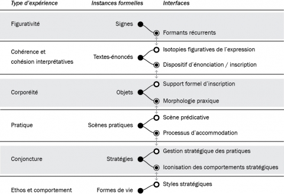

[Jacques Fontanille](https://semioticon.com/seo/F/fontanille.html# "Semiotics Encyclopedia Online - Fontanille, Jacques") entwirft in [Pratiques sémiotiques](https://www.cairn.info/pratiques-semiotiques--9782130569848.htm "Pratiques sémiotiques - Jacques Fontanille | Cairn.info") (Fontanille [2008](#ref-fontanillePratiquesSemiotiques2008)) ein Modell semiotischer Ebenen, das von den Zeichen auf der untersten bis zu den Lebensformen auf der obersten Ebene reicht. Jede dieser Ebenen lässt sich, das ist seine These, semiotisch als Dualität von Ausdrucks- und Bedeutungsseite analysieren.

Ich lese Fontanilles Buch gerade und kann seinen Ansatz nicht im Detail beurteilen oder referieren. Mir sind einige Ausgangspunkte seiner Theorie bekannt, weil ich mich im Studium mit der Semiotik von Fontanilles Lehrer [A. J. Greimas](http://www.signosemio.com/greimas/index-en.asp "Algirdas Julien Greimas : Biography and Bibliography / Signo - Applied Semiotics Theories") beschäftigt habe.

Stark vereinfacht kann man davon sprechen, dass im Modell Fontanilles bei einem semiotischen Prozess mehrere Ebenen involviert sind:

- die der _Zeichen_, etwa von Lauten und Buchstaben, also z.B. der Laute, die das Wort _Spaghetti_ bilden,
- die der _Texte und Äußerungen_, z.B. der Folge von Sätzen, die ein Spaghetti-Rezept beschreiben,
- die der mit einem materiellen Träger von Zeichen und Texten produzierten _Objekte_, z.B. des Rezepts auf meinem Handybildschirm einschließlich von Überschriften und der vom Browser und der Suchmaschine verwendeten Auszeichnungen,
- die der _Praktiken_, z.B. des Spaghettikochens und der Interpretation des Rezepts, die dabei stattfindet (wobei alle Praktiken, da sie einen Sinn haben, Bedeutungen implizieren),
- die der _Strategien,_ die Praktiken zielbezogen kombinieren, z.B. der Zusammenstellung eines Menüs,
- die der _Lebensformen_, die allen Handlungen Bedeutungen zuordnen und sie auf Werte beziehen, z.B. eines mediterranen, gesundheitsbezogenen Lebensstils.

Jede dieser Ebene lässt sich für sich analysieren, aber sie wirken zusammen. Dabei _integrieren_ die jeweils höheren Ebenen _aufsteigend_ die tieferen, auf die sie angewiesen sind. Umgekehrt gibt es auch eine _absteigende Integration_, bei der die tieferen Ebenen die höheren integrieren, wenn etwa ein Gebet als Ausdruck einer religiösen Lebensform gebraucht und verstanden wird, oder, banaler, wenn ein Rezept den praktischen Vorgang des Kochens (Ebene der Praktiken) beschreibt und mit rhetorischen Mitteln auf den Lebensstil verweist (Ebene der Lebensformen), zu dem das beschriebene Gericht gehört.

(Ich gehe nicht auf wichtige Unterscheidungen ein, die diesem Konzept zugrundeliegen, vor allem nicht auf die Unterscheidung von _Form_ und _Substanz_. Auf jeder der semiotischen Ebenen hat die Ausdrucksseite Bedeutung, weil sie eine Form hat, die auf eine Form auf der Bedeutungsseite bezogen werden kann. Die Substanz der von den menschlichen Stimmorganen produzierten Laute hat z.B. eine Form, weil sich Gegensatzpaare wie _stimmhaft_ und _stimmlos_ bilden lassen, die auf Unterschiede in der Bedeutung bezogen sind. Eine Einheit auf der Inhalts-Ebene lässt sich also nicht einfach einer Einheit auf der Ausdrucks-Ebene zuordnen, sondern die Unterschiede zwischen den Einheiten auf einer Ebene ermöglichen den Ausdruck der Unterschiede auf der anderen Ebene.)

Die Semiotik der auf Greimas zurückgehenden Schule, zu der Fontanille gehört, beschäftigt sich explizit mit Phänomenen wie Marken und Werbung, mit denen wir es auch in der Content-Strategie zu tun haben. Ich lese Fontanilles Buch auch mit der Frage, ob sich die Semiotik als eine Basiswissenschaft der Content-Strategie verstehen oder benutzen lässt.

Wenn man Fontanilles Modell verwendet, erkennt man, dass Content und Content-Strategie zu verschiedenen seiner Ebenen gehören. Man fragt sich, ob man viele Missverständnisse und Unklarheiten in der Disziplin der Content-Strategie auflösen könnte, wenn man diese Ebenen für sich analysiert und sich dann damit beschäftigt, wie sie zusammenwirken.

Content-Strategie ist entstanden, weil es digitale Objekte oder Artefakte gibt, die Träger von Zeichen und Texten sind, und weil diese Artefakte eine Vielzahl von spezifischen Praktiken ermöglichen und erfordern. Content-Strategie steuert—ganz im Sinne des Fontanilleschen Strategiebegriffs—die Kombination und Selektion von Praktiken, die mit der Erstellung und dem Management digitaler bedeutungstragender Artefakte zu tun haben, und zwar so, dass diese Artefakte Praktiken unterstützen, die meist selbst durch digitale Technologien ermöglicht oder beeinflusst wurden.

Beispiel: Es ist eine content-strategische Aufgabe, die Erstellung und Aktualisierung der Texte und Bilder für die Produktseiten eines Online-Shops zu steuern. Wie die Texte und Bilder konkret aussehen, hängt mit den technischen Anforderungen des Shops und mit den Möglichkeiten, ihn praktisch zu nutzen, eng zusammen. Dabei werden Inhalte auf der tieferen Ebenen genutzt, nämlich Texte und Bilder (Ebene der textuellen Äußerungen), die auch für Printproduktionen verwendet werden könnten, und die sinnliche Eigenschaften verwenden, die sie mit den Produkten selbst teilen, z.B. Farben (Ebene der Zeichen/Figurativität). Die Inhalte unterstützen Praktiken des E-Commerce, die auf diese Inhalte angewiesen sind, aber über sie hinausgehen: Um als User mit den Inhalten umgehen zu können, sie verstehen zu können, muss man wissen, wie ein Online-Shop funktioniert. Diese Praktiken (z.B. ein Online-Einkauf) können aber auf der textuellen Ebene beschrieben sein, z.B. durch eine Gebrauchsanleitung für den Online-Shop (wobei die Beschreibung die Praxis nie komplett erklärt, also die Ebene der Praxis nicht auf die unter ihr liegende Ebene reduziert werden kann.) Strategisch müssen die Praktiken der Inhaltserstellung gesteuert werden, und diese Praktiken müssen wiederum strategisch auf die kommerziellen Ziele des Unternehmens abgestimmt werden, das den Shop betreibt. Dabei können die Inhalte Botschaften enthalten, die für eine ganze Lebensform stehen, also etwa für einen ökologischen Lebensstil.

Etwas unscharf formuliert, bedeutet das, dass wir uns in der Content Strategie vor allem mit digitalen Fassungen von Inhalten beschäftigen, die innerhalb von Praktiken verwendet und interpretiert werden, die selbst zu einem großen Teil mit digitalen Technologien in Verbindung stehen. Das bedeutet nicht, dass es in der Content-Strategie nur um digitale Inhalte geht, aber auch die nicht-digitalen Inhalte oder die Objekte, zu denen sie gehören (etwas Print-Produkte), stehen über viele Praktiken in in einer Verbindung zu digitalen Objekten und Strategien.

Inhalte unterstützen Praktiken, diese Praktiken können sehr unterschiedlich sein, und sie gehören wiederum zu unterschiedlichen Lebensformen, mit denen sie über Strategien verknüpft sind. Im Moment unterstützten sehr viele Inhalte, mit denen sich Content-Strateginnen und Content-Strategen beschäftigen, die Praktiken von Unternehmen bzw. gemeinsame Praktiken von Unternehmen und Kunden. Es gibt aber auch Praktiken z.b. in der Bürokratie oder von Regierung und öffentlicher Verwaltung, die auf Inhalte angewiesen sind, mit denen sich die Content-Strategie beschäftigt.

Eine Content-Strategie für eine Postwachstums-Gesellschaft kümmert sich um digitale Inhalte, die zu Praktiken beitragen, bei denen nur regenerative Ressourcen verbraucht werden. Sie ist über ein Ethos mit Lebensformen verbunden, die im Widerspruch zu den Praktiken einer auf Wachstum ausgerichteten Wirtschaft stehen. Aber auch die Praktiken z.B. des üblichen Content-Marketing sind nicht unabhängig von Lebensformen und damit nicht ethisch neutral.

* * *

Hier der Versuch einer Übersetzung einer Tabelle aus Fontanilles Buch (im Abschnitt _La hiérarchie des plans d'immanence_)—um explizit zu machen, wie ich sein Konzept interpretiere:

**Hierarchie der semiotischen Immanenz-Ebenen**

  
| Erfahrungstyp | Formale Instanzen | Schnittstellen |
| :-- | :-- | :-- |
| Figurativität | Zeichen  
↓ | Wiederkehrende Bestandteile |
| Interpretative Kohärenz und Kohäsion | Textuelle Äußerungen  
↓ | Figurative Isotopien auf der Ausdrucksebene  
—  
Anordnung der Äußerung oder Einschreibung |
| Körperlichkeit | Objekte  
↓ | Formaler Träger der Einschreibung  
—  
Praxisbezogene Morphologie |
| Praxis | Praktische Szenen  
↓ | Prädikative Szene  
—  
Abstimmungsprozess |
| Handlungskomplexe | Strategien  
↓ | Strategische Führung der Praktiken  
—  
Ikonisierung der strategischen Verhaltensweisen |
| Ethos und Haltung | Lebensformen | Strategische Stile |

Optisch leicht veränderte Version der Originaltabelle (aus Dondero and Reyes-Garcia [2016](#ref-donderoSupportsImagesPhotographie2016)):

## Nachweise

Dondero, Maria Giulia, and Everardo Reyes-Garcia. 2016. “Les supports des images : de la photographie à l’image numérique.” _Revue française des sciences de l’information et de la communication_, no. 9 (September). doi:[10.4000/rfsic.2124](https://doi.org/10.4000/rfsic.2124).

Fontanille, Jacques. 2008. _Pratiques Sémiotiques_. 1re éd. Formes Sémiotiques. Paris: Presses universitaires de France.
