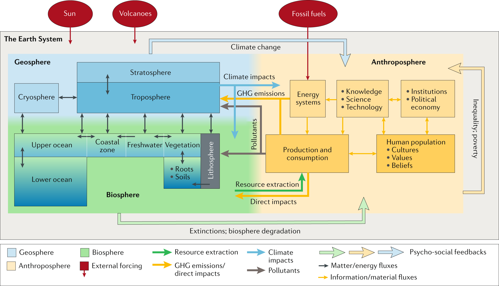

Einige der bekanntesten Vertreter der Erdsystemwissenschaft haben jetzt in _The emergence and evolution of Earth System Science_ (Steffen et al. [2020](#ref-steffenEmergenceEvolutionEarth2020)) die Geschichte dieser, wie es in dem Artikel heisst, _transdisziplinären_ Wissenschaft dargestellt. Der Artikel macht verständlich, in welchen wissenschaftlichen Zusammenhang Publikationen zu den [planetaren Grenzen](https://wittenbrink.net/lostandfound/tag/planetary-boundaries/ "Planetary Boundaries – Lost and Found"), zum [Anthropozän](https://wittenbrink.net/lostandfound/tag/anthropozaen/ "Anthropozän – Lost and Found") und zu [Kipp-Punkten](https://wittenbrink.net/lostandfound/tag/kipp-punkte/ "Kipp-Punkte – Lost and Found") und Kaskaden von Kipp-Punkten gehören.

Der Aufsatz zeigt, dass die Erdsystemwissenschaft wie andere Wissenschaften auch auf der Entwicklung von Beobachtungsinstrumenten und -technologien und von wissenschaftlichen Institutionen und Organisationen aufbaut. Die Raumfahrt und vernetzte Hochleistungsrechner, und zugleich die institutionalisierte globale Zusammenarbeit von Wissenschaftlerinnen und Wissenschaftlern haben es ermöglicht, das Erdsystem mit Modellen zu simulieren. Gleichzeitig wurde das Konzept des Erdsystems entwickelt. Die [Gaia-Hypothese](https://de.wikipedia.org/wiki/Gaia-Hypothese "Gaia-Hypothese – Wikipedia") von Lovelock und Margulis stellte dafür einen wichtigen Ausgangspunkt dar.

Modelle des Erdsystems simulieren Prozesse und Feedback-Mechanismen, die miteinander in Wechselwirkung stehen und zusammen das Erdsystem bilden. Die Modelle werden laufend verfeinert und mit immer genaueren Daten validiert. Der Ausdruck _Erdsystem_ bezeichnet also einerseits die wissenschaftlichen Modelle, die die Wechselwirkungen zwischen den für das Leben relevanten Komponenten der Schichten zwischen Erdoberfläche und Atmosphäre als ein System modellieren und andererseits das System dieser Komponenten selbst, das wir durch die Modellierungen immer besser verstehen. Das Erdsystem hat sich in der Erdgeschichte laufend verändert und wird sich weiter verändern, wobei die Veränderungen inzwischen maßgeblich von der _Anthroposphäre_, den menschlichen Komponenten des Systems, beeinflusst werden. Die Veränderungen können sprunghaft sein, und aufgrund der Komplexität des Erdsystems sind sie nicht vollständig voraussagbar.

Die Erforschung des Erdsystems ist zugleich die Erforschung der Wechselwirkungen zwischen diesem System und der Anthroposphäre. Sie ermöglicht Prognosen dazu, wie sich das Erdsystem aufgrund der menschlichen Einflüsse weiterentwickeln wird, und sie beeinflusst damit selbst die Entwicklung der Anthroposphäre—sie hat also einen politisch-sozialen Kontext und politisch-soziale Konsequenzen. Am deutlichsten wird das gerade angesichts der Klima- und Biodiversitätskrise. Diese Krisen betreffen die Zukunft des gesamten Erdsystem und können nur ausgehend von Prozessen verstanden werden, die dieses System als ganzes beeinflussen.

> ... die große Herausforderung für die Erdsystemwissenschaft besteht darin, eine tiefe Integration biophysikalischer Prozesse und menschlicher Dynamik zu erreichen, um ein wirklich einheitliches Verständnis des Erdsystems zu schaffen (the grand challenge for ESS is to achieve a deep integration of biophysical processes and human dynamics to build a truly unified understanding of the Earth System. (Steffen et al. [2020](#ref-steffenEmergenceEvolutionEarth2020), S. 54, Übersetzung H.W.)

* * *

Systemdiagramm des Erdsystems, Abb. 3 aus "The emergence and evolution of Earth System Science"

Ein detailliertes Systemdiagramm des Erdsystems, inspiriert durch das ursprüngliche Bretherton-Diagramm (Abb. 2), aber mit dem Menschen (der Anthroposphäre) als vollständig integrativer, interagierender Sphäre. Die innere Dynamik der Anthroposphäre wird als ein Produktions-/Konsumkern dargestellt, der von Energiesystemen angetrieben und von menschlichen Gesellschaften moduliert wird, die von ihren Kulturen, Werten, Institutionen und ihrem Wissen beeinflusst werden. Die Wechselwirkungen zwischen dem Anthropozän und dem übrigen Erdsystem sind zweiseitiger Natur, wobei menschliche Treibhausgasemissionen, Ressourcenentnahme und Schadstoffe Auswirkungen haben, die durch das Geosphäre-Biosphäre-System nachhallen. Rückkopplungen auf die Anthroposphäre sind ebenfalls wichtig, einschliesslich direkter Auswirkungen des Klimawandels und der Verschlechterung der Biosphäre, aber auch psychosoziale Rückkopplungen aus dem restlichen Erdsystem und innerhalb der Anthroposphäre. GHG, greenhouse gas/Treibhausgas. (A detailed systems diagram of the Earth System, inspired by the original Bretherton diagram (Fig. 2), but with humans (the anthroposphere) as a fully integrative, interacting sphere. The internal dynamics of the anthroposphere are depicted as a production/consumption core driven by energy systems and modulated by human societies, as influenced by their cultures, values, institutions and knowledge. Interactions between the Anthropocene and the rest of the Earth System are two way, with human greenhouse gas emissions, resource extraction and pollutants driving impacts that reverberate through the geosphere–biosphere system. Feedbacks to the anthroposphere are also important, including direct impacts of climate change and biosphere degradation, and also psycho-social feedbacks from the rest of the Earth System and within the anthroposphere. GHG, greenhouse gas. Übersetzung H.W. mit Hilfe von www.DeepL.com/Translator) Abb. 3 aus Steffen et al. ([2020](#ref-steffenEmergenceEvolutionEarth2020))

* * *

Ich habe den Aufsatz sofort gelesen, als ich auf ihn gestoßen bin. Er verbindet für mich viele Texte und Konzepte, auf die ich hier in Lost and Found eingegangen bin, gehört also zu der Lesegeschichte, die ich hier schreibe. Welchen Einschnitt die Erdsystemwissenschaft bedeutet und wie ihre Themen zusammenhängen, ist mir erst in den letzten Jahren bewusst geworden. Einen wichtigen Ausgangs- und Bezugspunkt für mich bilden dabei Bruno Latours Bücher über Gaia (Latour [2015](#ref-latourFaceGaiaHuit2015) und [2017](#ref-latourOuAtterrirComment2017)). Latour verwendet den von Lovelock eingeführten Ausdruck Gaia, um klarzumachen, dass es sich beim Erdsystem nicht um ein Ganzes handelt, das auf einen bestimmten stabilen Zustand ausgerichtet ist, sondern um eine Gesamtheit von Akteuren, die sich selbst und die Beziehungen untereinander laufend verändern, die also eine Geschichte haben. (Zu den Unterschieden zwischen den Begriffen _Gaia_ und _Erdsystem_ siehe Latour and Lenton ([2019](#ref-latourExtendingDomainFreedom2019)), dessen Mitautor Timothy Lenton auch zu den Autoren von _The emergence and evolution of Earth System Science_ gehört.) William Lovelock selbst hat sich gerade erst, kurz vor seinem 101en Geburtstag, zu den ingenieurwissenschaftlichen Wurzeln der Gaia-Hypothese geäußert und dabei Latours Interpretation des Gaia-Konzepts unterstützt (Watts [2020](#ref-wattsJamesLovelockBiosphere2020)). Für Latour steht _Gaia_ für ein neues, nicht mehr Galileisches Wissenschaftsparadigma, bei dem die Erde statt der Sterne Leitgegenstand der Wissenschaft ist und Wissenschaft als _irdische_ menschliche Aktivität verstanden wird, die keinen Sonderstatus gegenüber anderen Praktiken und Existenzweisen hat.

Auch der neue Aufsatz hebt hervor, dass die Zukunft des Erdsystems und seiner Akteure offen ist. Ein Grund dafür ist, dass sie von der Entwicklung der menschlichen Gesellschaften, und damit auch von der Entwicklung von Wissenschaft und Technik abhängig ist, zu der Innovationen und Kreativität gehören, deren Ergebnisse sich nicht vorwegnehmen lassen. Die Offenheit der Geschichte relativiert aber nicht die Erkenntnisse, die bereits über das Erdsystem gewonnen wurden, und sie ist keine Entschuldigung dafür, die Risiken zu ignorieren, zu denen die Überschreitung der planetaren Grenzen führt.

Ich interpretiere diesen Text als eine Menge von Aussagen über die Realität. Gleichzeitig frage ich mich, in welchem Verhältnis mein eigenes Handeln, und dabei auch die Texte hier, zu den Tatsachen und Akteuren stehen, mit denen sich die Erdsystemwissenschaft beschäftigt, wie ich also selbst _face à Gaia_ schreibe und schreiben soll, handle und handeln soll. Dabei möchte ich den Kurzschluss vermeiden, die Mikro-Ebene meines Alltags und meines Blogs direkt auf die Makro-Ebene des Erdsysteme zu projizieren und ihr damit eine fiktive Bedeutung zu geben, die aber keine realen Folgen hätte. Den Horizont oder Kontext für mein Schreiben bildet nicht _das Erdsystem_, sondern ihn bilden vor allem die Texte und Theorien über das Erdsystem oder, anders gesagt, sehr viele und sehr komplexe Vermittlungsprozesse.

Anders formuliert: Ich kann die Erdsystemwissenschaft auch als Metawissenschaft für meine eigene Praxis verwenden und damit das, was ich tue, nicht nur von moralischen Normen abhängig machen, sondern von Ereignissen oder _Kipp-Punkten_, die den Kontext für das, was ich tue, verändern. Wollte ich die Erdsystemwissenschaft oder Gaia ignorieren, müsste ich mich zu einer Naivität zwingen, die mit allem, was ich vom Lesen, Schreiben und von meiner Arbeit an einer Hochschule erwarte, nicht vereinbar ist. Ich müsste ignorieren, was ich durch diese Wissenschaft erfahre, nämlich wie abhängig alles, was mir wichtig ist, von den Prozessen ist, die die Erdsystemwissenschaft beschreibt, und wie ich mit jeder Handlung zu diesen Prozessen beitrage.

## Nachweise

Latour, Bruno. 2015. _Face à Gaïa: Huit Conférences Sur Le Nouveau Régime Climatique_. Les Empêcheurs de Penser En Rond. Paris: La Découverte : Les Empêcheurs de penser en rond. [https://editionsladecouverte.fr/catalogue/index-Face\_\_\_Ga\_a-9782359251081.html](https://editionsladecouverte.fr/catalogue/index-Face___Ga_a-9782359251081.html).

———. 2017. _Où atterrir?: comment s'orienter en politique_. Paris: Éditions La Découverte. [http://banq.pretnumerique.ca/accueil/isbn/9782707197818](http://banq.pretnumerique.ca/accueil/isbn/9782707197818).

Latour, Bruno, and Timothy M. Lenton. 2019. “Extending the Domain of Freedom, or Why Gaia Is So Hard to Understand.” _Critical Inquiry_ 45 (3): 659–80. doi:[10.1086/702611](https://doi.org/10.1086/702611).

Steffen, Will, Katherine Richardson, Johan Rockström, Hans Joachim Schellnhuber, Opha Pauline Dube, Sébastien Dutreuil, Timothy M. Lenton, and Jane Lubchenco. 2020. “The Emergence and Evolution of Earth System Science.” _Nature Reviews Earth & Environment_ 1 (1): 54–63. doi:[10.1038/s43017-019-0005-6](https://doi.org/10.1038/s43017-019-0005-6).

Watts, Jonathan. 2020. “James Lovelock: 'The Biosphere and I Are Both in the Last 1% of Our Lives'.” _The Guardian_. July 18. [http://www.theguardian.com/environment/2020/jul/18/james-lovelock-the-biosphere-and-i-are-both-in-the-last-1-per-cent-of-our-lives](http://www.theguardian.com/environment/2020/jul/18/james-lovelock-the-biosphere-and-i-are-both-in-the-last-1-per-cent-of-our-lives).
