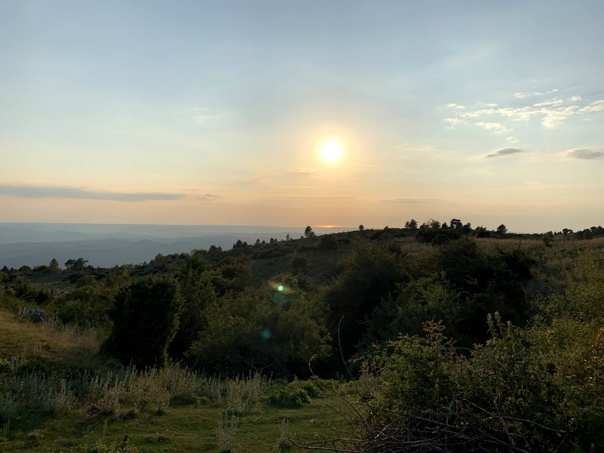

\[caption id="attachment\_10861" align="alignleft" width="700"\] Blick von Mala Učka am Berg Vojak über Istrien in Richtung Venedig\[/caption\]

Am letzten Wochenende waren wir in Kroatien, in Karlovac, Ičići und dann in Zagreb. Wir haben uns von unserer Freundin [Erika](https://erikapetric.com/ "| architecture . photography . research") verabschiedet, die im Juli gestorben ist. Erika hatte schon lange Krebs, das wussten wir. Wir haben aber nicht geglaubt, dass diese Krankheit sie einfach wegnehmen würde. Ich bin nicht sicher, ob sie es selbst erwartet hat. Wir waren und sind so ratlos wie ihr Freund, der in ihren letzten Wochen immer mit ihr zusammen war - nach der Corona-Zeit, in der er nicht aus der Lombardei hinausdurfte und Erika in Graz völlig allein im Krankenhaus lag.

Das Wochenende war drückend heiss. Wir haben viele Menschen kennengelernt, die für unsere Freundin wichtig waren und denen sie wichtig war. Gemeinsam zu trauern schafft eine Verbundenheit, die ich nicht kannte, selbst zwischen Menschen, die sich nie gesehen haben. Die Intimität, für die der Tod sorgt, ist stärker als jedes _social distancing_.

Erika war nicht religiös, jedenfalls nicht katholisch. Sie wurde nach ihrem Tod eingeäschert—wir haben vermutet, dass das ihrem Willen entsprach. Sie wurde in Karlovac neben ihrem Bruder beigesetzt. Erikas Bruder wurde im Kroatien-Krieg von einem Gleichaltrigen erschossen, der mit seiner Waffe spielte. Er war gerade erst erwachsen geworden. Erika ist über diesen besonders absurden Tod nie hinweggekommen. Als ich sie kennenlernte, hat sie eine Ausstellung dazu geplant. Sie hat sich später mit dem Schützen getroffen und blieb mit ihm in Verbindung. So hat sie versucht, nicht hart zu werden.

In Ičići hatte Erika eine kleine Ferienwohnung. Erika hat meist an mehreren Orten zugleich gelebt, aber in Ičići hat sie sich am wohlsten gefühlt. Wir haben einen kleinen Teil ihrer Asche im Meer, in ihrem Garten und auf einem Berg verstreut. Ich bin selbst so katholisch, dass mir solche privaten Rituale etwas riskant vorkommen (so wie das private Ritual, mit dem wir vor ein paar Jahren unsere Hochzeit auf Šipan gefeiert haben). Einmal habe ich versteckt ein Kreuzzeichen gemacht.

Den Namen _Ičići_ habe ich von meinen Reisen auf die Insel Cres in Erinnerung. Er kam mir typisch kroatisch vor. Kroatien war damals für mich ein exotisches Land. Diesmal haben wir immer wieder auf Cres geschaut, vom Lungomare aus und, noch besser, von oben aus dem Gebirge. Ich hätte nie gedacht, einmal fast zu einem Familienbesuch hierhin zu kommen. Auch der Tag in Karlovac war eine seltsame Wiederholung. Fast genau ein Jahr vorher waren wir mit Anas Kindern in Karlovac, auf dem Weg nach Žirje. Nach Erikas Beisetzung haben wir von einer Terrasse auf die Stelle eines Flusses geschaut, an der wir damals gebadet haben.

Wir sind mit dem Bus zurück nach Graz gefahren und haben unterwegs Anas Tante in Zagreb besucht. An den Grenzen mussten alle Insassen des Busses dreimal aussteigen, in einer Schlange vor den Ordnungskräften warten und sich auf Ausweise oder erhöhte Temperatur kontrollieren lassen. Menschen, die vom Balkan kommen, sind in Mitteleuropa geduldet, aber nicht erwünscht. Erika hat auch über ein Ausstellungsprojekt nachgedacht, das diese Erfahrung von Grenzen verarbeitet, der Title war _Smuggling_.
