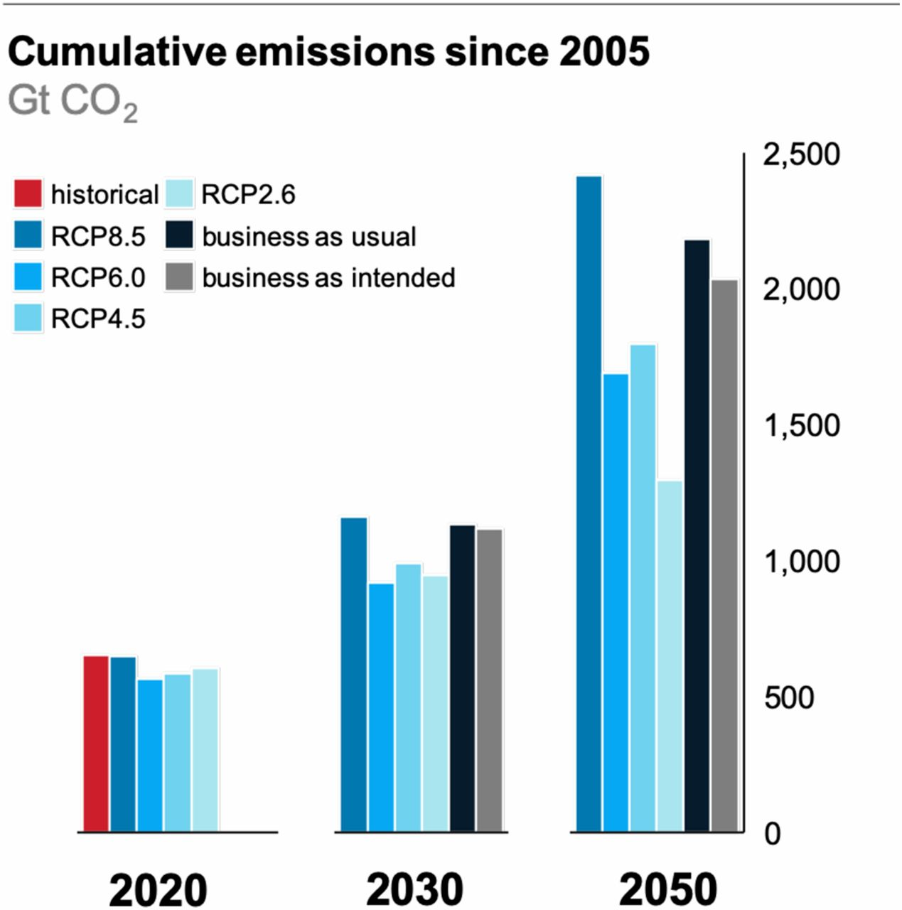

Habe eben den Artikel [RCP8.5 tracks cumulative CO2 emissions](https://www.pnas.org/content/early/2020/07/30/2007117117 "RCP8.5 tracks cumulative CO2 emissions | PNAS") (Schwalm, Glendon, and Duffy [2020](#ref-schwalmRCP8TracksCumulative2020)) gelesen, über den in vielen Medien berichtet wurde (meine Hypothesis-Annotationen [hier](https://hyp.is/go?url=https%3A%2F%2Fwww.pnas.org%2Fcontent%2Fearly%2F2020%2F07%2F30%2F2007117117&group=__world__)). Es geht darum, welches der Szenarien, die der Weltklimarat für die zukünftige Entwicklung vorgeschlagen hat, am realistischsten ist. Die Autoren kommen zu dem Ergebnis, dass das Worst Case-Szenario RCP8.5 vom bisherigen Verlauf der CO2 Emissionen bestätigt wird: Die kumulierten Emissionen bis 2005 weichen nur um ca. 1% von diesem Szenario ab. Andererseits stellen sie fest, dass dieses Szenario auch die Risiken der wahrscheinlichen Entwicklung bis 2050 am besten erfasst. Zwar sind die aktuellen CO2-Emissionen niedriger als in RCP8.5—sie liegen zwischen diesem Szenario und dem nächstschlimmen RCP4.5. Aber die inzwischen bekannten Feedback-Mechanismen (z.B. Auftauen des Permafrosts, Zerstörung von Böden, zunehmende Waldbrände) tragen zusätzlich zum Treibhauseffekt bei, so dass das _Business-as-usual_\-Szenario RCP8.5 den tatsächlichen Risiken der aktuellen Entwicklung am besten entspricht.

* * *

Gesamte kumulierte CO2-Emissionen von 2005 bis 2020, 2030 und 2050. Datenquellen: Historische Daten aus dem Global Carbon Project (6); Emissionen, die mit den RCPs übereinstimmen, stammen aus der RCP-Datenbank Version 2.0.5 (https://tntcat.iiasa.ac.at/RcpDb/); "business as usual" und "business as intended" stammen aus den Szenarien "Current Policies" bzw. "Stated Policies" der IEA (9). Die IEA-Daten (nur fossile Brennstoffe aus der Energienutzung) wurden mit der zukünftigen Landnutzung und den Industrieemissionen kombiniert, um die gesamten CO2-Emissionen zu schätzen. Die zukünftigen Landnutzungsemissionen wurden anhand linearer Trendanpassung an die Landnutzungsemissionsdaten des Global Carbon Project von 2005 bis 2019 geschätzt (6). Industrieemissionen werden auf 10% der Gesamtemissionen geschätzt. Die endgültigen IEA-Daten verwenden historische Werte bis 2020 und danach Szenariowerte. Biotische Rückkopplungen sind in keiner IEA-basierten Schätzung enthalten. Es ist zu beachten, dass die RCP-Antriebsniveaus (im Original: forcing levels) die Summe der biotischen Rückkopplungen und der menschlichen Emissionen darstellen sollen. (Übersetzung der Original-Bildunterschrift mit Hilfe von [https://www.deepl.com/translator](https://www.deepl.com/translator)). Originalgrafik: [https://www.pnas.org/content/early/2020/07/30/2007117117/tab-figures-data](https://www.pnas.org/content/early/2020/07/30/2007117117/tab-figures-data). Distributed under [Creative Commons Attribution-NonCommercial-NoDerivatives License 4.0 (CC BY-NC-ND)](https://creativecommons.org/licenses/by-nc-nd/4.0/)

* * *

Ein Hintergrund dieser Veröffentlichung in den _Proceedings_ der Akademie der Wissenschaften der USA sind Forschungen zur Klimasensitivität. Soweit ich informiert bin, ist dabei vor allem die Studie [An assessment of Earth's climate sensitivity using multiple lines of evidence](https://agupubs.onlinelibrary.wiley.com/doi/abs/10.1029/2019RG000678 "An assessment of Earth's climate sensitivity using multiple lines of evidence - Sherwood - - Reviews of Geophysics - Wiley Online Library") (und das öffentliche Echo auf sie) relevant (Sherwood et al. [2020](#ref-sherwoodAssessmentEarthClimate2020)), bei der das _radiative forcing_, der _Strahlungs-Antrieb_, zu dem eine Verdoppelung der Treibhaugase gegenüber dem vorindustriellen Niveau führt, genauer angegeben wird als bisher. Sie beträgt danach mit 66% Wahrscheinlichkeit 2.6‐3.9 Grad Kelvin.

Zeke Hausfather, einer der Autoren dieser Studie hat zu der Verteidigung von RCP8.5 [in einem Twitter-Thread](https://twitter.com/hausfath/status/1290362946325889024 "Zeke Hausfather auf Twitter: "PNAS published a defense of the RCP8.5 scenario by the scientists at @woodsholeresctr. While I agree with parts of it, some parts are also a bit incomplete or problematic. Lets take a look: https://t.co/5ddiwUV1aY 1/14" / Twitter") kritisch Stellung genommen. Darin geht er auf eine Reihe weiterer Forschungen und Modelle ein, aus denen sich ihm zufolge eine Relativierung der Wahrscheinlichkeit von RCP8.5 ergibt—wenn man das so formulieren darf.

Hinter der auf viele esoterisch wirkenden Frage nach der Wahrscheinlichkeit von RCP8.5 steht das—soweit man es wissen kann—wichtigste gesellschaftliche Problem der Gegenwart—ob und wie sich vermeiden lässt, dass die Erde das Holozän endgültig verlässt und sich zu einem Treibhaus entwickelt. Mich interessiert hier, wie dabei das Verhältnis von wissenschaftlichen, journalistischen und anderen Inhalten oder Veröffentlichungen zueinander ist, und ob sich Content-Strategien für diese Art von wissenschaftlicher Diskussion formulieren lassen. Wenn man wissenschaftliche Veröffentlichungen wie die zu RCP8.5 liest, merkt man schnell, dass sich hier nicht eine politische oder praktische Ebene von einer wissenschaftlichen abtrennen lässt, sondern dass es um die Interpretation komplexer Fakten geht, die, lax formuliert, sowohl naturwissenschaftlichen wie politischen Charakter haben, und die aber nicht (wie von den Klimaleugnern betrieben), _politisiert_ werden dürfen, um unliebsame Folgen erkannter Fakten zu vertuschen.

## Nachweise

Schwalm, Christopher R., Spencer Glendon, and Philip B. Duffy. 2020. “RCP8.5 Tracks Cumulative CO 2 Emissions.” _Proceedings of the National Academy of Sciences_, August, 202007117. doi:[10.1073/pnas.2007117117](https://doi.org/10.1073/pnas.2007117117).

Sherwood, S., M. J. Webb, J. D. Annan, K. C. Armour, P. M. Forster, J. C. Hargreaves, G. Hegerl, et al. 2020. “An Assessment of Earth's Climate Sensitivity Using Multiple Lines of Evidence.” _Reviews of Geophysics_, July. doi:[10.1029/2019RG000678](https://doi.org/10.1029/2019RG000678).
