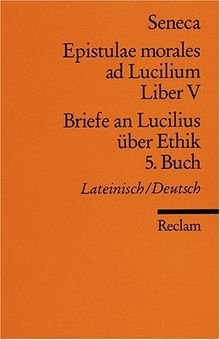

In dieser Woche habe ich [meinen Vater](https://wittenbrink.net/lostandfound/papa/ "Papa – Lost and Found") besucht. Mein Vater ist 1922 geboren, er hat seit etwa 90 Jahren wahrscheinlich jeden Tag etwas gelesen. Wenn ich ihn sehe, sprechen wir immer auch über Texte. Wenn er schlafen geht, nimmt er ein Reclamheft mit Seneca-Briefen, ein Smartphone und eine Brille mit.

\[caption id="attachment\_10907" align="alignleft" width="220"\] Seneca, Briefe an Lucilius, 5. Buch. Cover einer Reclam-Ausgabe\[/caption\]Wir haben in der letzten Woche zwei [Seneca-Briefe](https://www.thelatinlibrary.com/sen/seneca.ep5.shtml "Seneca: Epistulae Morales, Liber V") zusammen übersetzt. Ein wenig hat mich das in meine Schulzeit zurückversetzt, als ich vor jeder Latein-Schularbeit Nachmittage mit meinem Vater gelernt habe. Wahrscheinlich habe ich mich damals daran gewöhnt, Texte zu lesen, die sich nicht einfach erschließen, die man übersetzen muss, und die immer auch fremd bleiben—die einen aber auch hoffen lassen, die fremde Sprache, in der sie geschrieben sind, irgendwann zu beherrschen, so dass man sie ohne Übersetzung einfach versteht.

Ich habe wahrscheinlich auch schon sehr früh von meinen Eltern (und noch mehr von meiner Mutter als von meinem Vater) gelernt, Lesen als etwas zu verstehen, bei dem man Bezüge herstellt, bei dem man sich zwischen einem Text und anderen Texten hin- und herbewegt. So wie das Übersetzen aus einer fremden Sprache hat dieses Herstellen von Beziehungen etwas Lustvolles, vielleicht sogar Delirierendes, und etwas Enttäuschendes. Der Bezug verspricht den Text zu erklären, und gleichzeitig ist er willkürlich, zufällig oder überflüssig: möglicherweise nur Teil eines toten enzyklopädischen Wissens oder eines Beziehungswahns, bei dem man sich aus isolierten Lesebruchstücken ein Weltbild synthetisiert.

Menschen aus der Generation meines Vaters und meiner Lehrer würden wahrscheinlich empfehlen, die Lektüre auf das eigene Erleben zu beziehen, um nicht enttäuscht zu werden, sich in Bezügen zu verlieren und immer weiter von sich selbst zu entfernen. Ich nehme das Erleben selbst schon so sehr als Lektüre und Lektüre-abhängig wahr, dass es mir nicht als Gegenpol zu Lektüre ausreicht. Um mich nicht in der Lektüre zu verlieren, versuche ich nicht nur über das zu schreiben, was ich lese, sondern auch über das Lesen selbst, über das, was dabei passiert. Deshalb komme ich wahrscheinlich immer wieder darauf zurück, darüber zu bloggen.

* * *

Ich kann einen Text, den ich lese, aktualisierend übersetzen, ihn als für die Situation geschrieben lesen, in der ich mich gerade befinde. Damit passe ich ihn in ein phantasiertes großes Ganzes ein, relativiere ihn. Ich schaffe ein tertium comparationis auf das ich den Text ebenso beziehen kann wie das, was ich selbst sagen kann. Ich kann aber auch davon ausgehen, dass ich den Text durch die Übersetzung oder Interpretation in einen anderen Text umforme, der so nur hier und jetzt möglich ist, und dass ich durch diese Umformung erkenne, was hier und jetzt möglich ist.

Ich kann Seneca also z.B. aktualisierend lesen und versuchen, aktuelle Gegenstücke zu der grausamen Behandlung von Sklaven zu finden, über die er schreibt. (Eine solche _Horizontverschmelzung_ ist wahrscheinlich eine Bestandteil jeder, auch einer konsequent dekonstruktiven Lektüre. Sie entspricht dem Verstehen eines Textes ohne Wahrnehmung eines Übersetzungsvorgangs.) Ich kann aber auch versuchen, zu verstehen, wie und warum ich ihn so lese, wie ich ihn jetzt lese, was ich dabei voraussetze und was ich ausblende. Andere Texte, die ich gelesen habe, helfen mir ihn zu verstehen, unabhängig davon, ob es zwischen diesen Texten eine kausale Verbindung gibt.

Mich hat in den Texten Senecas überrascht, wie sehr sie an Montaigne und die französischen Moralisten erinnern—das macht sie für mich leichter als andere lateinische Texte. Durch diese Art von Beziehungen verstehe ich nicht Seneca besser (also den Autor _Seneca_, den ich unabhängig von seiner Wirkungsgeschichte konstriere). Ich verstehe aber etwas besser (oder ich glaube wenigstens es besser zu verstehen), das zu meiner Geschichte und Situation gehört, nämlich einen Typ des sentenziösen, moralisierenden und zugleich philosophischen Schreibens, der möglicherweise sogar mitdefiniert, was ich hier in meinem Blog tue.

Durch diese Art von Lektüre komme ich nicht zu etwas Allgemeinem, zur Erkenntnis von Gesetzmäßigkeiten, zu etwas _Gültigem_. Ich komme eher dazu, etwas Besonderes wahrzunehmen und festzuhalten wie in einer Reisebeschreibung— von dem Besuch bei meinem Vater, der mir diese Lektüre ermöglicht, über die Besonderheit des moralistischen Schreibens (die ich anders wahrnehmen würde, wenn ich andere Texte gelesen hätte) bis hin zum auch zufälligen Festhalten dieser Besonderheiten in meinem Blog.

Als ich mit diesem Text begonnen habe, wollte ich von den Hinweisen auf die Reise zu meinem Vater und zu Seneca zu einem anderen Thema überleiten, nämlich meiner Verwendung eines neuen Lektüretools und der Verlegenheit, mich nicht in den Lesebruchstücken zu verlieren. Durch diesen Umweg, wird mir etwas klarer, was ich auch dort, bei der Verwendung von [Hypothesis](https://hypothes.is/users/HeinzWittenbrink "Hypothesis") suche: nicht Aktualisierung, sondern Möglichkeiten zu erfassen, was aktuell, was vielleicht nur genau jetzt und genau hier so möglich ist.
