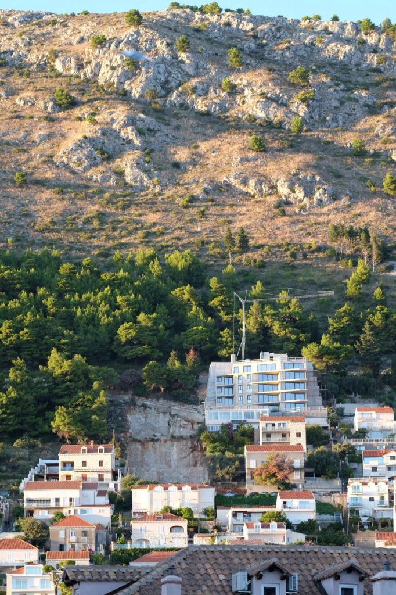

Zurück aus Dubrovnik - nach drei Wochen Urlaub, von denen ich die erste [zum größten Teil im Bett verbracht habe](https://wittenbrink.net/lostandfound/campylobacter/ "Campylobacter – Lost and Found").

Ich schreibe monothematisch: Was ich wahrnehme, sehe ich vor dem Hintergrund von Klimakrise und Überschreiten der [Planetaren Grenzen](https://de.wikipedia.org/wiki/Planetare_Grenzen "Planetare Grenzen – Wikipedia"). Ich wünschte mir, mein früherer Vorgesetzter Günter Riegler hätte Recht, [wenn er mir vorwirft, dass ich einer Ideologie nachlaufe](https://twitter.com/GuenterRiegler/status/1300141114213699584 "Günter Riegler auf Twitter: "@heinz @siegfriednagl @GrazStadt @StadtGraz Mah bitte @heinz - Du betest da eine Propaganda nach ... kein Wohnungsbau mehr? Mieten steigen lassen? Kein Zuzug mehr? Keine Forschung? Keinen Zuwachs bei Studierenden? Geh bitte, das willst Du doch selbst nicht ..." / Twitter"). Aber mein Verstand und meine wissenschaftliche Grundbildung sagen mir, dass wir mit unserer Wachstumswirtschaft geradewegs in eine Katastrophe gesteuert sind. Dieser Gedanke nimmt mir auch in Dalmatien am Meer die Unbefangenheit.

Hier in Graz fällt es mir nicht zu schwer mir vorzustellen, wie eine Entwicklung zu einer [Postwachstumsstadt](https://www.postwachstumsstadt.de/ "Postwachstumsstadt") aussehen könnte. Wenn eine kleine, reiche Stadt mit einer vielfältigen Wirtschaft diesen Übergang nicht schaffen könnte, wäre er wohl überall unmöglich (außer wenn nicht die Reichen, sondern die Armen die treibenden Kräfte hinter den großen historischen Veränderungen sind.) In Dubrovnik ist es anders. Die Wirtschaft in Dubrovnik hat sich an eine der Adern des fossilen Kapitalismus angesaugt, nämlich die des internationalen Massentourismus. Wenn durch diese Ader kein Blut—kein Öl—mehr fließt, gerät die Stadt in eine Existenzkrise. In der Zeit der Pandemie, in der auf dem [Stradun](https://de.wikipedia.org/wiki/Stradun "Stradun – Wikipedia") Anfang September so wenige Touristen herumgehen wie sonst im Spätherbst, kann man sich diese Krise vorstellen—auch wenn niemand daran glaubt, dass sie endgültig sein könnte.

\[caption id="attachment\_10977" align="alignleft" width="682"\] Neubau in Dubrovnik, 2020\[/caption\]

Der Tourismus in Dubrovnik ist noch CO2-intensiver als anderswo. Die meisten Gäste kommen in normalen Jahren mit den unablässig [bei Cavtat](https://de.wikipedia.org/wiki/Flughafen_Dubrovnik "Flughafen Dubrovnik – Wikipedia") startenden und landenden Flugzeugen. Massen besuchen die Stadt auf Kreuzfahrten mit riesigen, mit Schweröl angetriebenen Schiffen. Wenn man nachts auf Dubrovnik schaut, sieht man die Ketten von Autos, die in die Stadt hinein und aus ihr hinausfahren. Mit dem Zug kann man Dubrovnik nicht erreichen, und man kann sich übrigens dort auch kaum mit dem Fahrrad bewegen. Dabei wird die Stadt im Sommer noch von den Luxusyachten des [einen Prozent](https://www.sueddeutsche.de/politik/occupy-wall-street-ursprung-und-zukunft-einer-bewegung-ihr-seid-reich-wir-die-mehrheit-1.1161905 "Occupy Wall Street - Ursprung und Zukunft einer Bewegung - Ihr seid reich - wir die Mehrheit - Politik - SZ.de") belagert, das dieses Wirtschaftssystem kontrolliert—nicht wenige von ihnen unter der Flagge Australiens, eines Landes [mit einer der höchsten CO2-Emissionsraten pro Kopf](https://en.wikipedia.org/wiki/Greenhouse_gas_emissions_by_Australia "Greenhouse gas emissions by Australia - Wikipedia").

Wir schauen von der Terrasse vor unserer Wohnung in Dubrovnik auf die Altstadt, deren Anblick mich wegen der Unwahrscheinlichkeit dieses Ensembles bei jedem Besuch wieder überrascht. Das alte Dubrovnik zeigt, was in den Epochen vor der Entdeckung von Kohle und Erdöl möglich war, wenn man die vorhandenen knappen und schwer zu kontrollierenden Energien perfekt ausnutzte: den Wind, um mit Segelschiffen mit einem großen Teil der damals bekannten Welt Handel zu treiben, und die Muskelkraft von Menschen und Tieren für Karawanen aus dem Landesinneren und zum Bau der monumentalen Mauern und Festungen, die den Rahmen der Stadt bilden.

Der Tourismus hat in Dubrovnik und in seiner Umgebung einen Immobilienboom ausgelöst. Es wird überall gebaut, meist ohne ästhetische Rücksichten und mit ebenfalls CO2 emittierendem Beton. Das Geld, das man über den Tourismus erhält, wird in Möglichkeiten investiert, noch mehr Touristen unterzubringen, und diese Immobilen zwingen dazu, den Tourismus zu intensivieren. Hinter einigen dieser Bauten stecken, wie man von Einheimischen erfährt, mafiöse Strukturen, die—von der Regierungspartei HDZ geschützt—die Möglichkeiten ausnutzen, Geld aus der Herzegowina in Dubrovnik und Geld aus Dubrovnik in der Herzegowina zu waschen.

Die touristische Destination Dubrovnik ist ein Symbol einer globalisierten Wirtschaft, deren exponentielles Wachstum die, die bereits abhängig sind, exponentiell noch abhängiger macht. Der Tourismus koppelt die Stadt von ihrer Region ab. Das Seafood, das die Touristen tonnenweise verspeisen, stammt so wenig aus der Umgebung von Dubrovnik wie das Gemüse, das man in den Supermärkten kauft. Eine Ökologisierung dieser Region, eine Ausrichtung auf die Kultivierung des Territoriums (am Land und im Meer) ist eine Herkulesaufgabe. Wenn wir in Österreich über ökologische Politik sprechen, sollten wir noch mehr über die Verhältnisse nachdenken, die nur wenige 100 km entfernt in einer Region wie Dalmatien herrschen—für dessen wirtschaftliche Entwicklung österreichische Banken durch ruinöse Kreditbedingungen übrigens eine fatale Rolle spielten.

Auf der Rückfahrt nach Zagreb (mit einem nicht CO2-freien Auto) habe ich versucht wahrzunehmen, wie sich die Natur von Süd- nach Norddalmatien ganz allmählich verändert, bis man dann, am Velebit, ziemlich plötzlich die Grenze zwischen der mediterranen und der mitteleuropäisch alpinen Region überschreitet. Geringe Unterschiede in der Temperatur und in der Dichte der Vegetation führen zu völlig verschiedenen Landschaften—Unterschiede, die viel kleiner sind, als die 2, 3 oder mehr Grad Celsius Temperatursteigerung, die uns in den kommenden Jahrzehnten bevorstehen. Ich genieße Dubrovnik und die mediterrane Landschaft, auch wenn ich die ökologische Krise und die Frage, was man gegen sie tun kann, nicht aus dem Kopf bekomme. Gerade deshalb ist es für mich immer weniger selbstverständlich, dass diese Stadt und diese Landschaften erhalten bleiben.
