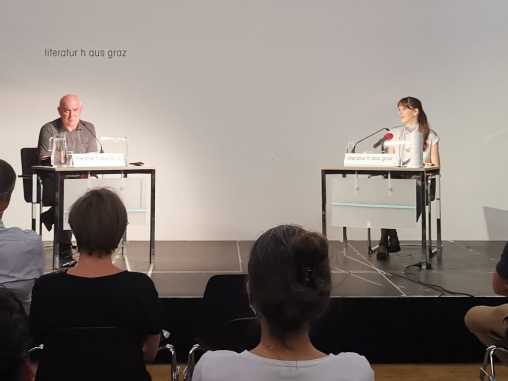
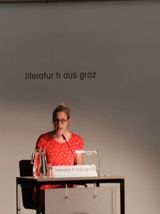

Am Donnerstagabend wurde [Jana Radičević als neue Grazer Stadtschreiberin](http://www.literaturhaus-graz.at/veranstaltung/come-together-jana-radicevic/ "Come together: Neue Stadtschreiberin Jana Radičević | Literaturhaus Graz") eingeführt. Nina Reichert las Übersetzungen von Gedichten aus dem Band [Ako kažem može postati istina](https://www.partizanskaknjiga.com/knjige/ako-kazem-moze-postati-istina-jana-radicevic "Ako kažem može postati istina - Jana Radičević | Partizanska Knjiga") (_Wenn ich es sage, kann es wahr werden_). Sie werden demnächst in den [Lichtungen](https://lichtungen.at/ "Lichtungen") erscheinen.

\[caption id="attachment\_11042" align="aligncenter" width="700"\] Jana Radičević und Klaus Kastberger im Literaturhaus Graz, 10. September 2020\[/caption\]

Die Texte erschließen sich nur zu einem kleinen Teil, wenn man sie einmal in einer Übersetzung hört. Manche Gedichte habe ich als einen Fluß aus gleichwertigen Sätzen und Bildern wahrgenommen, sie haben mich an [John Ashbery](https://www.poetryfoundation.org/poets/john-ashbery "John Ashbery | Poetry Foundation") und an [Marko Pogačar](https://korrespondenzen.at/pogacar-an-die-verlorenen-haelften/ "Marko Pogačar: An die verlorenen Hälften | Edition Korrespondenzen") erinnert, der vor ein paar Jahren in Graz gelesen hat. Es kann sein, dass ich damit ganz falsch liege. \[caption id="attachment\_11044" align="alignleft" width="225"\] Nina Reichert liest Gedichte von Jana Radičević, 10. September 2020\[/caption\] In anderen Texten spielen Kindheitserinnerungen, die vor allem um den Großvater und die Großmutter kreisen, eine wichtige Rolle. Die Texte sind in sich vielfältig und konzessionslos. Nina Reichert hat sie sehr klar und nicht zu nüchtern so gelesen, dass sich nicht einzelne Elemente vordrängten. Möglicherweise wirken die Gedichte im Original knapper oder spröder als in der deutschen Version. Auf YouTube gibt es einen Trailer zu zum ersten Gedichtbuch von Jana Radičević, mit dem Text, den sie am Donnerstag zu Anfang der Lesung auf serbokroatisch vorgetragen hat:

https://youtu.be/3QYXYh4O5vs

Ich bin auf die Publikation in den Lichtungen gespannt (und hätte gern so viel Zeit zum Sprachenlernen, dass ich die Texte bald im Original lesen kann.)
