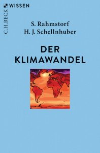

\[caption id="attachment\_11397" align="alignleft" width="197"\] Print-Cover des Buchs "Der Klimawandel" von Stefan Rahmstorf und Hans Joachim Schellnhuber\[/caption\]

Ich habe mir das kleine Buch von [Stefan Rahmstorf](http://www.pik-potsdam.de/~stefan/ "Home Page Stefan Rahmstorf") und [Hans Joachim Schellnhuber](https://www.pik-potsdam.de/members/john/ "Schellnhuber — Potsdam Institute for Climate Impact Research") über den Klimawandel (Rahmstorf & Schellnhuber, [2018](#ref-rahmstorfKlimawandelDiagnosePrognose2018)) schon vor einiger Zeit gekauft, mich aber jetzt erst gründlicher damit beschäftigt, angeregt durch das letzte Video Rahmstorfs [über Klimawandel und Meere](https://www.youtube.com/watch?v=Q8jn7sJzdDA "(653) Prof. Rahmstorf: Klimawandel und Meere - YouTube") (Potsdam Institut für Klimafolgenforschung, [2020](#ref-potsdaminstitutfurklimafolgenforschungProfRahmstorfKlimawandel2020)) .

Ich habe Schellnhuber und Rahmstorfs Buch wie ein Geschichtsbuch gelesen. Es beginnt mit der Darstellung des Klimas in den geologischen Epochen bis zum Holozän, behandelt dann die anthropogenen Veränderungen des Klimas und ihre Folgen für die Gesellschaften und Ökosysteme auf dem Planeten und im letzten Teil die Versuche und Möglichkeiten, eine Klimakatastrophe noch abzuwenden. Verbunden sind diese Themen durch Passagen über die Geschichte der Erforschung des Klimas.

Die aktualisierte letzte Ausgabe ist gerade erst zwei Jahre alt. Inhaltlich ist, soweit ich das als Nichtwissenschaftler sagen kann, bereits viel hinzuzufügen. Die [große Bescheunigung](http://www.igbp.net/globalchange/greatacceleration.4.1b8ae20512db692f2a680001630.html "Great Acceleration - IGBP") beschleunigt auch die Geschichte des Klimas: Innerhalb von wenigen Jahren verändern sich Ökosysteme radikal, und auch für die Reaktionen auf den Klimawandel ist entscheidend, was innerhalb weniger Jahre geschieht. Fridays for Future werden noch nicht erwähnt. Dennoch ist das Buch zwei Jahre nach seinem Erscheinen eine fundierte Einführung in die Thematik, auch durch die Konzentration auf die wichtigsten Entwicklungen und die Literatur dazu. Wäre ich der Lektor einer neuen Ausgabe, würde ich die Autoren bitten, außer auf die Klimabewegung auf die letzten Berichte des IPCC (IPCC, [2018](#ref-ipccGlobalWarmingIPCC2018), [2019](#ref-ipccClimateChangeLand2019); IPCC et al., [2019](#ref-ipccIPCCSpecialReport2019)) und auf die Publikationen zu den Kipppunkten (Lenton et al., [2019](#ref-lentonClimateTippingPoints2019); Steffen et al., [2018](#ref-steffenTrajectoriesEarthSystem2018)) einzugehen, an denen sie selbst mitgearbeitet haben. Vermisst habe ich ausführlichere Informationen zur Zerstörung der Biodiversität und über die Treibhausgase, die durch die Landwirtschaft produziert werden. Sicher wäre ein Abschnitt über den IPBES-Report (IPBES, [2019](#ref-ipbesGlobalAssessmentReport2019)) wichtig, und spätestens nach der Corona-Pandemie würde man auch gern etwas über die Zusammenhänge zwischen Klima und planetarer Gesundheit (Müller et al., [2018](#ref-mullerPlanetaryHealthUmfassendes2018)) lesen.

Als Lektor würde ich versuchen, eine aktuell gehaltene Onlineversion dieses Buches herauszubringen. (Es gibt eine 9. Auflage als Print-, aber nicht als Epub-Ausgabe; sie ist offenbar inhaltlich nicht verändert.) Zwar kann man Informationen zu allen aktuellen Entwicklungen auch an anderen Stellen finden, aber hier sprechen zwei Autoren mit einer Kompetenz, die wohl niemand im deutschen Sprachraum übertrifft. Deshalb wäre eine Gewichtung der neueren Entwicklung, darunter auch der Extremwetter-Ereignisse der letzten Jahre, aus ihrer Sicht besonders interessant. Zum Glück schreibt Stefan Rahmstorf laufend im Spiegel, in der [KlimaLounge](https://scilogs.spektrum.de/klimalounge/ "KlimaLounge » Nah dran am Wandel » SciLogs - Wissenschaftsblogs") und auf [Twitter](https://twitter.com/rahmstorf "Stefan Rahmstorf / Twitter"). Hans Joachim Schellnhuber interveniert immer wieder öffentlich, gerade erst bei einem Wiener [Wiener Stadtgespräch](https://cms.falter.at/falter/wiener-stadtgespraech/?gespraech=51 "Wiener Stadtgespräch - FALTER.at") und in einem Interview mit [Benedikt Narodoslawsky](https://twitter.com/dernaro "(3) B. Narodoslawsky / Twitter") (Narodoslawsky, [2020](#ref-narodoslawskyIstEtwasAtemberaubendes2020)).

Das Buch zeigt, dass nicht nur das Klima sondern auch die Klimawissenschaft eine Geschichte hat, zu deren Protagonisten die beiden Autoren gehören. Diese Geschichte definiert, was wir unter Klima- und Erdsystem verstehen, nicht weil das Wissen von den individuellen Perspektiven abhinge, also relativ wäre, sondern weil es in der Interpretation dieser Beiträge in einer wissenschaftlichen Community und ihren Institutionen entsteht. Schellnhuber und Rahmstorf verweisen immer wieder auf einzelne Forschungsprojekte und Entdeckungen, die die Klimawissenschaft vorangebracht haben. Als Beteiligte an der Geschichte der Klimaforschung vermitteln Rahmstorf und Schellnhuber authentisch, wie Wissen über das Klima entstanden ist und entsteht, auch wenn sie es in einer scheinbar unpersönlichen enzyklopädischer Form dokumentieren.

Wir sind noch immer gewohnt, zwischen Naturwissenschaften und Sozial- und Geisteswissenschaften zu unterscheiden und die Geschichte den Geisteswissenschaften zuzuordnen. Man kann dieses Buch als Infragestellung dieser Unterteilung interpretieren. Es zeigt, dass das Klima und mit ihm das Erdsystem ein historisches, veränderliches und empfindliches System ist, und dass die Erforschung dieses Systems selbst eine Geschichte hat, in der ein sich veränderndes Wissen von Individuen, Gruppen und Projekten produziert wird, und dass wir auf die Privilegierung einer menschlichen, von der Natur getrennten Geschichte wohl bald als eine vorübergehende Phase zurückblicken werden.

## Nachweise

IPBES. (2019). _Global assessment report of the intergovernmental science-policy platform on biodiversity and ecosystem services_ (p. 1753). IPBES Secretariat. [https://doi.org/10.5281/zenodo.3831674](https://doi.org/10.5281/zenodo.3831674)

IPCC (Ed.). (2018). _Global Warming of 1.5°C. An IPCC Special Report on the impacts of global warming of 1.5°C above pre-industrial levels and related global greenhouse gas emission pathways, in the context of strengthening the global response to the threat of climate change, sustainable development, and efforts to eradicate poverty_.

IPCC. (2019). _Climate Change and Land: an IPCC special report on climate change, desertification, land degradation, sustainable land management, food security, and greenhouse gas fluxes in terrestrial ecosystems \[P.R. Shukla, J. Skea, E. Calvo Buendia, V. Masson-Delmotte, H.-O. Pörtner, D. C. Roberts, P. Zhai, R. Slade, S. Connors, R. van Diemen, M. Ferrat, E. Haughey, S. Luz, S. Neogi, M. Pathak, J. Petzold, J. Portugal Pereira, P. Vyas, E. Huntley, K. Kissick, M. Belkacemi, J. Malley, (eds.)\]_. IPCC.

IPCC, Pörtner, H. O., Roberts, D. C., Masson-Delmotte, V., Zhai, P., Tignor, M., Poloczanska, P., Mintenbeck, K., Alegría, A., Nicolai, M., Okem, A., Petzold, J., Rama, B., & Weyer, N. M. (Eds.). (2019). _IPCC Special Report on the Ocean and Cryosphere in a Changing Climate_. In Press. [https://www.ipcc.ch/site/assets/uploads/sites/3/2019/12/SROCC\_FullReport\_FINAL.pdf](https://www.ipcc.ch/site/assets/uploads/sites/3/2019/12/SROCC_FullReport_FINAL.pdf)

Lenton, T. M., Rockström, J., Gaffney, O., Rahmstorf, S., Richardson, K., Steffen, W., & Schellnhuber, H. J. (2019). Climate tipping points — too risky to bet against. _Nature_, _575_(7784), 592–595. [https://doi.org/10.1038/d41586-019-03595-0](https://doi.org/10.1038/d41586-019-03595-0)

Müller, O., Jahn, A., & Gabrysch, S. (2018). Planetary health: Ein umfassendes Gesundheitskonzept. _Dtsch Arztebl International_, _115_(40), A–1751 –. [https://www.aerzteblatt.de/int/article.asp?id=201358](https://www.aerzteblatt.de/int/article.asp?id=201358)

Narodoslawsky, B. (2020, November 24). _Da ist etwas Atemberaubendes passiert_. [https://www.falter.at/zeitung/20201124/da-ist-etwas-atemberaubendes-passiert](https://www.falter.at/zeitung/20201124/da-ist-etwas-atemberaubendes-passiert)

Potsdam Institut für Klimafolgenforschung (Director). (2020, November 19). _Prof. Rahmstorf: Klimawandel und Meere_. [https://www.youtube.com/watch?v=Q8jn7sJzdDA&feature=emb\_logo](https://www.youtube.com/watch?v=Q8jn7sJzdDA&feature=emb_logo)

Rahmstorf, S., & Schellnhuber, H.-J. (2018). _Der Klimawandel: Diagnose, Prognose, Therapie_ (8., vollständig überarbeitete und aktualisierte Auflage, Originalausgabe). C.H. Beck.

Steffen, W., Rockström, J., Richardson, K., Lenton, T. M., Folke, C., Liverman, D., Summerhayes, C. P., Barnosky, A. D., Cornell, S. E., Crucifix, M., Donges, J. F., Fetzer, I., Lade, S. J., Scheffer, M., Winkelmann, R., & Schellnhuber, H. J. (2018). Trajectories of the Earth System in the Anthropocene. _Proceedings of the National Academy of Sciences_, _115_(33), 8252–8259. [https://doi.org/10.1073/pnas.1810141115](https://doi.org/10.1073/pnas.1810141115)
