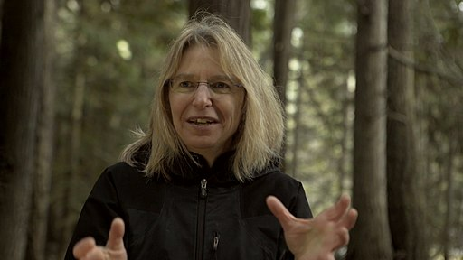

Suzanne Simard, Bildquelle: [Wikimedia Commons](https://commons.wikimedia.org/wiki/File:Suzanne_Simard.jpg)

Ich habe gestern den [letzten Wochenendpodcast der New York Times](https://www.nytimes.com/2020/12/06/podcasts/the-daily/tree-communication-suzanne-simard.html "The Sunday Read: ‘The Social Life of Forests’ - The New York Times") gehört, einer Reportage über die Forschungen [Suzanne Simards](https://forestry.ubc.ca/faculty-profile/suzanne-simard/ "Suzanne Simard | Faculty Member Profile | UBC Forestry") über Wälder und Bäume. Der Podcast ist die Audioversion eines [Artikels](https://www.nytimes.com/interactive/2020/12/02/magazine/tree-communication-mycorrhiza.html "The Social Life of Forests - The New York Times") von [Ferris Jabr](https://ferrisjabr.wordpress.com/ "Ferris Jabr") (Twitter: [(@ferrisjabr)](https://twitter.com/ferrisjabr?lang=de "Ferris Jabr (@ferrisjabr) / Twitter"). Jabr, der gerade ein Buch über die Koevolution von Erde und Leben schreibt, berichtet über Simards Leben, über ihre Publikationen, über die Wirkung ihrer Arbeiten und die Kritik an ihnen. Sein Artikel ist gut belegt. Er ist ein Best Practice-Beispiel für Wissenschaftsjounalismus in der Zeit des ökologischen Zusammenbruchs—auch wenn die Zerstörung der Ökosysteme, von denen er berichtet, nicht sein Hauptthema ist.

Jabr teilt die Begeisterung Suzanne Simards für den Wald. Man taucht beim Hören in die Welt ein, die Simard erforscht. Dafür sorgen vor allem die erzählerischen Teile des Textes, die Passagen über ihr Leben und einen gemeinsam Waldbesuch. In der Textversion tragen dazu die Fotos von [Brendan George Ko](http://www.brendangeorgeko.com/ "Brendan George Ko") bei.

Mich haben am meisten die Abschnitte über die Sensitivität der Bäume für ihre Umwelt fasziniert, z.B. die Vermutung, dass Bäume dazu in der Lage sind, Wasser in der Nähe zu “hören”. Suzanne Simard schließt nicht aus, dass Bäume Menschen in ihrer Nähe wahrnehmen. Sie hat sich dabei von irrationalistischen Interpretationen ihrer Forschungen immer distanziert.

Reflektierend berichtet Jabr über das Verhältnis der Forschungen Suzanne Simards zum üblichen Darwinismus, zum Konzept des _egoistischen Gens_. Dabei geht es um die metaphorische Ausweitung oder Generalisierung ihrer Forschungen, darum, ob die Evolution verstanden werden kann, wenn man nur die Gene der Individuen als Akteure annimmt, oder ob es eine eigene Evolution von größeren Einheiten gibt, wobei auf dieser Ebene auch diese Akteure selbst (etwas ein Wald) sich nicht in Konkurrenz zueinander entwickeln.

Jabr weist auf die Verbindungen Darwins zu Malthus und Adam Smith hin. Es liegt nahe, den Darwinismus, unabhängig davon, ob man ihn Darwin selbst zuordnen kann oder nicht, in eine Beziehung zur Ideologie des freien Markts und der Konkurrenz um begrenzte Ressourcen zu bringen, und diesem darwinistischen Konzept ein Denken gegenüberzustellen, bei dem Kooperation die Hauptrolle spielt und neue oder komplexe Entitäten oder Akteure nicht einfach auf die Selbsterhaltung ihrer Komponenten reduziert werden können. Was Simard über den Wald sagt, erinnert an die [Gaia-Hypothese](https://wittenbrink.net/lostandfound/ein-aufsatz-zur-geschichte-der-erdsystemwissenschaft-und-gaia-als-horizont-fuer-mein-blog/ "Ein Aufsatz zur Geschichte der Erdsystemwissenschaft—und Gaia als Horizont für mein Blog – Lost and Found") für das Leben auf der Erde als ganzes und an die Forschungen, die zeigen, dass [Menschen und andere höhere Tiere alles andere sind als Individuen](https://www.swarthmore.edu/past-commencements/last-collection-scott-gilbert "Last Collection: Scott Gilbert :: Past Commencements :: Swarthmore College"), sondern tatsächlich aus einer Vielheit unterschiedlicher Wesen bestehen, darunter Viren und Bakterien.

Ich bin ansprechbar für die metaphorische Interpretation solcher Forschungen, und auf dieser Ebene verstehe ich sie als Bestätigung eines nichtdarwinistischen, wenn man so sagen kann: anarchistischen Weltbilds. Viel wichtiger finde ich aber, dass man mit diesen Forschungsergebnissen den Reduktionismus, der letztlich jedem dieser Weltbilder und Ideologien zugrundeliegt, angreifen kann. Ich sehe sie als Argumente dafür, dass es auf keiner ontologischen Ebene so etwas wie privilegierte Akteure gibt, ein _Zugrundeliegendes_, auf das man dann die anderen Phänomene zurückführen kann. Wenn Simard von einer Soziologie des Waldes spricht, dann kann man das so weiterdenken, dass das Soziale eben in dieser Verbindung von Entitäten zu anderen, komplexen Entitäten besteht, deren Eigenschaften nicht auf die Eigenschaften ihrer Komponenten zurückgeführt werden können, ohne dass man sie deshalb selbst als letzte oder eigentliche Realität ansehen muss.

Ansatzpunkte zum Weiterlesen: Ich bin wieder auf Richard Powers gestoßen, dessen Roman [Die Wurzeln des Lebens](https://www.fischerverlage.de/buch/richard-powers-die-wurzeln-des-lebens-9783596703128 "Die Wurzeln des Lebens - Richard Powers | S. Fischer Verlage") auf die Forschungen Suzanne Simards zurückgeht. Seit langem möchte ich mich auch mit Forschungen zur Anthropologie des Waldes beschäftigen, die in Verbindungen mit den Arbeiten Philippe Descolas entstanden sind (notiert habe ich mir [Eduardo Kohn](https://www.mcgill.ca/anthropology/people/eduardokohn "Eduardo Kohn | Anthropology - McGill University")). Meinen Horizont jetzt gerade bestimmt Hans Henny Jahnn, dessen [Schriften zur Kunst, Literatur und Politik](https://www.hoffmann-und-campe.de/buch-info/schriften-zur-kunst-literatur-und-politik-buch-3104/ "Schriften zur Kunst, Literatur und Politik von Hans Henny Jahnn") ich abends lese. Jahnns zunächst kraus wirkende Ideen über innere Sekretion und Hormone, die Lebewesen miteinander verbinden, sind vielleicht nicht so weit von Suzanne Simards Soziologie des Waldes entfernt.

* * *

## Nachweise

Gilbert, S. (2011). Last Collection: Scott Gilbert. Commencement 2011, Swarthmore College. [https://www.swarthmore.edu/past-commencements/last-collection-scott-gilbert](https://www.swarthmore.edu/past-commencements/last-collection-scott-gilbert)

Jabr, F. (o. J.). The Sunday Read: ‘The Social Life of Forests’. Abgerufen 8. Dezember 2020, von [https://www.nytimes.com/2020/12/06/podcasts/the-daily/tree-communication-suzanne-simard.html](https://www.nytimes.com/2020/12/06/podcasts/the-daily/tree-communication-suzanne-simard.html)

Jabr, F. (2020, Dezember 3). The Social Life of Forests. The New York Times. [https://www.nytimes.com/interactive/2020/12/02/magazine/tree-communication-mycorrhiza.html](https://www.nytimes.com/interactive/2020/12/02/magazine/tree-communication-mycorrhiza.html)

Jahnn, H. H., Bitz, U., & Jahnn, H. H. (1991). Schriften zur Kunst, Literatur und Politik 1946-1959. Hoffmann und Campe.

Powers, R., Allié, M., & Kempf-Allié, G. (2020). Die Wurzeln des Lebens. Fischer Taschenbuch.
