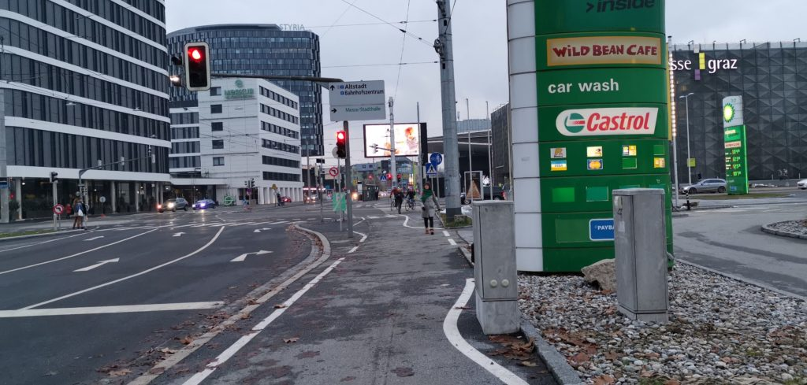
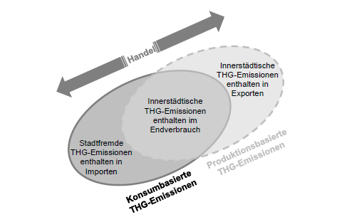

Ich habe am Sonntag auf einer langen Zugfahrt die Untersuchung zum Treibhausgas-Budget der Stadt Graz gelesen, die das Wegener-Institut vor einem Jahr publiziert hat. Man kann sie vom Portal der Stadt downloaden ([PDF](https://www.umweltservice.graz.at/infos/andere/Treibhausgasbudget_Graz_2019.pdf "Pichler, C., & Steininger, K. W. /(2019/). Das Treibhausgasbudget für die Stadt Graz. Wegener Center Verlag.")). Es handelt sich um die erste umfassende Untersuchung zum CO2-Budget der Stadt. Sie stellt dar, vieviel Treibhausgase die Stadt durch Produktion und Konsum erzeugt, und wieviele Anteile auf die einzelnen Sparten und Branchen entfallen. Außerdem haben die Autoren berechnet, um wieviel sich die Emissionen pro Jahr reduzieren müssen, damit Graz einen seiner Bevölkerungszahl entsprechenden, gerechten Anteil dazu beiträgt, dass die Ziele des Pariser Abkommens erreicht werden. [Karl Steininger](https://homepage.uni-graz.at/de/karl.steininger/ "Steininger, Karl W. - Steininger, Karl, Ao.Univ.-Prof. Mag. Dr.rer.soc.oec."), der die Studie mit Christian Pichler verfasst hat, hat sich auch in anderen Publikationen mit Treibhausbudgets auf der Ebene lokaler Akteure beschäftigt, so 2020 in einem [Papier zum Treibhausbudget der Stadt Wien](https://www.wifo.ac.at/wwa/pubid/66396 "Köppl, A., Schleicher, S., Mühlberger, M., & Steininger, K. W. /(2020/). Klimabudget Wien—Klimaindikatoren im Rahmen eines Klimabudgets. Österreichisches Institut für Wirtschaftsforschung").

Messe Graz und Styria-Gebäude. Bild: Anastasija Georgi

Mich interessiert an dieser Untersuchung besonders, wie die globale Klimakrise und die Problematik der weltweiten sozialen Gerechtigkeit mit lokalen Themen verbunden sind. Nach der Lektüre habe ich mich zuerst gefragt, wie diese komplexen Zusammenhänge überhaupt auf der Ebene einer Stadt vermittelt werden können, auf der sie bisher nur wenig diskutiert werden. Je länger ich darüber nachdenke, desto plausibler erscheint mir, dass sich diese globalen Zusammenhänge von der lokalen Ebene aus sogar am besten erschließen lassen, weil sich nur auf dieser Ebene handeln lässt und Unterschiede nur hier erfahrbar werden. Die Untersuchung des Wegener-Centers liefert begründete Zahlen, um Fragen der globalen Klimagerechtigkeit auf die Ebene der Stadt Graz zu übersetzen.

Venn-Diagramm zur Veranschaulichung der THG-Bilanzierungs-perspektiven  
Quelle: Pichler und Steininger 2019, S. 10

Auf welches Budget man sich bezieht, unterscheidet sich danach, ob man die Emissionen untersucht, die durch Produktion oder aber den Verbrauch in Graz entstehen. Außerdem kann man entweder davon ausgehen, dass jeder Mensch auf der Erde noch den gleichen Anteil an Emissionen erzeugen kann (Ansatz _Gleichverteilung pro Kopf_, S. 55ff.), oder aber denen, die jetzt schon am meisten verbrauchen, einen größeren Anteil zugestehen, weil sie sich stärker verändern müssen (Ansatz _Verringerung und Konvergenz_, S.51ff.). Die Untersuchung kommt deshalb nicht zu einem Ergebnis, sondern zu mehreren. Das wichtigste von ihnen: Um 2050 bei Emissionen anzukommen, die die Atmosphäre nicht mehr zusätzlich belasten, und bis dahin nicht mehr CO2-Emissionen zu erzeugen, als es dem Anteil der Stadt an der Weltbevölkerung entspricht, muss Graz den Ausstoß an CO2-Äquivalenten pro Jahr um 5,6% bzw 6,4% pro Kopf einer weiter wachsenden Bevölkerung verringern.

> Werden aus diesem Budget jährlich die konsumbasierten Emissionen abgebucht, und starten diese bei 2,77 Mio t CO2äqu, so müssen diese Emissionen im Durchschnitt jährlich um zumindest 5,6% sinken, um mit den errechneten Budgets bis 2050 auszukommen. Aufgrund der im Zeitverlauf wachsenden Grazer Bevölkerung entspricht dies, bezogen auf die Pro-Kopf-Größen, einerReduktion von durchschnittlich jährlich 6,4% pro Kopf. (S. 59)

Wenn man ignoriert, welche Emissionen Herstellung, Transport und Entsorgung der Güter erzeugen, die in Graz konsumiert, aber an anderen Orten produziert werden, verringern sich diese Zahlen. Sie verringern sich auch, wenn man den Menschen in Graz mehr Emissionen pro Kopf zugesteht als denen in anderen Teilen der Welt. Solche Argumente gegen eine Reduktion der Emissionen um etwa 6% sind aber ethisch fragwürdig: Bezieht man den Konsum von woanders produzierten Gütern und Dienstleistungen nicht ein, macht man andere für die Umweltbelastungen verantwortlich, von denen man selbst profitiert. Gesteht man sich selbst ein höheres Budget zu als anderen, weil man im Augenblick schon mehr konsumiert, bestraft man alle zusätzlich, die nicht oder viel weniger zu der Klimakrise beigetragen haben, die jetzt eine Umorientierung erzwingt.

Aus der Sicht einer [radikalen Ökologiebewegung](https://wittenbrink.net/lostandfound/was-heisst-radikale-oekologiebewegung/ "Was heisst “radikale Ökologiebewegung”? – Lost and Found"), die wirtschaftliches Wachstum und Eigentumsverhältnisse in Frage stellt, gibt es umgekehrt gute Argumente dafür, striktere Reduktionsziele anzunehmen. Die Berechnungen der Untersuchung gehen vom 2°-Ziel, nicht vom 1,5°-Ziel aus (S. 49). Außerdem orientieren die Autoren des Wegener Centers sich an einem Pfad zur Reduktion von Treibhausgasen, der von einer Reduktion der Emissionen auf 0 erst zwischen 2050 und 2100 ausgeht. Sie gehen deshalb von einem globalen Budget von 765 Gigatonnen CO2-Äquivalenten bis 2050 aus. Wenn Graz einen gerechten Anteil an den Anstrengungen übernehmen will, mit 2/3 Wahrscheinlichkeit die Erwärmung bei 1,5° zu stoppen, für die der [IPCC-Sonderbericht von 2018](https://www.de-ipcc.de/256.php "Sonderbericht 1,5 °C globale Erwärmung – SR1.5 - de-IPCC") ein Maximum von 420 Gigatonnen CO2 angibt, dann ist das Budget nur noch gut halb so groß wie jenes, das vom Wegener-Center zugrundegelegt wurde (siehe [diese Tabelle](https://wittenbrink.net/lostandfound/ein-tweet-von-greta-thunberg-zum-verbleibenden-co2-budget/ "Ein Tweet von Greta Thunberg zum verbleibenden CO2-Budget – Lost and Found")).

Die Untersuchung berücksichtigt auch nicht, wie die Verantwortung für Emissionen sozial verteilt ist. Sie geht von Pro-Kopf-Emissionen aus. Tatsächlich hängt es aber vom Lebensstandard ab, wieviel Emissionen erzeugt werden, sodass auch innerhalb einer Stadt wie Graz gefragt werden muss, wie die Belastungen gerecht verteilt werden können. Gerecht wäre, dass die, die im Moment besonders viel zum CO2-Ausstoß beitragen, überproportional an der Reduktion beteiligt werden.

Ich will hier keine Kritik an der Studie, sondern Fragen formulieren—Pichler und Steininger liefern die Grundlagen dafür, für die Stadt Graz konkret zu überlegen, was Klimagerechtigkeit bedeutet. Auch die Zahlen, zu denen sie kommen, ergeben, dass ein radikaler Kurswechsel in der Wirtschafts-, Verkehrs und Baupolitik der Stadt nötig ist.

## Nachweise

Köppl, A., Schleicher, S., Mühlberger, M., & Steininger, K. W. (2020). _Klimabudget Wien—Klimaindikatoren im Rahmen eines Klimabudgets_. Österreichisches Institut für Wirtschaftsforschung. [https://www.wifo.ac.at/wwa/pubid/66396](https://www.wifo.ac.at/wwa/pubid/66396)

Rogelj, J., Shindell, D., Jiang, K., Fifita, S., Forster, P., Ginzburg, V., Handa, C., Kheshgi, H., Kobayashi, S., Kriegler, E., Mundaca, L., Seferian, R., Vilarino, M. V., Calvin, K., Edelenbosch, O., Emmerling, J., Fuss, S., Gasser, T., Gillet, N., … Zhou, W. (2018). Chapter 2: Mitigation pathways compatible with 1.5°C in the context of sustainable development. In _Global Warming of 1.5 °C an IPCC special report on the impacts of global warming of 1.5°C above pre-industrial levels and related global greenhouse gas emission pathways, in the context of strengthening the global response to the threat of climate change_. Intergovernmental Panel on Climate Change. [https://www.ipcc.ch/site/assets/uploads/sites/2/2019/02/SR15\_Chapter2\_Low\_Res.pdf](https://www.ipcc.ch/site/assets/uploads/sites/2/2019/02/SR15_Chapter2_Low_Res.pdf)

Pichler, C., & Steininger, K. W. (2019). _Das Treibhausgasbudget für die Stadt Graz_. Wegener Center Verlag. [https://www.umweltservice.graz.at/infos/andere/Treibhausgasbudget\_Graz\_2019.pdf](https://www.umweltservice.graz.at/infos/andere/Treibhausgasbudget_Graz_2019.pdf)
