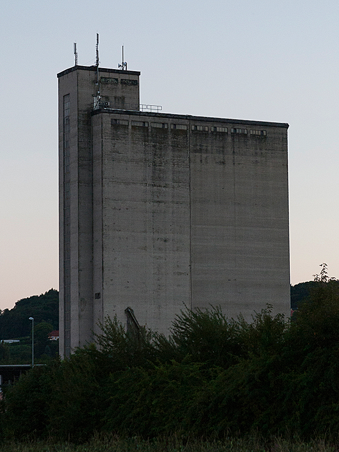

Seit dem Beginn des _harten Lockdown_ zeigen wir in der [off\_gallery](https://offgallery.at) die Ausstellung _Mein Feldbach_ mit Bildern von Barbara Riegler. Parallel dazu haben eine Diashow eingerichtet, in der wir unter dem Titel _everydaygraz_ Fotos aus Graz auf die Schaufensterscheibe der Galerie projizieren. Um diese Bilder haben wir über Social Medien gebeten und inzwischen viele Teilnehmerinnen und Teilnehmer gefunden. Morgen werden wir die [Ausstellung offiziell beenden](https://www.facebook.com/events/406227677394117).

Titelbild der Ausstellung „Mein Feldbach‟. Foto: Barbara Riegler

Zum ersten Mal haben wir eine Ausstellung nicht mit einer öffentlichen Vernissage begonnen. Ich bin nicht einmal sicher, ob wir gegen die Corona-Bestimmungen verstoßen haben, als Barbara, Ana und ich nach dem Hängen auf die Ausstellung angestoßen haben.

In ihren Fotos zeigt Barbara Riegler Gegenstände und Personen aus ihrer Heimatstadt Feldbach. Für sie repräsentieren sie, was sie mit dieser Stadt verbindet, was ihr vom Leben in diesem Ort geblieben ist und was sie bewahren will, was sie geprägt hat.

Es gehört zu den Qualitäten dieser Fotos, dass man nicht viel über diese persönliche Geschichte der Fotografin wissen muss, um sie lesen zu können. Sie zeigen nicht Objekte, die durch diese Geschichte interessant sind und außerhalb der persönlichen Biografie bedeutungslos sind. Die Bilder zeigen Häuser, Landschaften, Konstellationen und Gesichter, die die Fotografin an einen Ort binden. Sie erklären diese Bindung eher, als dass sie durch sie erklärt würden.

Wenn Barbara Riegler selbst über diese Fotos spricht, sagt sie, was sie sieht und gesehen hat, nicht was sie in Verbindung damit erlebt hat. Sie beschreibt höchstens die Anlässe, bei denen sie auf die Gegenstände ihrer Bilder aufmerksam geworden ist. In den Fotos versucht sie—so verstehe ich sie—dem Besonderen dieser Gegenstände nahezukommen, zu dem auch Licht und Farbtöne in einem bestimmten, manchmal lange erwarteten Moment gehören. Gerade darin kann sich dann etwas Typisches zeigen. Alles andere lässt sie weg. So entstehen reduzierte, manchmal simpel wirkende Kompositionen, die es ermöglichen, sich in das Gezeigte zu versenken.

Die Bilder Barbara Rieglers und ihre Zusammenstellung im Galerieraum sind ein fotografischer Essay, ein Versuch über einen Ort, und das, was diesen Ort für seine Autorin ausmacht, was sie dort gefunden hat. Die einmalige Anordnung während der Ausstellung in der Galerie ist eine Expedition zu einem geografischen und chronologischen Netzwerk, dem (der Ausdruck ist von Michail Bachtin) _Chronotopos[1](#fn-15003-1)_ „Mein Feldbach‟. Zu der zweischichtigen Konstellation, die sich so ergibt, gehört die Gegenwart der Stadt Graz, auf die durch die projizierten Bilder auf der Schaufensterscheibe verwiesen wird. Die flüchtigen, immateriellen und alltäglichen Bilder der Diashow sind ein Teil des Rahmens für die im Galerieraum angebrachten gedruckten Fotos. Dieser Rahmen integriert Barbara Rieglers Foto-Essay in den Raum der Gasse vor der Galerie und trennt ihn zugleich wie eine Bühne vom Alltagsraum des _everydaygraz_.

Durch einen Zufall, die Covid-19-Pandemie, kann man Barbara Rieglers Bilder meist nur durch die Schaufensterscheibe sehen. Die Distanzierung durch die Scheibe, die den Ausstellungsraum zu einem halböffentlichen und halbprivaten Erinnerungsraum macht, passt zu diesen Bildern einen nahen, und doch vom Grazer Stadtraum sehr verschiedenen Landschaft in einer noch nicht lange vergangenen, in einem anderen Rhythmus verlaufenden Zeit.

* * *

1. > "Im künstlerisch-literarischen Chronotopos verschmelzen räumliche und zeitliche Merkmale zu einem sinnvollen und konkreten Ganzen. Die Zeit verdichtet sich hierbei, sie zieht sich zusammen und wird auf künstlerische Weise sichtbar; der Raum gewinnt Intensität, er wird in die Bewegung der Zeit, des Sujets, der Geschichte hineingezogen. Die Merkmale der Zeit offenbaren sich im Raum, und der Raum wird von der Zeit mit Sinn erfüllt und dimensioniert." Chronotopoi (in: Handbuch Literatur & Raum, edited by Jörg Dünne and Andreas Mahler, Berlin and Boston: De Gruyter, 2015, pp. 160-169). [PDF](https://www.researchgate.net/publication/332523640_Chronotopoi_in_Handbuch_Literatur_Raum_edited_by_Jorg_Dunne_and_Andreas_Mahler_Berlin_and_Boston_De_Gruyter_2015_pp_160-169 "https://www.researchgate.net/publication/332523640_Chronotopoi_in_Handbuch_Literatur_Raum_edited_by_Jorg_Dunne_and_Andreas_Mahler_Berlin_and_Boston_De_Gruyter_2015_pp_160-169").
    
    [↩](#fnref-15003-1)
