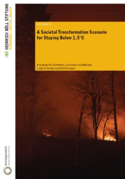

Beim Klimareporter weist [Linda Schneider](https://www.boell.de/de/person/linda-schneider "Linda Schneider | Heinrich-Böll-Stiftung") auf [eine neue Studie der Heinrich-Böll-Stiftung und des Konzeptwerks Neue Ökonomie hin](https://www.klimareporter.de/gesellschaft/warum-der-klimawissenschaftliche-mainstream-in-die-sackgasse-fuehrt "Warum der klimawissenschaftliche Mainstream in die Sackgasse führt – klimareporter"), an der sie selbst mitgearbeitet hat: das [Societal Transformation Scenario for Staying Below 1.5°C](https://www.boell.de/de/2020/12/09/societal-transformation-scenario-staying-below-15degc "A Societal Transformation Scenario for Staying Below 1.5°C | Heinrich-Böll-Stiftung"). Die Studie zeigt, wie das [1,5° Ziel](https://wittenbrink.net/lostandfound/ein-tweet-von-greta-thunberg-zum-verbleibenden-co2-budget/ "Ein Tweet von Greta Thunberg zum verbleibenden CO2-Budget – Lost and Found") durch eine Degrowth-Strategie erreicht werden kann.

Linda Schneider schreibt:

> Die Heinrich-Böll-Stiftung und das Konzeptwerk Neue Ökonomie haben kürzlich das erste globale 1,5-Grad-Szenario veröffentlicht, das ohne den Einsatz von Risikotechnologien wie CCS, Geoengineering und Nuklearenergie auskommt und stattdessen an den Konsum- und Produktionsmustern des globalen Nordens ansetzt – das "Societal Transformation Scenario for Staying Below 1.5°C", kurz STS. Also ein "gesellschaftliches Transformationsszenario, um unter 1,5 Grad zu bleiben".

Ausgangspunkt ist, dass die Entkoppelung von Wirtschaftswachstum und Treibhausgasemissionen unrealistisch ist—mit Sicherheit, möchte ich ergänzen, in einem Zeitraum, der für die Begrenzung der Erhitzung auf 1,5° notwendig wäre.

> Da sich die absolute Entkopplung von Wirtschaftswachstum und Treibhausgasemissionen aber als Trugschluss erweist, fällt es den Modellen immer schwerer, anspruchsvolle Klimaziele wie das 1,5-Grad-Ziel bei einem rasant schwindenden globalen CO2-Budget zu erreichen.

Das Szenario geht im Gegensatz zu den Szenarien des IPCC nicht von weiterem Wachstum der Wirtschaft in allen Ländern aus, und es verwendet ein einfacheres Berechnungsmodell:

> Das STS wurde mithilfe des Global Calculator erstellt, einem relativ einfachen, aber auch weitgehend transparenten Modell, das seine sozio-ökonomischen, politischen und ethischen Annahmen nicht hinter Algorithmen versteckt wie die hochkomplexen Integrated Assessment Models (IAMs), die üblicherweise für solche Szenarien verwendet werden.

Ein entscheidender Aspekt ist die Klimagerechtigkeit.

> Aus einer Perspektive der globalen Gerechtigkeit oder zumindest Verringerung der Ungerechtigkeit ist es entscheidend, dass die starken Emissionsreduktionen vom globalen Norden ausgehen und damit auch Raum für höhere Konsumniveaus im Süden lassen.

* * *

Ein paar ergänzende aktuelle Hinweise und Links:

## Zur Dringlichkeit einer schnellen und vollständigen Dekarbonisierung:

Zum Jahresende hat Inside Climate News auf die neuen Forschungsergebnisse hingewiesen, aus denen hervorgeht, dass ein Stopp der Treibhausgasemissionen tatsächlich auch zu einem Ende der globalen Erhitzung führen wird, **wenn er schnell kommt**: [Many Scientists Now Say Global Warming Could Stop Relatively Quickly After Emissions Go to Zero](https://insideclimatenews.org/news/03012021/five-aspects-climate-change-2020/ "Many Scientists Now Say Global Warming Could Stop Relatively Quickly After Emissions Go to Zero - Inside Climate News"). Zitiert werden [Joeri Rogelj](https://www.imperial.ac.uk/people/j.rogelj "Home - Dr Joeri Rogelj") und [Michael E. Mann](https://michaelmann.net/ "MICHAEL E. MANN"), zwei der Klimawissenschaftler mit der größten Autorität. Ein schnelles Ende der Emissionen ist also entscheidend, nicht ihre langsame und möglicherweise sogar unvollständige (_Net Zero_) Reduktion (zu den Risiken der _Net Zero_\-Forderung siehe auch [10 myths about net zero targets and carbon offsetting, busted](https://www.climatechangenews.com/2020/12/11/10-myths-net-zero-targets-carbon-offsetting-busted/ "10 myths about net zero targets and carbon offsetting, busted") in den Climate Home News, einen Artikel, an dem 41 Wissenschaftler mitgearbeitet haben).

## Zur Klimagerechtigkeit:

In einer langen Reportage berichtet [Sally Williams](https://www.theguardian.com/profile/sally-williams "Sally Williams | The Guardian") im Guardian über die Folgen des Zyklons Idai, der 2019 Mozambique verwüstet hat—wo jetzt Heuschreckenschwärme, ziemlich sicher auch ein Effekt der globalen Erhitzung, die Ernte der Opfer dieses Sturms zerstört haben: [‘The sea is rising, the climate is changing’: the lessons learned from Mozambique’s deadly cyclone](https://www.theguardian.com/world/2021/jan/02/the-sea-is-rising-the-climate-is-changing-the-lessons-learned-from-mozambiques-deadly-cyclone "‘The sea is rising, the climate is changing’: the lessons learned from Mozambique’s deadly cyclone | Cyclone Idai | The Guardian"). [Daviz Simango](https://de.wikipedia.org/wiki/Daviz_Simango "Daviz Simango – Wikipedia"), der Bürgermeister von Beira, der lange vor dem Zyklon vor den Folgen der Klimakatastrophe gewarnt hat, formuliert in einem traurigen Witz, warum Klimagerechtigkeit eine zentrale Forderung der Klimabewegung sein muss und warum weitere Emissionen in den reichen Ländern nicht tragbar sind:

> “Imagine a poor person is standing outside a fancy restaurant,” Simango says. “You walk by that person, go into the restaurant and order food. When you have finished eating, you go outside and say to the poor person, ‘You are paying.’”

## Weitere neuen Studien zur schnellen Dekarbonisierung aus Deutschland:

Im vergangenen Jahr habe ich mir zwei weitere neue Studien/Papiere aus Deutschland notiert, in denen aus anderen Perspektiven ebenfalls beschrieben wird, wie eine schnelle Dekarbonisierung möglich ist. Das Wuppertal-Institut hat für FridaysForFuture dargestellt, wie [Deutschland bis 2035 CO2-neutral werden kann](https://www.wupperinst.org/a/wi/a/s/ad/5169/ "Studie: Wie Deutschland bis 2035 CO2-neutral werden kann - Wuppertal Institut für Klima, Umwelt, Energie"). Die Reiner Lemoine Stiftung hat in einem zusammenfassenden Impulspapier [Weichenstellungen ins Erneuerbare Energiesystem](https://www.reiner-lemoine-stiftung.de/meldungen/impulspapier-weichenstellungen-ins-erneuerbare-energiesystem "Impulspapier: Weichenstellungen ins Erneuerbare Energiesystem | Reiner Lemoine-Stiftung") vorgestellt. Ich würde diese Papiere mit der Studie der Heinrich-Böll-Stiftung und des Konzeptwerks Neue Ökonomie zusammen lesen.

## Nachweise

10 myths about net zero targets and carbon offsetting, busted. (2020, Dezember 11). Climate Home News. [https://www.climatechangenews.com/2020/12/11/10-myths-net-zero-targets-carbon-offsetting-busted/](https://www.climatechangenews.com/2020/12/11/10-myths-net-zero-targets-carbon-offsetting-busted/)

Berwyn, B. (2021, Jänner 3). Many Scientists Now Say Global Warming Could Stop Relatively Quickly After Emissions Go to Zero. Inside Climate News. [https://insideclimatenews.org/news/03012021/five-aspects-climate-change-2020/](https://insideclimatenews.org/news/03012021/five-aspects-climate-change-2020/)

Kobiela, G., Samadi, S., Kurwan, J., Tönjes, A., Fischedick, M., Koska, T., Lechtenböhmer, S., März, S., & Schüwer, D. (2020). CO2-neutral bis 2035: Eckpunkte eines deutschen Beitrags zur Einhaltung der 1,5-°C-Grenze ; Diskussionsbeitrag für Fridays for Future Deutschland. Wuppertal Institut für Klima, Umwelt, Energie. [http://nbn-resolving.de/urn:nbn:de:bsz:wup4-opus-76065](http://nbn-resolving.de/urn:nbn:de:bsz:wup4-opus-76065)

Kuhnhenn, K., Costa, L., Mahnke, E., Schneider, L., & Lange, S. (2020). A Societal Transformation Scenario for Staying Below 1.5C. Heinrich Böll Foundation and Konzeptwerk Neue Ökonomie. [https://www.boell.de/de/2020/12/09/societal-transformation-scenario-staying-below-15degc](https://www.boell.de/de/2020/12/09/societal-transformation-scenario-staying-below-15degc)

Reiner Lemoine Stiftung. (2020). Weichenstellungen ins Erneuerbare Energiesystem. Impulspapier zur EnergieSystemWende im Wahljahr 2021. [https://www.reiner-lemoine-stiftung.de/images/impulspapier/RLS\_Impulspapier\_Weichenstellungen\_Ern\_Energiesystem\_Nov\_2020.pdf](https://www.reiner-lemoine-stiftung.de/images/impulspapier/RLS_Impulspapier_Weichenstellungen_Ern_Energiesystem_Nov_2020.pdf)

Williams, S. (2021, Jänner 2). ‘The sea is rising, the climate is changing’: The lessons learned from Mozambique’s deadly cyclone. The Guardian. [http://www.theguardian.com/world/2021/jan/02/the-sea-is-rising-the-climate-is-changing-the-lessons-learned-from-mozambiques-deadly-cyclone](http://www.theguardian.com/world/2021/jan/02/the-sea-is-rising-the-climate-is-changing-the-lessons-learned-from-mozambiques-deadly-cyclone)
